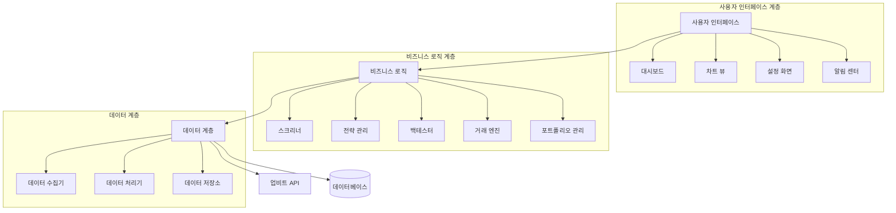

# 디자인 문서

## 개요

업비트 자동매매 시스템은 파이썬 기반의 애플리케이션으로, 한국 업비트 거래소의 KRW 마켓 코인들을 대상으로 자동화된 거래 기능을 제공합니다. 이 시스템은 종목 스크리닝, 데이터 관리, 매매 전략 관리, 포트폴리오 구성, 백테스팅, 실시간 거래, 모니터링 및 알림 기능을 포함합니다. 사용자 친화적인 인터페이스를 통해 비개발자도 쉽게 사용할 수 있도록 설계되었습니다.

## 아키텍처

시스템은 다음과 같은 주요 계층으로 구성됩니다:

1. **데이터 계층**: 시장 데이터 수집, 저장, 관리
2. **비즈니스 로직 계층**: 스크리닝, 전략 실행, 백테스팅, 거래 실행
3. **사용자 인터페이스 계층**: GUI 컴포넌트, 차트, 대시보드

### 아키텍처 다이어그램



## 컴포넌트 및 인터페이스

### 1. 데이터 계층

#### 1.1 데이터 수집기
- **기능**: 업비트 API를 통해 시장 데이터(가격, 거래량, 호가 등) 수집
- **인터페이스**:
  - `collect_market_data(symbol: str, timeframe: str, start_date: datetime, end_date: datetime) -> pd.DataFrame`: 특정 코인의 시장 데이터 수집
    - 반환값: OHLCV 데이터가 포함된 DataFrame
  - `collect_orderbook_data(symbol: str) -> Dict`: 특정 코인의 호가 데이터 수집
    - 반환값: 호가 정보가 포함된 딕셔너리
  - `collect_ticker_data() -> pd.DataFrame`: 모든 코인의 현재 시세 정보 수집
    - 반환값: 모든 코인의 현재 시세 정보가 포함된 DataFrame

#### 1.2 데이터 처리기
- **기능**: 수집된 데이터 정제, 가공, 기술적 지표 계산
- **인터페이스**:
  - `calculate_indicators(data: pd.DataFrame, indicators: List[Dict]) -> pd.DataFrame`: 기술적 지표 계산
    - `indicators` 구조:
    ```python
    [
        {
            "name": "SMA",  # 단순 이동 평균
            "params": {
                "window": 20,
                "column": "close"
            }
        },
        {
            "name": "RSI",  # 상대 강도 지수
            "params": {
                "window": 14
            }
        }
    ]
    ```
    - 반환값 구조:
    ```python
    # 원본 데이터프레임에 지표 컬럼이 추가된 형태
    timestamp    | open  | high  | low   | close | volume | SMA_20 | RSI_14
    --------------------------------------------------------------------
    1609459200   | 100.0 | 105.0 | 98.0  | 103.0 | 1000   | 102.5  | 65.2
    1609459260   | 103.0 | 107.0 | 102.0 | 106.0 | 1200   | 103.1  | 67.8
    ...
    ```
  - `normalize_data(data: pd.DataFrame, method: str = 'minmax') -> pd.DataFrame`: 데이터 정규화
    - `method`: 'minmax', 'zscore', 'robust' 등의 정규화 방법
  - `resample_data(data: pd.DataFrame, timeframe: str) -> pd.DataFrame`: 데이터 리샘플링
    - `timeframe`: '1m', '5m', '15m', '1h', '4h', '1d' 등의 시간대

#### 1.3 데이터 저장소
- **기능**: 시장 데이터, 전략, 백테스팅 결과 등 저장 및 관리
- **인터페이스**:
  - `save_market_data(data: pd.DataFrame) -> bool`: 시장 데이터 저장
    - 반환값: 저장 성공 여부
  - `load_market_data(symbol: str, timeframe: str, start_date: datetime, end_date: datetime) -> pd.DataFrame`: 시장 데이터 로드
    - 반환값: OHLCV 데이터가 포함된 DataFrame
  - `cleanup_old_data(days_to_keep: int) -> int`: 오래된 데이터 정리
    - 반환값: 삭제된 레코드 수

### 2. 비즈니스 로직 계층

#### 2.1 스크리너
- **기능**: 거래량, 변동성, 가격 추세 등을 기반으로 코인 필터링
- **인터페이스**:
  - `screen_by_volume(min_volume: float, timeframe: str) -> List[str]`: 거래량 기준 스크리닝
  - `screen_by_volatility(min_volatility: float, max_volatility: float, timeframe: str) -> List[str]`: 변동성 기준 스크리닝
  - `screen_by_trend(trend_type: str, timeframe: str) -> List[str]`: 추세 기준 스크리닝
  - `get_screened_coins(criteria: List[Dict]) -> List[Dict]`: 설정된 기준으로 코인 스크리닝
    - `criteria` 구조: 
    ```python
    [
        {
            "type": "volume",  # 스크리닝 유형 (volume, volatility, trend)
            "params": {
                "min_volume": 1000000000,  # 최소 거래량 (KRW)
                "timeframe": "1d"  # 시간대
            }
        },
        {
            "type": "volatility",
            "params": {
                "min_volatility": 0.05,  # 최소 변동성 (5%)
                "max_volatility": 0.20,  # 최대 변동성 (20%)
                "timeframe": "1d"
            }
        }
    ]
    ```
    - 반환값 구조:
    ```python
    [
        {
            "symbol": "KRW-BTC",
            "name": "비트코인",
            "current_price": 50000000,
            "volume_24h": 5000000000,
            "volatility_24h": 0.08,
            "matched_criteria": ["volume", "volatility"]
        },
        # ... 다른 코인들
    ]
    ```

#### 2.2 전략 관리
- **기능**: 매매 전략 생성, 수정, 저장, 관리
- **인터페이스**:
  - `create_strategy(name: str, description: str, parameters: Dict) -> str`: 새 전략 생성
    - 반환값: 생성된 전략 ID
    - `parameters` 구조:
    ```python
    {
        "strategy_type": "moving_average_crossover",  # 전략 유형
        "params": {
            "short_window": 20,  # 단기 이동 평균 기간
            "long_window": 50,   # 장기 이동 평균 기간
            "signal_line": 9     # 시그널 라인 기간
        }
    }
    ```
  - `update_strategy(strategy_id: str, parameters: Dict) -> bool`: 전략 수정
    - 반환값: 수정 성공 여부
  - `delete_strategy(strategy_id: str) -> bool`: 전략 삭제
    - 반환값: 삭제 성공 여부
  - `get_strategies() -> List[Dict]`: 모든 전략 조회
    - 반환값: 전략 목록
  - `get_strategy(strategy_id: str) -> Dict`: 특정 전략 조회
    - 반환값: 전략 정보

#### 2.3 백테스터
- **기능**: 과거 데이터를 사용하여 전략 성능 테스트
- **인터페이스**:
  - `run_backtest(strategy_id: str, symbol: str, timeframe: str, start_date: datetime, end_date: datetime, initial_capital: float) -> Dict`: 백테스트 실행
    - 반환값: 백테스트 결과 (ID, 성과 지표, 거래 내역 등)
  - `run_portfolio_backtest(portfolio_id: str, timeframe: str, start_date: datetime, end_date: datetime, initial_capital: float) -> Dict`: 포트폴리오 백테스트 실행
    - 반환값: 포트폴리오 백테스트 결과
  - `calculate_performance_metrics(backtest_results: Dict) -> Dict`: 성과 지표 계산
    - 반환값: 계산된 성과 지표 (수익률, 최대 손실폭, 승률 등)
    ```python
    {
        "total_return": 0.25,  # 총 수익률 (25%)
        "annualized_return": 0.15,  # 연간 수익률 (15%)
        "max_drawdown": 0.12,  # 최대 손실폭 (12%)
        "win_rate": 0.65,  # 승률 (65%)
        "profit_factor": 1.8,  # 수익 요인
        "sharpe_ratio": 1.2,  # 샤프 비율
        "sortino_ratio": 1.5,  # 소티노 비율
        "trades_count": 42  # 총 거래 횟수
    }
    ```
  - `save_backtest_results(backtest_id: str, results: Dict) -> bool`: 백테스트 결과 저장
    - 반환값: 저장 성공 여부
  - `compare_backtest_results(backtest_ids: List[str]) -> Dict`: 백테스트 결과 비교
    - 반환값: 비교 결과

#### 2.4 거래 엔진
- **기능**: 실시간 시장 모니터링 및 주문 실행
- **인터페이스**:
  - `start_trading(strategy_id: str, symbol: str, amount: float, risk_params: Dict) -> str`: 거래 시작
    - 반환값: 거래 ID
    - `risk_params` 구조:
    ```python
    {
        "max_loss_percent": 5.0,  # 최대 손실 허용 비율 (%)
        "take_profit_percent": 10.0,  # 이익 실현 비율 (%)
        "stop_loss_percent": 3.0,  # 손절 비율 (%)
        "max_position_size": 0.3  # 최대 포지션 크기 (전체 자본 대비 %)
    }
    ```
  - `stop_trading(trading_id: str) -> bool`: 거래 중지
    - 반환값: 중지 성공 여부
  - `execute_order(symbol: str, order_type: str, side: str, amount: float, price: float = None) -> Dict`: 주문 실행
    - `order_type`: 'market', 'limit' 등의 주문 유형
    - `side`: 'buy', 'sell' 등의 주문 방향
    - 반환값: 주문 정보
  - `get_trading_status(trading_id: str) -> Dict`: 거래 상태 조회
    - 반환값: 거래 상태 정보
    ```python
    {
        "trading_id": "trading-123",
        "strategy_id": "strategy-456",
        "symbol": "KRW-BTC",
        "status": "active",  # active, paused, stopped
        "position": {
            "side": "long",  # long, short, none
            "entry_price": 50000000,
            "current_price": 51000000,
            "quantity": 0.01,
            "profit_loss": 0.02,  # 2% 수익
            "entry_time": "2023-01-01T12:00:00"
        },
        "orders": [
            # 최근 주문 목록
        ],
        "performance": {
            "total_trades": 10,
            "win_rate": 0.6,
            "profit_loss": 0.05  # 5% 수익
        }
    }
    ```

#### 2.5 포트폴리오 관리
- **기능**: 여러 코인과 전략 조합 관리
- **인터페이스**:
  - `create_portfolio(name: str, description: str) -> str`: 포트폴리오 생성
    - 반환값: 생성된 포트폴리오 ID
  - `add_coin_to_portfolio(portfolio_id: str, symbol: str, strategy_id: str, weight: float) -> bool`: 포트폴리오에 코인 추가
    - 반환값: 추가 성공 여부
  - `remove_coin_from_portfolio(portfolio_id: str, symbol: str) -> bool`: 포트폴리오에서 코인 제거
    - 반환값: 제거 성공 여부
  - `update_coin_weight(portfolio_id: str, symbol: str, weight: float) -> bool`: 코인 가중치 수정
    - 반환값: 수정 성공 여부
  - `calculate_portfolio_performance(portfolio_id: str) -> Dict`: 포트폴리오 성과 계산
    - 반환값: 포트폴리오 성과 지표
    ```python
    {
        "expected_return": 0.15,  # 기대 수익률 (15%)
        "volatility": 0.08,  # 변동성 (8%)
        "sharpe_ratio": 1.5,  # 샤프 비율
        "max_drawdown": 0.12,  # 최대 손실폭 (12%)
        "coin_contributions": [
            {
                "symbol": "KRW-BTC",
                "weight": 0.4,  # 40% 비중
                "expected_return": 0.18,  # 18% 기대 수익률
                "contribution": 0.072  # 전체 수익률에 대한 기여도 (0.4 * 0.18)
            },
            # ... 다른 코인들
        ]
    }
    ```

### 3. 사용자 인터페이스 계층

#### 3.1 대시보드
- **기능**: 시스템 상태, 포트폴리오 성과, 활성 거래 등 표시
- **컴포넌트**:
  - 포트폴리오 요약
  - 활성 거래 목록
  - 시장 개요
  - 알림 센터

#### 3.2 차트 뷰
- **기능**: 가격 차트, 기술적 지표, 거래 시점 시각화
- **컴포넌트**:
  - 캔들스틱 차트
  - 기술적 지표 오버레이
  - 거래 시점 마커
  - 시간대 선택기

#### 3.3 설정 화면
- **기능**: 시스템 설정, API 키 관리, 알림 설정 등
- **컴포넌트**:
  - API 키 관리
  - 데이터베이스 설정
  - 알림 설정
  - 백업 및 복원

#### 3.4 알림 센터
- **기능**: 시스템 이벤트, 거래 알림, 가격 알림 등 관리
- **컴포넌트**:
  - 알림 목록
  - 알림 설정
  - 알림 필터

## 데이터 모델

### 1. 시장 데이터 모델

#### 1.1 OHLCV 데이터
```python
class OHLCV:
    timestamp: datetime  # 타임스탬프
    symbol: str          # 코인 심볼
    open: float          # 시가
    high: float          # 고가
    low: float           # 저가
    close: float         # 종가
    volume: float        # 거래량
    timeframe: str       # 시간대 (예: '1m', '5m', '1h', '1d')
```

#### 1.2 호가 데이터
```python
class OrderBook:
    timestamp: datetime  # 타임스탬프
    symbol: str          # 코인 심볼
    asks: List[Order]    # 매도 호가 목록
    bids: List[Order]    # 매수 호가 목록
```

```python
class Order:
    price: float         # 가격
    quantity: float      # 수량
```

#### 1.3 거래 데이터
```python
class Trade:
    timestamp: datetime  # 타임스탬프
    symbol: str          # 코인 심볼
    price: float         # 가격
    quantity: float      # 수량
    side: str            # 매수/매도
    order_id: str        # 주문 ID
    fee: float           # 수수료
```

### 2. 전략 모델

```python
class Strategy:
    id: str              # 전략 ID
    name: str            # 전략 이름
    description: str     # 전략 설명
    parameters: Dict     # 전략 매개변수
    created_at: datetime # 생성 시간
    updated_at: datetime # 수정 시간
```

### 3. 백테스트 모델

```python
class Backtest:
    id: str              # 백테스트 ID
    strategy_id: str     # 전략 ID
    symbol: str          # 코인 심볼
    portfolio_id: str    # 포트폴리오 ID (포트폴리오 테스트용)
    timeframe: str       # 시간대
    start_date: datetime # 시작 날짜
    end_date: datetime   # 종료 날짜
    initial_capital: float # 초기 자본
    trades: List[Trade]  # 거래 내역
    performance_metrics: Dict # 성과 지표
    created_at: datetime # 생성 시간
```

### 4. 포트폴리오 모델

```python
class Portfolio:
    id: str              # 포트폴리오 ID
    name: str            # 포트폴리오 이름
    description: str     # 포트폴리오 설명
    coins: List[PortfolioCoin] # 코인 목록
    created_at: datetime # 생성 시간
    updated_at: datetime # 수정 시간
```

```python
class PortfolioCoin:
    symbol: str          # 코인 심볼
    strategy_id: str     # 전략 ID (Strategy 모델과의 관계)
    weight: float        # 가중치
```

**참고**: `PortfolioCoin`의 `strategy_id`는 `Strategy` 모델의 `id`를 참조합니다. 하나의 포트폴리오 내에서 여러 코인이 각각 다른 전략을 사용할 수 있으며, 또는 여러 코인이 동일한 전략을 공유할 수도 있습니다. 이를 통해 포트폴리오 내에서 코인별로 최적화된 전략을 적용할 수 있습니다.

## 오류 처리

### 1. API 오류 처리
- 업비트 API 요청 실패 시 재시도 메커니즘 구현
- API 속도 제한 준수를 위한 요청 제한 및 대기 로직
- API 응답 검증 및 예외 처리

### 2. 데이터 오류 처리
- 누락된 데이터 처리 (보간, 건너뛰기 등)
- 이상치 탐지 및 처리
- 데이터 일관성 검증

### 3. 거래 오류 처리
- 주문 실패 시 재시도 또는 대체 전략
- 잔액 부족 상황 처리
- 네트워크 지연 또는 단절 상황 처리

### 4. 시스템 오류 처리
- 예외 로깅 및 모니터링
- 중요 오류 발생 시 알림 전송
- 자동 복구 메커니즘

## 테스트 전략

### 1. 단위 테스트
- 각 컴포넌트의 핵심 기능에 대한 단위 테스트
- 모의 객체(mock)를 사용한 외부 의존성 테스트
- 경계 조건 및 예외 상황 테스트

### 2. 통합 테스트
- 컴포넌트 간 상호작용 테스트
- 데이터 흐름 테스트
- API 통합 테스트

### 3. 백테스팅 검증
- 알려진 결과와의 비교를 통한 백테스팅 엔진 검증
- 다양한 시장 조건에서의 전략 테스트
- 성능 지표 계산 정확성 검증

### 4. 사용자 인터페이스 테스트
- 기능 테스트
- 사용성 테스트
- 반응성 및 성능 테스트

## 기술 스택

### 1. 백엔드
- **언어**: Python 3.8+ (선택 이유: 데이터 분석 라이브러리가 풍부하고, 빠른 개발이 가능함)
- **데이터베이스**: SQLite (로컬 개발), PostgreSQL (확장성 고려)
  - SQLite: 설치 없이 파일 기반으로 사용 가능하여 초기 개발 및 배포가 간편함
  - PostgreSQL: 대용량 데이터 처리 및 동시성 지원이 필요할 경우 마이그레이션 가능
- **API 클라이언트**: requests, aiohttp (비동기 요청)
  - requests: 간단한 API 호출에 사용, 직관적인 인터페이스 제공
  - aiohttp: 실시간 데이터 처리 및 다중 요청 처리에 효율적인 비동기 방식 지원
- **데이터 처리**: pandas, numpy
  - pandas: 시계열 데이터 처리에 최적화된 기능 제공
  - numpy: 고성능 수치 계산을 위한 기반 라이브러리
- **기술적 분석**: ta-lib, pandas-ta
  - ta-lib: C로 작성된 고성능 기술적 분석 라이브러리로 계산 속도가 빠름
  - pandas-ta: 순수 Python으로 작성되어 설치가 쉽고, 다양한 지표 제공

### 2. 프론트엔드
- **GUI 프레임워크**: PyQt6 (선택 이유: 크로스 플랫폼 지원, 풍부한 위젯, 안정성)
- **차트 라이브러리**: 
  - pyqtgraph: 실시간 차트에 최적화된 고성능 그래픽 라이브러리, 대용량 데이터 렌더링에 효율적
  - Matplotlib: 정적 차트 및 복잡한 시각화에 사용, 다양한 차트 유형 및 커스터마이징 옵션 제공
- **스타일링**: QSS (Qt Style Sheets) - CSS와 유사한 문법으로 일관된 UI 스타일링 가능

### 3. 배포
- **패키징**: PyInstaller (선택 이유: 단일 실행 파일로 패키징하여 배포 용이)
- **설정 관리**: configparser, yaml
  - configparser: 간단한 설정에 사용, Python 표준 라이브러리
  - yaml: 복잡한 계층 구조의 설정에 적합, 가독성이 좋음
- **로깅**: logging (Python 표준 라이브러리, 다양한 로깅 레벨 및 핸들러 지원)

## 보안 고려사항

### 1. API 키 보안
- **API 키 암호화 저장**: `cryptography` 라이브러리를 사용하고, OS의 키체인/자격 증명 관리자를 활용하여 시스템 레벨에서 안전하게 보관
- **최소 권한 원칙 적용**: (필요한 권한만 부여)

### 2. 데이터 보안
- 민감한 데이터 암호화
- 로컬 데이터베이스 접근 제한

### 3. 거래 보안
- 거래 금액 제한
- 이상 거래 탐지 및 방지

## 확장성 고려사항

### 1. 다중 거래소 지원
- 추상화된 거래소 인터페이스 설계
- 거래소별 어댑터 구현

### 2. 추가 전략 유형
- 플러그인 아키텍처로 새로운 전략 유형 쉽게 추가 가능
- 사용자 정의 전략 지원

### 3. 성능 최적화
- 대용량 데이터 처리를 위한 최적화
- 병렬 처리 및 비동기 작업 지원