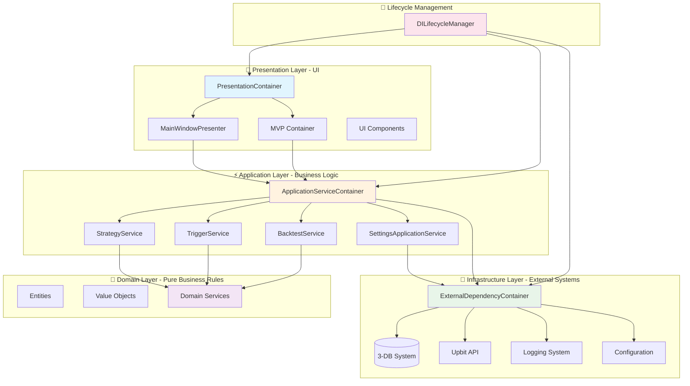
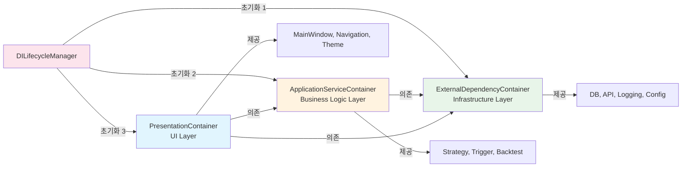
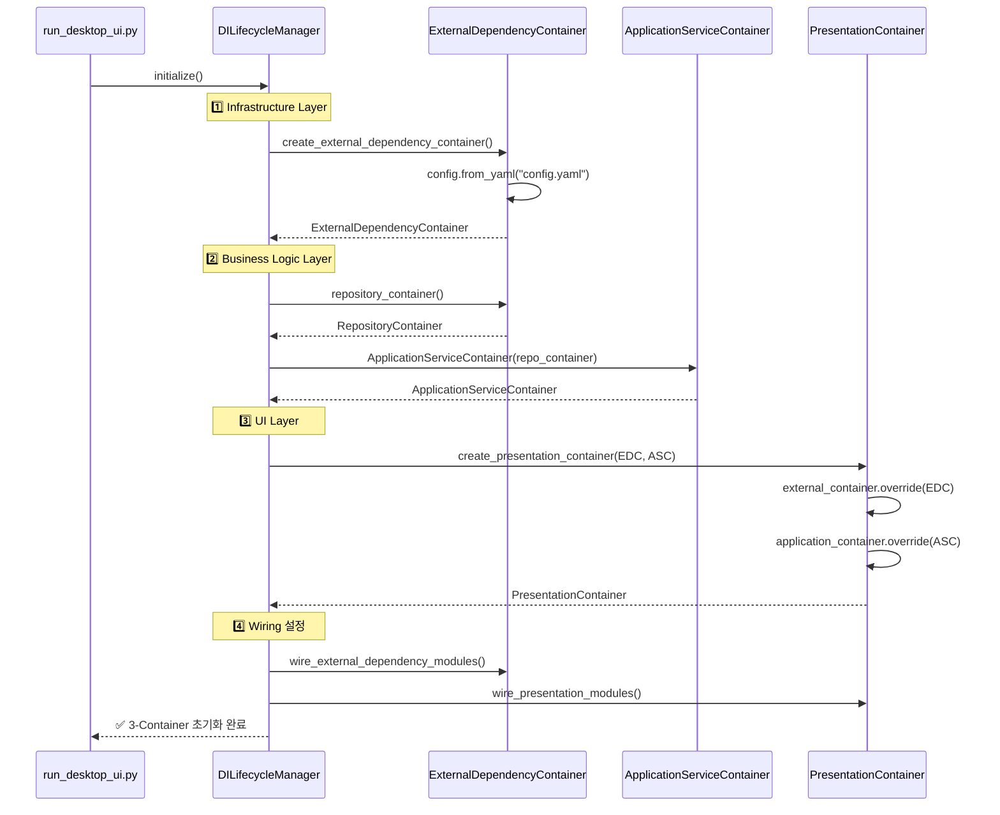
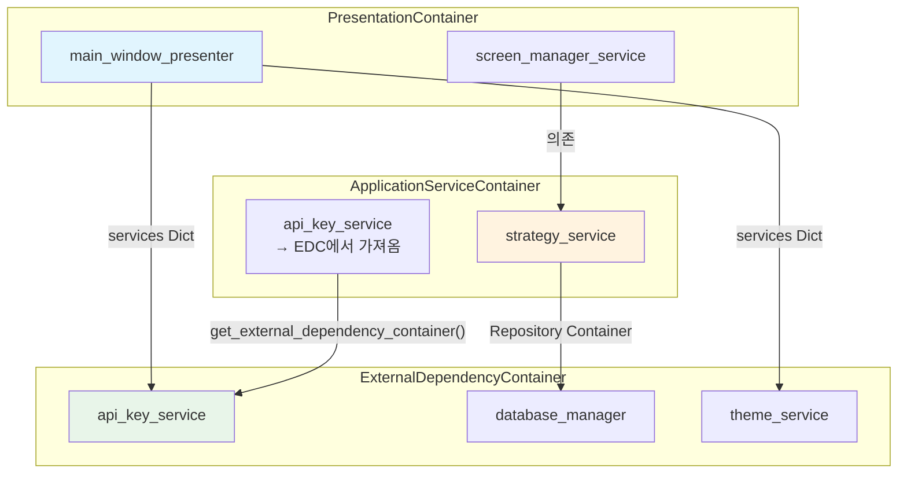
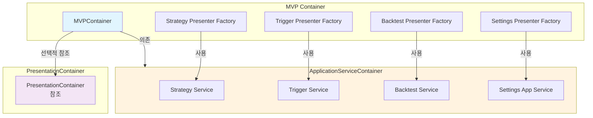
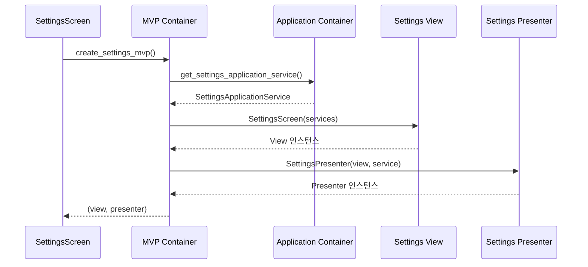

# 🏗️ 완전한 3-Container DDD 아키텍처 종합 문서

> **업비트 자동매매 시스템의 Clean Architecture + DDD + 3-Container DI 시스템 완전 가이드**

## 📋 문서 정보

- **문서 유형**: 3-Container DDD 아키텍처 종합 레퍼런스
- **대상 독자**: 개발자, 아키텍처 설계자
- **프로젝트**: 업비트 자동매매 시스템
- **완성 상태**: 100% 작동하는 3-Container 시스템 (2025.10.01 검증 완료)
- **최종 업데이트**: 2025년 10월 1일

---

## 📊 Section 1: 아키텍처 개요

### 🎯 3-Container DDD 시스템 전체 그림



### 🌟 설계 철학

#### Clean Architecture + DDD 융합

**핵심 원칙**:

1. **의존성 방향**: Presentation → Application → Domain ← Infrastructure
2. **Domain 순수성**: Domain Layer는 외부 의존성 없음 (순수 비즈니스 규칙)
3. **계층별 격리**: 각 Container가 담당 계층만 관리하여 책임 분리
4. **통합 생명주기**: DILifecycleManager가 3-Container를 중앙 관리

**3-Container 분리 이유**:

- **ExternalDependencyContainer**: DB, API, 로깅 등 외부 시스템 통합 (Infrastructure)
- **ApplicationServiceContainer**: 비즈니스 로직 조합 및 Use Case 실행 (Application)
- **PresentationContainer**: UI 서비스 및 MVP Presenter 관리 (Presentation)

### 📈 기존 2-Container 대비 개선점

| 항목 | 기존 (2-Container) | 개선 (3-Container) |
|------|-------------------|-------------------|
| **계층 분리** | Infrastructure + Application 혼재 | Infrastructure, Application, Presentation 완전 분리 |
| **UI 관리** | MainWindow가 직접 DI 컨테이너 접근 | PresentationContainer가 UI Layer 전담 |
| **의존성 명확성** | 혼재된 Provider로 인한 혼란 | 계층별 Provider 명확히 분리 |
| **테스트 용이성** | 계층 간 의존성 복잡 | 계층별 독립 테스트 가능 |
| **확장성** | 새 Provider 추가 시 충돌 위험 | 담당 Container에만 추가하면 됨 |
| **유지보수** | Provider 위치 찾기 어려움 | 계층별로 명확히 위치 파악 |

### 🔄 3-Container 관계도



---

## 🏗️ Section 2: 3-Container 시스템 상세

### 1️⃣ ExternalDependencyContainer (Infrastructure Layer)

**파일 위치**: `upbit_auto_trading/infrastructure/dependency_injection/external_dependency_container.py`

#### 담당 영역

**외부 시스템 통합 전담**:

- Database Connections (3-DB 분리: settings.sqlite3, strategies.sqlite3, market_data.sqlite3)
- API Clients (Upbit Public/Private API)
- Logging Systems (Component Logger)
- Configuration Management (config.yaml 로드)
- Security Services (API Key 암호화)
- Path Management (파일 시스템 경로)

#### Provider 목록 (실제 구현 기준)

| Provider 이름 | 타입 | 설명 | 의존성 |
|--------------|------|------|--------|
| `config` | Configuration | 환경별 설정 관리 | config.yaml |
| `logging_service` | Factory | Component Logger 생성 | - |
| `application_logging_service` | Singleton | Application Layer 로깅 | - |
| `database_manager` | Singleton | 3-DB 연결 관리 | - |
| `path_service` | Singleton | 경로 관리 서비스 | - |
| `config_loader` | Singleton | 설정 파일 로더 | - |
| `settings_service` | Factory | 설정 영속화 서비스 | config_loader |
| `secure_keys_repository` | Singleton | API 키 저장소 (SQLite) | database_manager |
| `strategy_repository` | Singleton | 전략 저장소 (SQLite) | database_manager |
| `trigger_repository` | Singleton | 트리거 저장소 (SQLite) | database_manager |
| `api_key_service` | Factory | API 키 암호화 관리 | secure_keys_repository |
| `style_manager` | Singleton | 전역 스타일 관리 | - |
| `theme_service` | Factory | UI 테마 관리 | settings_service, style_manager |
| `domain_event_publisher` | Singleton | 도메인 이벤트 발행 | - |
| `repository_container` | Factory | Repository 접근 Adapter | self |

#### 코드 예시: Provider 정의

```python
from dependency_injector import containers, providers

class ExternalDependencyContainer(containers.DeclarativeContainer):
    """외부 의존성 DI 컨테이너 - Infrastructure Layer 전담"""

    # Configuration Provider
    config = providers.Configuration()

    # Logging Service
    logging_service = providers.Factory(
        "upbit_auto_trading.infrastructure.logging.create_component_logger",
        name="ExternalDependencyContainer"
    )

    # Database Manager - 3-DB 분리 구조
    database_manager = providers.Singleton(
        "upbit_auto_trading.infrastructure.services.database_connection_service.DatabaseConnectionService"
    )

    # API Key Service - 보안 키 관리
    api_key_service = providers.Factory(
        "upbit_auto_trading.infrastructure.services.api_key_service.ApiKeyService",
        secure_keys_repository=secure_keys_repository
    )

    # Theme Service - UI 테마
    theme_service = providers.Factory(
        "upbit_auto_trading.infrastructure.services.theme_service.ThemeService",
        settings_service=settings_service,
        style_manager=style_manager
    )
```

#### Repository Container 패턴

```python
class RepositoryContainer:
    """Application Layer에서 Repository 접근을 위한 Adapter"""

    def __init__(self, container):
        self._container = container

    def get_strategy_repository(self):
        return self._container.strategy_repository()

    def get_trigger_repository(self):
        return self._container.trigger_repository()

    def get_api_key_service(self):
        return self._container.api_key_service()
```

---

### 2️⃣ ApplicationServiceContainer (Business Logic Layer)

**파일 위치**: `upbit_auto_trading/application/application_service_container.py`

#### 담당 영역

**비즈니스 로직 조합 및 Use Case 실행**:

- Strategy Management (전략 생성, 수정, 검증)
- Trigger Management (트리거 조건 구성)
- Backtest Execution (백테스팅 실행 및 결과 분석)
- Settings Management (설정 검증 및 적용)
- Event Integration (Domain Event ↔ Application Handler)
- Notification Services (알림 전송)
- Cache Management (캐시 무효화)

#### Provider 목록 (실제 구현 기준)

| Service 이름 | 설명 | 의존성 (Repository Container) |
|-------------|------|------------------------------|
| `strategy_service` | 전략 관리 서비스 | strategy_repository, compatibility_service |
| `trigger_service` | 트리거 관리 서비스 | trigger_repository, strategy_repository |
| `backtest_service` | 백테스팅 서비스 | strategy_repository, backtest_repository |
| `notification_service` | 알림 서비스 | - |
| `cache_invalidation_service` | 캐시 무효화 서비스 | - |
| `event_handler_registry` | 이벤트 핸들러 레지스트리 | notification_service, cache_invalidation_service |
| `logging_service` | 로깅 Application Service | - |
| `component_lifecycle_service` | 컴포넌트 생명주기 관리 | logging_service |
| `settings_validation_service` | 설정 검증 서비스 | logging_service |
| `settings_application_service` | 설정 통합 관리 | logging, lifecycle, validation |
| `api_key_service` | API 키 관리 (EDC에서 가져옴) | ExternalDependencyContainer |
| `database_service` | DB 관리 (EDC에서 가져옴) | ExternalDependencyContainer |
| `settings_service` | 설정 영속화 (EDC에서 가져옴) | ExternalDependencyContainer |
| `settings_view_factory` | Settings Factory | settings_app_service, logging_service, api_key_service |

#### 코드 예시: Service 생성 패턴

```python
class ApplicationServiceContainer:
    """Application Service들의 의존성 주입 컨테이너"""

    def __init__(self, repository_container):
        self._repo_container = repository_container
        self._services = {}

    def get_strategy_service(self) -> StrategyApplicationService:
        if "strategy" not in self._services:
            self._services["strategy"] = StrategyApplicationService(
                self._repo_container.get_strategy_repository(),
                self._repo_container.get_compatibility_service()
            )
        return self._services["strategy"]

    def get_api_key_service(self) -> 'ApiKeyService':
        """Infrastructure DI Container에서 ApiKeyService 가져오기"""
        if "api_key_service" not in self._services:
            from upbit_auto_trading.infrastructure.dependency_injection import (
                get_external_dependency_container
            )
            external_container = get_external_dependency_container()
            self._services["api_key_service"] = external_container.api_key_service()
        return self._services["api_key_service"]

    def get_settings_view_factory(self) -> 'SettingsViewFactory':
        if "settings_view_factory" not in self._services:
            from upbit_auto_trading.application.factories.settings_view_factory import (
                create_settings_view_factory
            )
            self._services["settings_view_factory"] = create_settings_view_factory(
                settings_app_service=self.get_settings_application_service(),
                logging_service=self.get_logging_service(),
                api_key_service=self.get_api_key_service()
            )
        return self._services["settings_view_factory"]
```

---

### 3️⃣ PresentationContainer (UI Layer) ⭐ NEW

**파일 위치**: `upbit_auto_trading/presentation/presentation_container.py`

#### 담당 영역

**UI Layer 서비스 및 MVP Presenter 관리**:

- MainWindow Presenter (MVP 패턴 핵심)
- Application UI Services (Screen, Window, Menu)
- UI Infrastructure (Navigation, StatusBar)
- Theme & Style Management (UI 일관성)

#### Provider 목록 (실제 구현 기준)

| Provider 이름 | 타입 | 설명 | 의존성 |
|--------------|------|------|--------|
| `external_container` | Dependency | ExternalDependencyContainer 주입받음 | - |
| `application_container` | Dependency | ApplicationServiceContainer 주입받음 | - |
| `navigation_service` | Factory | Navigation Bar 서비스 | - |
| `status_bar_service` | Factory | Status Bar 서비스 | database_health_service |
| `screen_manager_service` | Factory | 화면 전환 관리 | application_container |
| `window_state_service` | Factory | 윈도우 상태 관리 | - |
| `menu_service` | Factory | 메뉴 관리 | - |
| `main_window_presenter` | Factory | MainWindow MVP Presenter | services Dict |

#### 코드 예시: MainWindowPresenter Services Dict 패턴

```python
from dependency_injector import containers, providers

class PresentationContainer(containers.DeclarativeContainer):
    """Presentation Layer 전담 DI 컨테이너"""

    # External Container Dependencies
    external_container = providers.Dependency()
    application_container = providers.Dependency()

    # UI Infrastructure
    navigation_service = providers.Factory(
        "upbit_auto_trading.ui.desktop.common.widgets.navigation_bar.NavigationBar"
    )

    status_bar_service = providers.Factory(
        "upbit_auto_trading.ui.desktop.common.widgets.status_bar.StatusBar",
        database_health_service=providers.Factory(
            "upbit_auto_trading.application.services.database_health_service.DatabaseHealthService"
        )
    )

    # Application UI Services
    screen_manager_service = providers.Factory(
        "upbit_auto_trading.application.services.screen_manager_service.ScreenManagerService",
        application_container=application_container
    )

    # MainWindowPresenter - Services Dict 패턴
    main_window_presenter = providers.Factory(
        "upbit_auto_trading.presentation.presenters.main_window_presenter.MainWindowPresenter",
        services=providers.Dict(
            # Infrastructure Services
            theme_service=external_container.provided.theme_service,
            api_key_service=external_container.provided.api_key_service,

            # UI Infrastructure
            navigation_bar=navigation_service,
            database_health_service=providers.Factory(
                "upbit_auto_trading.application.services.database_health_service.DatabaseHealthService"
            ),

            # Application UI Services
            screen_manager_service=screen_manager_service,
            window_state_service=window_state_service,
            menu_service=menu_service
        )
    )
```

---

## 🔄 Section 3: DILifecycleManager 통합 관리

**파일 위치**: `upbit_auto_trading/infrastructure/dependency_injection/di_lifecycle_manager.py`

### 🎯 역할 및 책임

**3-Container 생명주기 중앙 관리**:

- 3-Container 초기화 순서 제어
- Container 간 의존성 주입 설정
- Wiring 통합 관리
- 생명주기 관리 (생성, 초기화, 정리)

### 📊 3-Container 초기화 순서



### 💻 코드 예시: DILifecycleManager 사용

```python
from upbit_auto_trading.infrastructure.dependency_injection.di_lifecycle_manager import (
    DILifecycleManager
)

# 1. DILifecycleManager 생성 및 초기화
di_manager = DILifecycleManager()
di_manager.initialize()

# 2. 3-Container 접근
external_container = di_manager.get_external_container()
application_container = di_manager.get_application_container()
presentation_container = di_manager.get_presentation_container()

# 3. MainWindowPresenter 조회
main_window_presenter = di_manager.get_main_window_presenter()

# 4. 개별 Service 접근
theme_service = external_container.theme_service()
strategy_service = application_container.get_strategy_service()

# 5. 종료 시 정리
di_manager.shutdown()
```

### 🔗 Container 간 의존성 주입 체계



### 🧪 Wiring 체계

```python
def wire_external_dependency_modules(container: ExternalDependencyContainer):
    """Infrastructure Layer 모듈 Wiring"""
    wiring_modules = [
        "upbit_auto_trading.infrastructure.services",
        "upbit_auto_trading.infrastructure.repositories",
        "upbit_auto_trading.infrastructure.external_apis",
        "upbit_auto_trading.ui.desktop.common.styles",
    ]
    container.wire(modules=wiring_modules)

def _wire_presentation_modules(self):
    """Presentation Layer 모듈 Wiring"""
    presentation_modules = [
        'upbit_auto_trading.presentation.presenters',
        'upbit_auto_trading.ui.desktop.views',
        'upbit_auto_trading.ui.desktop.common.widgets'
    ]
    self._presentation_container.wire(modules=presentation_modules)
```

---

## 🎯 Section 4: MVP Container & 3-Container 연동

**파일 위치**: `upbit_auto_trading/presentation/mvp_container.py`

### 🏗️ MVP Container의 3-Container 지원 구조



### 💻 코드 예시: MVP Container 초기화

```python
class MVPContainer:
    """MVP 패턴 구성 요소들의 의존성 주입 컨테이너"""

    def __init__(
        self,
        application_container: ApplicationServiceContainer,
        presentation_container: Optional['PresentationContainer'] = None
    ):
        """3-Container 시스템 지원"""
        self._app_container = application_container
        self._presentation_container = presentation_container
        self._presenters: Dict[str, Any] = {}
        self._views: Dict[str, Any] = {}

    def set_presentation_container(self, presentation_container):
        """PresentationContainer 나중에 주입 가능"""
        self._presentation_container = presentation_container
        logger.info("✅ MVP Container에 Presentation Container 연동 완료")

    def create_strategy_maker_presenter(self):
        """전략 메이커 Presenter 생성"""
        if "strategy_maker" not in self._presenters:
            strategy_service = self._app_container.get_strategy_service()
            self._presenters["strategy_maker"] = lambda view: StrategyMakerPresenter(
                view=view,
                strategy_service=strategy_service
            )
        return self._presenters["strategy_maker"]
```

### 🔄 Presenter 생성 및 View 연결 패턴



---

## 🔧 Section 5: Provider 아키텍처 패턴

### 📋 Provider 정의 표준

#### 1. Factory 패턴 (매번 새 인스턴스)

```python
# 사용 사례: 상태를 가지는 서비스, 요청마다 새로 생성
api_key_service = providers.Factory(
    "upbit_auto_trading.infrastructure.services.api_key_service.ApiKeyService",
    secure_keys_repository=secure_keys_repository
)
```

#### 2. Singleton 패턴 (전역 단일 인스턴스)

```python
# 사용 사례: 공유 리소스, 전역 상태 관리
database_manager = providers.Singleton(
    "upbit_auto_trading.infrastructure.services.database_connection_service.DatabaseConnectionService"
)
```

#### 3. Dict 패턴 (Services 조합)

```python
# 사용 사례: 여러 서비스를 묶어서 주입
main_window_presenter = providers.Factory(
    "upbit_auto_trading.presentation.presenters.main_window_presenter.MainWindowPresenter",
    services=providers.Dict(
        theme_service=external_container.provided.theme_service,
        api_key_service=external_container.provided.api_key_service,
        navigation_bar=navigation_service,
        screen_manager_service=screen_manager_service
    )
)
```

### 🔗 의존성 주입 체계

#### External Container Provider 접근

```python
# PresentationContainer에서 ExternalDependencyContainer Provider 접근
theme_service=external_container.provided.theme_service

# ApplicationServiceContainer에서 직접 접근
from upbit_auto_trading.infrastructure.dependency_injection import (
    get_external_dependency_container
)
external_container = get_external_dependency_container()
api_key_service = external_container.api_key_service()
```

#### Application Container Provider 접근

```python
# MVP Container에서 Application Service 접근
strategy_service = self._app_container.get_strategy_service()
```

### 📊 계층 간 Provider 참조 규칙

| 계층 | 접근 가능한 Container | 접근 방법 |
|------|---------------------|----------|
| **Presentation** | ExternalDependency, Application | `external_container.provided.xxx`, `app_container.get_xxx()` |
| **Application** | ExternalDependency | `get_external_dependency_container().xxx()` |
| **Infrastructure** | 없음 (최하위 계층) | - |

---

## 🧪 Section 6: 테스트 & 검증 가이드

### ✅ 3-Container 시스템 초기화 테스트

```python
def test_3_container_initialization():
    """3-Container 시스템 초기화 검증"""
    # Given
    di_manager = DILifecycleManager()

    # When
    di_manager.initialize()

    # Then
    assert di_manager.is_initialized
    assert di_manager.get_external_container() is not None
    assert di_manager.get_application_container() is not None
    assert di_manager.get_presentation_container() is not None

    # Cleanup
    di_manager.shutdown()
```

### ✅ Provider 접근 테스트

```python
def test_provider_access():
    """3-Container Provider 접근 검증"""
    di_manager = DILifecycleManager()
    di_manager.initialize()

    # External Dependency Container
    external_container = di_manager.get_external_container()
    theme_service = external_container.theme_service()
    assert theme_service is not None

    # Application Service Container
    app_container = di_manager.get_application_container()
    strategy_service = app_container.get_strategy_service()
    assert strategy_service is not None

    # Presentation Container
    presentation_container = di_manager.get_presentation_container()
    main_window_presenter = presentation_container.main_window_presenter()
    assert main_window_presenter is not None

    di_manager.shutdown()
```

### ✅ MVP Container 연동 테스트

```python
def test_mvp_container_integration():
    """MVP Container와 3-Container 연동 검증"""
    di_manager = DILifecycleManager()
    di_manager.initialize()

    app_container = di_manager.get_application_container()
    presentation_container = di_manager.get_presentation_container()

    # MVP Container 생성
    from upbit_auto_trading.presentation.mvp_container import MVPContainer
    mvp_container = MVPContainer(
        application_container=app_container,
        presentation_container=presentation_container
    )

    # Presenter 생성 테스트
    presenter_factory = mvp_container.create_strategy_maker_presenter()
    assert presenter_factory is not None

    di_manager.shutdown()
```

### ✅ UI 기능 통합 테스트 (7규칙 전략 검증)

```powershell
# UI 통합 검증
python run_desktop_ui.py

# 검증 항목:
# 1. MainWindow 정상 로드
# 2. 설정 화면 접근 가능
# 3. 전략 메이커 화면 접근 가능
# 4. 트리거 빌더에서 7규칙 구성 가능
```

---

## 📚 Section 7: 개발 가이드라인

### 🆕 새 Provider 추가 방법 (계층별)

#### Infrastructure Layer Provider 추가

```python
# 1. upbit_auto_trading/infrastructure/dependency_injection/external_dependency_container.py

class ExternalDependencyContainer(containers.DeclarativeContainer):
    # 새 Provider 추가
    new_infrastructure_service = providers.Singleton(
        "upbit_auto_trading.infrastructure.services.new_service.NewService",
        dependency1=dependency1,
        dependency2=dependency2
    )
```

#### Application Layer Service 추가

```python
# 2. upbit_auto_trading/application/application_service_container.py

class ApplicationServiceContainer:
    def get_new_service(self) -> NewApplicationService:
        """새 Application Service 조회"""
        if "new_service" not in self._services:
            self._services["new_service"] = NewApplicationService(
                self._repo_container.get_some_repository()
            )
        return self._services["new_service"]
```

#### Presentation Layer Provider 추가

```python
# 3. upbit_auto_trading/presentation/presentation_container.py

class PresentationContainer(containers.DeclarativeContainer):
    # 새 UI Service Provider 추가
    new_ui_service = providers.Factory(
        "upbit_auto_trading.ui.desktop.services.new_ui_service.NewUIService",
        dependency=external_container.provided.some_service
    )
```

### 🔄 Container 확장 패턴

```python
# RepositoryContainer에 새 Repository 추가
def create_repository_container(container_instance):
    class RepositoryContainer:
        def get_new_repository(self):
            return self._container.new_repository()

    return RepositoryContainer(container_instance)
```

### 📝 Import 경로 규칙

```python
# ✅ 올바른 Import
from upbit_auto_trading.infrastructure.dependency_injection import (
    get_external_dependency_container
)
from upbit_auto_trading.application.application_service_container import (
    ApplicationServiceContainer
)
from upbit_auto_trading.presentation.presentation_container import (
    PresentationContainer
)

# ❌ 잘못된 Import (순환 참조 위험)
from upbit_auto_trading.presentation import ...  # Infrastructure에서 접근 금지
from upbit_auto_trading.domain import ...  # Infrastructure에서 직접 접근 지양
```

### 🛡️ DDD 계층 위반 방지 규칙

```powershell
# PowerShell로 계층 위반 탐지

# Domain Layer 순수성 검증
Get-ChildItem upbit_auto_trading\domain -Recurse -Include *.py | Select-String -Pattern "import sqlite3|import requests|from PyQt6"

# Presentation → Domain 직접 접근 금지
Get-ChildItem upbit_auto_trading\presentation -Recurse -Include *.py | Select-String -Pattern "from upbit_auto_trading.domain.entities"

# Application → Presentation 역방향 접근 금지
Get-ChildItem upbit_auto_trading\application -Recurse -Include *.py | Select-String -Pattern "from upbit_auto_trading.presentation"
```

---

## 🔍 Section 8: 문제 해결 & 모니터링

### 🚨 3-Container 초기화 실패 디버깅

#### 증상 1: ExternalDependencyContainer 생성 실패

```python
# 오류: config.yaml 로드 실패
# 해결: 기본 설정으로 폴백 확인
try:
    container.config.from_yaml("config/config.yaml")
except Exception as e:
    logger.warning(f"config.yaml 로드 실패, 기본 설정 사용: {e}")
    container.config.from_dict({...})
```

#### 증상 2: ApplicationServiceContainer 생성 실패

```python
# 오류: RepositoryContainer가 None
# 해결: ExternalDependencyContainer 초기화 확인
repository_container = external_container.repository_container()
if repository_container is None:
    raise RuntimeError("RepositoryContainer 생성 실패")
```

#### 증상 3: PresentationContainer 의존성 주입 실패

```python
# 오류: external_container.override() 실패
# 해결: create_presentation_container() 사용
presentation_container = create_presentation_container(
    external_container=external_container,
    application_container=application_container
)
```

### ❌ Provider 누락 문제 해결

```python
# 디버깅: Provider 등록 확인
def validate_external_dependency_container(container):
    core_providers = [
        "config", "logging_service", "database_manager",
        "api_key_service", "theme_service"
    ]
    for provider_name in core_providers:
        if not hasattr(container, provider_name):
            logger.error(f"Provider 누락: {provider_name}")
            return False
    return True
```

### 🔧 Import 오류 해결 가이드

| 오류 메시지 | 원인 | 해결 방법 |
|-----------|------|----------|
| `ModuleNotFoundError: No module named 'upbit_auto_trading.infrastructure.dependency_injection.container'` | 잘못된 경로 | `external_dependency_container` 사용 |
| `ImportError: cannot import name 'ApplicationContext'` | Legacy 코드 | `DILifecycleManager`로 변경 |
| `AttributeError: 'ExternalDependencyContainer' object has no attribute 'xxx'` | Provider 미등록 | Container에 Provider 추가 |

### 📊 성능 모니터링 및 최적화

#### Container 초기화 시간 측정

```python
import time

start = time.time()
di_manager = DILifecycleManager()
di_manager.initialize()
elapsed = time.time() - start

logger.info(f"3-Container 초기화 소요 시간: {elapsed:.3f}초")
# 목표: 1초 이내
```

#### Provider 생성 횟수 모니터링

```python
# Singleton Provider는 1회만 생성되어야 함
database_manager_1 = external_container.database_manager()
database_manager_2 = external_container.database_manager()
assert database_manager_1 is database_manager_2  # 동일 인스턴스

# Factory Provider는 매번 새로 생성
api_key_service_1 = external_container.api_key_service()
api_key_service_2 = external_container.api_key_service()
assert api_key_service_1 is not api_key_service_2  # 다른 인스턴스
```

---

## 🎯 요약 및 모범 사례

### ✅ 3-Container DDD 아키텍처 핵심 원칙

1. **계층별 Container 분리**: Infrastructure, Application, Presentation 완전 격리
2. **DILifecycleManager 중앙 관리**: 모든 Container 생명주기를 하나의 관리자가 제어
3. **의존성 방향 준수**: Presentation → Application → Infrastructure (Domain은 독립)
4. **Provider 타입 선택**: Singleton (공유), Factory (매번 생성), Dict (조합)
5. **Wiring 정확성**: 계층별 모듈만 해당 Container에 Wiring

### 🏆 모범 사례

```python
# ✅ 올바른 3-Container 사용 패턴
from upbit_auto_trading.infrastructure.dependency_injection.di_lifecycle_manager import (
    DILifecycleManager
)

# 1. DILifecycleManager로 통합 관리
with DILifecycleManager() as di_manager:
    # 2. MainWindowPresenter 조회
    main_window_presenter = di_manager.get_main_window_presenter()

    # 3. 개별 Container 접근 (필요 시)
    external_container = di_manager.get_external_container()
    app_container = di_manager.get_application_container()

    # 4. Service 접근
    theme_service = external_container.theme_service()
    strategy_service = app_container.get_strategy_service()

    # 5. 자동 정리 (with 종료 시)
```

### 🚀 향후 확장 가이드

#### 새 기능 추가 시 체크리스트

- [ ] Domain Layer에 Entity/VO/Service 추가
- [ ] Infrastructure Layer에 Repository 구현체 추가
- [ ] ExternalDependencyContainer에 Repository Provider 등록
- [ ] Application Layer에 Application Service 추가
- [ ] ApplicationServiceContainer에 Service 등록
- [ ] Presentation Layer에 Presenter/View 추가
- [ ] PresentationContainer에 Provider 등록 (필요 시)
- [ ] MVP Container에 Presenter Factory 추가
- [ ] 테스트 코드 작성 (단위 + 통합)
- [ ] `run_desktop_ui.py`로 전체 동작 검증

---

## 📖 참고 문서

- **[DDD 아키텍처 패턴 가이드](./DDD_아키텍처_패턴_가이드.md)**: DDD 계층별 상세 가이드
- **[MVP 아키텍처 가이드](./MVP_ARCHITECTURE.md)**: MVP 패턴 완전 가이드
- **[의존성 주입 아키텍처 가이드](./DEPENDENCY_INJECTION_ARCHITECTURE.md)**: DI 컨테이너 심화 학습
- **[통합 아키텍처 가이드](./INTEGRATED_ARCHITECTURE_GUIDE.md)**: 기존 2-Container 구조 이해
- **[Factory 패턴 구현 계획서](./FACTORY_PATTERN_IMPLEMENTATION_PLAN.md)**: Factory 패턴 적용 가이드

---

**🎉 완성된 3-Container DDD 아키텍처로 확장 가능하고 유지보수하기 쉬운 자동매매 시스템을 구축하세요!**
