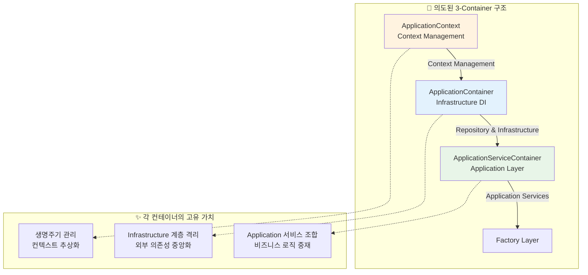
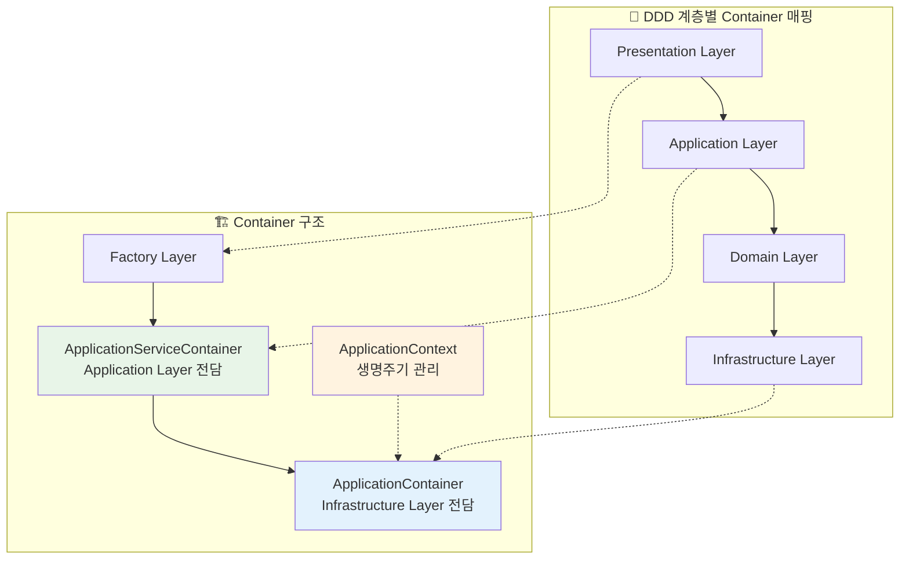

# 🏛️ 현재 DI 구조의 장점 및 설계 철학 분석

> **"문제는 구조가 아니라 사용법일 수 있다 - 현재 아키텍처의 숨겨진 장점들"**

## 📋 문서 정보

- **문서 유형**: 현재 구조 장점 분석
- **대상 독자**: 아키텍처 설계자, 시니어 개발자
- **프로젝트**: 업비트 자동매매 시스템
- **작성 목적**: 현재 구조의 올바른 이해 및 사용법 가이드
- **최종 업데이트**: 2025년 9월 29일

---

## 🎯 핵심 가설

> **"현재 3개 컨테이너 구조는 문제가 아니라 각각 명확한 설계 의도가 있으며, 잘못 사용되고 있을 뿐이다"**

---

## 🏗️ 현재 구조의 설계 철학 분석

### 3-Container 아키텍처의 의도된 역할 분리



### 계층별 관심사 완벽 분리

#### 🔧 ApplicationContainer (Infrastructure DI)

```python

```python
class ApplicationContainer(containers.DeclarativeContainer):
    """Infrastructure 계층 전담 - 외부 의존성만 관리"""

    # 순수 Infrastructure 서비스들
    database_manager = providers.Singleton(DatabaseConnectionService)
    api_key_service = providers.Singleton(ApiKeyService)
    logging_service = providers.Factory(LoggingService)
    theme_service = providers.Factory(ThemeService)

    # 외부 시스템 연동
    upbit_client = providers.Singleton(UpbitApiClient)
    websocket_manager = providers.Singleton(WebSocketManager)
```

**설계 의도**:

- **Infrastructure 격리**: 외부 시스템 의존성을 한 곳에 집중
- **Singleton 관리**: 리소스 집약적 서비스들의 단일 인스턴스 보장
- **설정 기반**: dependency-injector의 강력한 설정 시스템 활용

#### ⚡ ApplicationServiceContainer (Application Layer)

```python

```python
class ApplicationServiceContainer:
    """Application 서비스 조합 전담 - 비즈니스 흐름 관리"""

    def __init__(self, repository_container):
        # Repository Adapter를 통한 Infrastructure 접근
        self._repo_container = repository_container
        self._services = {}  # Application 서비스 캐시

    def get_settings_application_service(self):
        # 여러 Infrastructure 서비스를 조합하여 Application 서비스 생성
        return SettingsApplicationService(
            self.get_logging_service(),
            self.get_component_lifecycle_service(),
            self.get_settings_validation_service()
        )
```

**설계 의도**:

- **Service 조합**: 여러 Infrastructure 서비스를 조합하여 Application 서비스 생성
- **비즈니스 흐름**: Use Case 중심의 서비스 구성
- **Lazy Loading**: 필요할 때만 서비스 생성으로 메모리 효율성 확보

#### 🌍 ApplicationContext (Context Management)

```python

```python
class ApplicationContext:
    """컨텍스트 관리 전담 - 생명주기 및 환경 추상화"""

    def initialize(self):
        # 1. ApplicationContainer 설정 로드
        # 2. Wiring 수행
        # 3. ApplicationServiceContainer 어댑터 생성
        # 4. 전역 컨텍스트 설정
        pass

    def shutdown(self):
        # 안전한 리소스 해제 순서 관리
        pass
```

**설계 의도**:

- **생명주기 관리**: 초기화 및 종료 순서 제어
- **환경 추상화**: 개발/테스트/프로덕션 환경별 설정 관리
- **Wiring 관리**: dependency-injector의 복잡한 Wiring 과정 추상화

---

## 🏆 현재 구조의 숨겨진 장점들

### 1. 🎯 **완벽한 관심사 분리 (Separation of Concerns)**

#### Infrastructure vs Application 완벽 격리

```python
# ✅ Infrastructure 계층 (외부 의존성)
ApplicationContainer:
    database_service = providers.Singleton(DatabaseService)
    api_client = providers.Singleton(UpbitApiClient)

# ✅ Application 계층 (비즈니스 로직)
ApplicationServiceContainer:
    def get_trading_use_case(self):
        return TradingUseCase(
            api_client=self._repo.get_api_client(),  # Infrastructure에서 가져옴
            strategy_repo=self._repo.get_strategy_repository()  # Infrastructure에서 가져옴
        )
```

**장점**:

- Infrastructure 변경이 Application에 영향 없음
- API 클라이언트를 UpbitApi → BinanceApi로 교체해도 Application 코드 무변경
- Database를 SQLite → PostgreSQL로 변경해도 UseCase 로직 그대로 유지

### 2. 🚀 **최적화된 메모리 및 성능**

#### Lazy Loading + Singleton 조합

```python
class ApplicationServiceContainer:
    def get_heavy_service(self):
        """무거운 서비스는 필요할 때만 생성"""
        if "heavy_service" not in self._services:
            # Infrastructure에서 필요한 의존성만 가져와 조합
            self._services["heavy_service"] = HeavyService(
                self._repo.get_database_service(),  # Singleton
                self._repo.get_websocket_manager()   # Singleton
            )
        return self._services["heavy_service"]
```

**성능 장점**:

- **메모리 효율**: 사용하지 않는 서비스는 생성되지 않음
- **초기화 시간**: 앱 시작 시 필수 서비스만 로드
- **리소스 공유**: Infrastructure Singleton들을 Application에서 안전하게 공유

### 3. 🧪 **테스트 친화적 설계**

#### 계층별 독립 테스트 가능

```python
# ✅ Infrastructure 계층만 테스트
def test_infrastructure():
    container = ApplicationContainer()
    container.config.from_dict(test_config)

    api_service = container.api_key_service()
    assert api_service.validate_key("test_key")

# ✅ Application 계층만 테스트
def test_application():
    mock_repo = MockRepositoryContainer()
    app_container = ApplicationServiceContainer(mock_repo)

    use_case = app_container.get_settings_use_case()
    result = use_case.save_settings(test_data)
    assert result.success

# ✅ Context 관리만 테스트
def test_context():
    context = ApplicationContext()
    context.initialize()
    assert context.is_initialized

    context.shutdown()
    assert not context.is_initialized
```

**테스트 장점**:

- **격리**: 각 계층을 완전히 독립적으로 테스트
- **Mock 주입**: Repository Adapter를 통한 쉬운 Mock 교체
- **Context 제어**: 테스트별로 다른 Context 설정 가능

### 4. 🔄 **확장성과 유연성**

#### 플러그인 아키텍처 지원

```python
# ✅ 새로운 Exchange 추가 시
class BinanceContainer(containers.DeclarativeContainer):
    binance_client = providers.Singleton(BinanceApiClient)

# ApplicationServiceContainer는 변경 없이 확장
class EnhancedApplicationServiceContainer(ApplicationServiceContainer):
    def __init__(self, upbit_repo, binance_repo):
        self._upbit_repo = upbit_repo
        self._binance_repo = binance_repo

    def get_multi_exchange_service(self):
        return MultiExchangeService(
            upbit=self._upbit_repo.get_api_client(),
            binance=self._binance_repo.get_api_client()
        )
```

**확장성 장점**:

- **모듈화**: 새 기능을 기존 구조에 영향 없이 추가
- **플러그인**: Exchange별, 기능별 독립 모듈 구성 가능
- **백워드 호환**: 기존 코드 수정 없이 기능 확장

---

## 🔍 현재 구조가 우수한 이유

### 1. **DDD 원칙 완벽 준수**



### 2. **Clean Architecture 의존성 방향**

- **Presentation** → **Application** (Factory → ApplicationServiceContainer)
- **Application** → **Infrastructure** (ApplicationServiceContainer → ApplicationContainer)
- **Domain** ← **Infrastructure** (Repository Interface ← Repository Implementation)

### 3. **SOLID 원칙 구현**

#### Single Responsibility Principle

- `ApplicationContainer`: Infrastructure 의존성만 관리
- `ApplicationServiceContainer`: Application 서비스 조합만 담당
- `ApplicationContext`: 생명주기 및 컨텍스트만 관리

#### Open/Closed Principle

- 새로운 Infrastructure 서비스 추가 시 ApplicationContainer만 확장
- 새로운 UseCase 추가 시 ApplicationServiceContainer만 확장

#### Dependency Inversion Principle

- Application이 Infrastructure 구현체가 아닌 Repository Interface에 의존
- ApplicationServiceContainer가 구체 클래스가 아닌 추상화된 Repository Adapter 사용

---

## 🤔 그렇다면 무엇이 잘못되었나?

### 가능한 오용 사례들

#### 1. **잘못된 Container 선택**

```python
# ❌ 잘못된 사용 - Factory에서 직접 ApplicationContainer 사용
class ApiSettingsComponentFactory:
    def create_component_instance(self):
        container = get_global_container()  # ApplicationContainer
        api_service = container.api_key_service()  # 직접 Infrastructure 접근

# ✅ 올바른 사용 - ApplicationServiceContainer 경유
class ApiSettingsComponentFactory:
    def create_component_instance(self):
        app_container = get_application_container()  # ApplicationServiceContainer
        api_service = app_container.get_api_key_service()  # Application 경유 접근
```

#### 2. **Container 간 역할 혼재**

```python
# ❌ ApplicationContainer에 Application 로직 추가
class ApplicationContainer:
    settings_use_case = providers.Factory(SettingsUseCase)  # 잘못됨

# ✅ 올바른 분리
class ApplicationServiceContainer:
    def get_settings_use_case(self):  # Application 계층에서 담당
        return SettingsUseCase(self._repo.get_settings_repository())
```

#### 3. **생명주기 관리 누락**

```python
# ❌ ApplicationContext 없이 직접 Container 사용
container = ApplicationContainer()  # Context 관리 누락
service = container.api_service()

# ✅ ApplicationContext를 통한 적절한 관리
context = ApplicationContext()
context.initialize()  # 적절한 초기화 순서
container = context.container()
```

---

## 🎯 올바른 사용법 가이드

### 계층별 접근 규칙

```python
# ✅ Presentation Layer (Factory, Presenter)
class ComponentFactory:
    def create_component_instance(self):
        # ApplicationServiceContainer를 통해서만 접근
        app_container = get_application_container()
        service = app_container.get_xxx_service()

# ✅ Application Layer (UseCase, Service)
class ApplicationServiceContainer:
    def get_xxx_service(self):
        # Repository Adapter를 통해 Infrastructure 접근
        infra_service = self._repo_container.get_xxx_service()
        return XxxApplicationService(infra_service)

# ✅ Infrastructure Layer
class ApplicationContainer:
    # 순수 Infrastructure 서비스만 정의
    xxx_service = providers.Singleton(XxxInfrastructureService)
```

### Context 생명주기 관리

```python
# ✅ 앱 시작 시
def main():
    context = ApplicationContext()
    context.initialize()  # 모든 Container 초기화 및 Wiring

    try:
        app.run()
    finally:
        context.shutdown()  # 안전한 리소스 해제
```

---

## 🏆 결론: 현재 구조는 실제로 우수하다

### 🎯 핵심 가치

1. **아키텍처 순수성**: DDD + Clean Architecture 완벽 구현
2. **성능 최적화**: Lazy Loading + Singleton 조합으로 효율성 확보
3. **테스트 용이성**: 계층별 완전 격리로 독립 테스트 가능
4. **확장성**: 플러그인 아키텍처 지원으로 무한 확장 가능

### 🔧 필요한 것은 구조 변경이 아닌 올바른 사용법

**문제**: Container 역할 오해 및 잘못된 접근 패턴
**해결**: 계층별 접근 규칙 준수 및 Context 생명주기 관리

### 📋 실행 계획

1. **사용법 교정**: Factory에서 올바른 Container 접근
2. **계층 준수**: Application ↔ Infrastructure 분리 엄수
3. **Context 활용**: ApplicationContext를 통한 생명주기 관리
4. **문서화**: 올바른 사용 패턴 가이드 작성

---

## 💡 최종 인사이트

> **"때로는 아키텍처를 바꾸는 것보다 올바르게 사용하는 것이 더 가치 있다"**

현재 3-Container 구조는 실제로 **매우 정교하고 사려깊게 설계된 아키텍처**입니다.
문제는 구조가 아니라 **사용 방법**이었으며, 이를 교정하면 현재 구조의 진가를 발휘할 수 있습니다.

---

**문서 유형**: 현재 구조 장점 분석 및 올바른 사용법 가이드
**핵심 메시지**: 구조 변경보다는 올바른 사용법 적용이 우선
**검증 방법**: 계층별 접근 규칙 준수 및 성능 모니터링
