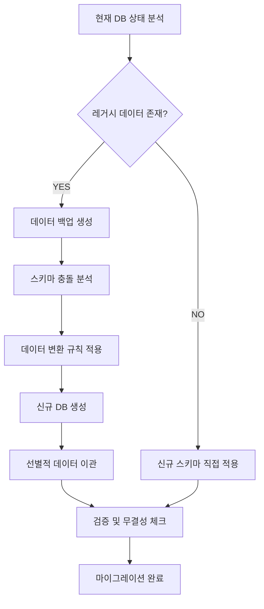

# 🗃️ DB 마이그레이션 및 정리 시스템 계획서

## 🎯 **문제점 분석**

### 🚨 **현재 문제상황**
1. **기획 변경 시 DB 구조 불일치**: 신규 스키마 vs 레거시 데이터 충돌
2. **디버깅 지옥**: 코드 문제인지 DB 문제인지 구분 어려움
3. **마이그레이션 관리 부족**: 스키마 변경 이력 추적 불가
4. **개발 토큰 낭비**: 잘못된 원인 분석으로 인한 시간 소모

### 🎯 **목표**
- **원클릭 DB 초기화**: 깨끗한 상태에서 개발 시작
- **스마트 마이그레이션**: 필요한 데이터만 선별적 이관
- **스키마 버전 관리**: 레거시 ↔ 신규 스키마 명확한 구분
- **자동화된 검증**: DB 상태 검증 및 문제 조기 발견

---

## 🏗️ **시스템 아키텍처**

### 📋 **3단계 프로세스**
```
1️⃣ BACKUP & ANALYZE     →     2️⃣ CLEAN MIGRATION     →     3️⃣ VALIDATE & VERIFY
   현재 DB 분석 및 백업          신규 스키마 적용           데이터 무결성 검증
```

### 🔄 **마이그레이션 플로우**


---

## 📂 **디렉토리 구조**

```
upbit_auto_trading/
├── data_layer/
│   ├── storage/
│   │   ├── migration_manager.py     # 🔧 기존 마이그레이션 관리자
│   │   └── db_cleanup_manager.py    # 🆕 DB 정리 관리자 (신규)
│   ├── migrations/                  # 🆕 마이그레이션 스크립트 폴더
│   │   ├── __init__.py
│   │   ├── schema_definitions/      # 스키마 정의
│   │   │   ├── legacy_schema.py     # 레거시 스키마 정의
│   │   │   ├── current_schema.py    # 현재(신규) 스키마 정의
│   │   │   └── version_registry.py  # 버전 관리
│   │   ├── data_transformers/       # 데이터 변환기
│   │   │   ├── strategy_transformer.py
│   │   │   ├── backtest_transformer.py
│   │   │   └── portfolio_transformer.py
│   │   └── scripts/                 # 마이그레이션 스크립트
│   │       ├── v1_to_v2_migration.py
│   │       └── emergency_rollback.py
│   └── validation/                  # 🆕 검증 시스템
│       ├── schema_validator.py      # 스키마 검증
│       ├── data_integrity_checker.py
│       └── performance_validator.py
└── tools/                           # 🆕 개발 도구
    ├── db_cleanup_tool.py           # CLI 도구
    └── migration_wizard.py          # 대화형 마이그레이션 도구
```

---

## 🛠️ **핵심 컴포넌트**

### 1️⃣ **DB 정리 관리자 (DB Cleanup Manager)**

```python
class DBCleanupManager:
    """DB 초기화 및 정리를 담당하는 클래스"""
    
    def analyze_current_state(self) -> Dict:
        """현재 DB 상태 분석"""
        
    def create_backup(self, backup_name: str) -> str:
        """백업 생성"""
        
    def apply_clean_schema(self, schema_version: str) -> bool:
        """깨끗한 스키마 적용"""
        
    def migrate_selective_data(self, migration_rules: Dict) -> bool:
        """선별적 데이터 이관"""
        
    def validate_migration(self) -> ValidationResult:
        """마이그레이션 결과 검증"""
```

### 2️⃣ **스키마 버전 관리 (Schema Version Registry)**

```python
SCHEMA_VERSIONS = {
    "v1.0": {
        "name": "Legacy Schema",
        "description": "기존 단순 전략 시스템",
        "tables": ["strategy", "backtest", "portfolio"],
        "migration_path": "v1_to_v2_migration.py"
    },
    "v2.0": {
        "name": "Strategy Combination Schema", 
        "description": "전략 조합 시스템 + 포지션 관리",
        "tables": ["strategy_definitions", "strategy_combinations", "positions"],
        "migration_path": None  # 최신 버전
    }
}
```

### 3️⃣ **데이터 변환 규칙 (Data Transformation Rules)**

```python
MIGRATION_RULES = {
    "strategy_migration": {
        "source_table": "strategy",
        "target_table": "strategy_definitions", 
        "field_mapping": {
            "id": "id",
            "name": "name", 
            "parameters": "default_parameters"
        },
        "default_values": {
            "strategy_type": "entry",
            "class_name": "LegacyStrategy"
        }
    },
    "backtest_preservation": {
        "preserve_tables": ["backtest_results", "trade_logs"],
        "archive_old": True
    }
}
```

---

## ⚡ **개발 태스크**

### 🔥 **Phase 1: 기반 인프라 구축 (3일)**

| 우선순위 | 태스크 | 예상 시간 | 담당 컴포넌트 |
|---------|--------|-----------|---------------|
| 🟢 HIGH | DB 정리 관리자 클래스 구현 | 1일 | `db_cleanup_manager.py` |
| 🟢 HIGH | 스키마 버전 레지스트리 구축 | 0.5일 | `version_registry.py` |
| 🟢 HIGH | 레거시 스키마 정의 | 0.5일 | `legacy_schema.py` |
| 🟡 MED | 백업 시스템 통합 | 1일 | `backup_manager.py` 확장 |

### 🚀 **Phase 2: 마이그레이션 로직 구현 (3일)**

| 우선순위 | 태스크 | 예상 시간 | 담당 컴포넌트 |
|---------|--------|-----------|---------------|
| 🟢 HIGH | 데이터 변환기 구현 | 1.5일 | `data_transformers/` |
| 🟢 HIGH | 선별적 이관 로직 | 1일 | `migration_manager.py` 확장 |
| 🟡 MED | 충돌 해결 메커니즘 | 0.5일 | `conflict_resolver.py` |

### 🔍 **Phase 3: 검증 시스템 구축 (2일)**

| 우선순위 | 태스크 | 예상 시간 | 담당 컴포넌트 |
|---------|--------|-----------|---------------|
| 🟢 HIGH | 스키마 무결성 검증 | 1일 | `schema_validator.py` |
| 🟡 MED | 데이터 일관성 체크 | 0.5일 | `data_integrity_checker.py` |
| 🟡 MED | 성능 검증 | 0.5일 | `performance_validator.py` |

### 🎯 **Phase 4: 개발자 도구 구축 (2일)**

| 우선순위 | 태스크 | 예상 시간 | 담당 컴포넌트 |
|---------|--------|-----------|---------------|
| 🟢 HIGH | CLI 도구 개발 | 1일 | `db_cleanup_tool.py` |
| 🟡 MED | 대화형 마이그레이션 도구 | 1일 | `migration_wizard.py` |

---

## 🎮 **사용법 예시**

### 🚨 **긴급 DB 초기화 (원클릭)**
```bash
# 현재 DB를 완전 초기화하고 최신 스키마 적용
python tools/db_cleanup_tool.py --reset-to-latest --backup-name "emergency_backup"
```

### 🔄 **스마트 마이그레이션 (레거시 데이터 보존)**
```bash
# 기존 데이터를 분석하여 필요한 것만 새 스키마로 이관
python tools/migration_wizard.py --interactive --preserve-backtests --preserve-strategies
```

### 🔍 **DB 상태 진단**
```bash
# 현재 DB 상태 분석 및 문제점 도출
python tools/db_cleanup_tool.py --analyze --report-format json
```

---

## 🎯 **예상 효과**

### ✅ **개발 효율성 향상**
- **디버깅 시간 70% 단축**: DB 문제 vs 코드 문제 명확한 구분
- **기획 변경 대응 속도 5배 향상**: 원클릭으로 깨끗한 상태 복원
- **토큰 사용량 50% 절약**: 잘못된 원인 분석 방지

### 🛡️ **안정성 향상**
- **제로 데이터 손실**: 완전한 백업 시스템
- **롤백 가능**: 언제든 이전 상태로 복원
- **무결성 보장**: 자동화된 검증 시스템

### 📈 **유지보수성 향상**  
- **스키마 히스토리 추적**: 모든 변경사항 기록
- **문서화 자동화**: 스키마 변경시 자동 문서 업데이트
- **테스트 환경 일관성**: 동일한 초기 상태 보장

---

## 📋 **체크리스트**

### 🔧 **구현 전 준비사항**
- [ ] 현재 DB 구조 완전 분석
- [ ] 백업 저장소 용량 확보 (최소 5GB)
- [ ] 테스트 환경 분리 설정
- [ ] 기존 마이그레이션 코드 호환성 확인

### ✅ **완료 기준**
- [ ] 원클릭 DB 초기화 동작 확인
- [ ] 레거시 데이터 이관 성공 
- [ ] 모든 검증 테스트 통과
- [ ] 롤백 메커니즘 동작 확인
- [ ] 문서화 완료

---

> **💡 핵심 철학**: "기획이 바뀌어도 DB 때문에 막히지 않는 개발환경 구축"

**🎯 최종 목표**: 새로운 기획이나 아키텍처 변경 시 **5분 내에 깨끗한 DB 환경**에서 개발을 재시작할 수 있는 시스템 완성!
