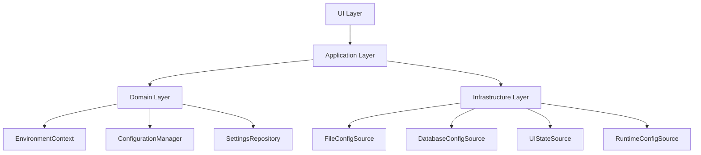

# 환경 프로파일 통합 관리 시스템 개발 가이드

## 📚 문서 개요

**문서 유형**: 개발 가이드
**대상 독자**: 시스템 개발자, 아키텍트
**최종 수정**: 2025-08-11
**버전**: 1.0

## 🎯 개발 목표

업비트 자동매매 시스템의 분산된 설정 관리를 **중앙 집중식 환경 프로파일 시스템**으로 통합하여, 설정의 일관성과 확장성을 보장합니다.

## 🏗️ 시스템 아키텍처

### 핵심 구성 요소



### 계층별 역할

| 계층 | 역할 | 주요 컴포넌트 |
|------|------|---------------|
| **UI Layer** | 사용자 인터페이스 | ProfileSelector, SettingsPanel |
| **Application Layer** | Use Case 구현 | EnvironmentSwitchUseCase, ConfigSyncUseCase |
| **Domain Layer** | 비즈니스 로직 | EnvironmentContext, ConfigurationManager |
| **Infrastructure Layer** | 외부 저장소 연동 | FileConfigSource, DatabaseConfigSource |

## 🔧 개발자 설정 추가 가이드

### 1. 새로운 설정 항목 추가

#### Step 1: 도메인 모델 확장

```python
# domain/models/environment_context.py
@dataclass
class EnvironmentContext:
    # 기존 설정들
    name: str
    database_config: Dict[str, Any]

    # 🆕 새로운 설정 추가
    trading_config: Dict[str, Any]  # 새로운 설정 카테고리
    notification_config: Dict[str, Any]  # 알림 설정

    def resolve_trading_setting(self, key: str) -> Any:
        """거래 관련 설정값 해석"""
        return self._resolve_with_priority('trading_config', key)
```

#### Step 2: 설정 소스 구현

```python
# infrastructure/config_sources/trading_config_source.py
class TradingConfigSource(ConfigSourceInterface):
    def __init__(self):
        self._file_path = "config/trading.yaml"

    def load_config(self, environment: str) -> Dict[str, Any]:
        """거래 설정 로드"""
        # 파일/DB/UI에서 설정 로드 로직
        pass

    def save_config(self, environment: str, config: Dict[str, Any]) -> bool:
        """거래 설정 저장"""
        # 설정 저장 로직
        pass
```

#### Step 3: 설정 검증 규칙 추가

```python
# domain/validators/trading_config_validator.py
class TradingConfigValidator:
    def validate(self, config: Dict[str, Any]) -> ValidationResult:
        """거래 설정 유효성 검증"""
        errors = []

        # 필수 필드 검증
        required_fields = ['max_position_size', 'stop_loss_percentage']
        for field in required_fields:
            if field not in config:
                errors.append(f"Required field missing: {field}")

        return ValidationResult(is_valid=len(errors) == 0, errors=errors)
```

### 2. 설정 우선순위 정의

```python
# domain/services/configuration_manager.py
class ConfigurationManager:
    PRIORITY_ORDER = [
        'runtime',      # 최고 우선순위 (실행 중 변경)
        'ui_state',     # UI에서 설정한 값
        'database',     # DB에 저장된 값
        'file',         # 파일에 정의된 기본값
        'default'       # 하드코딩된 기본값
    ]

    def resolve_setting(self, key: str) -> Any:
        """우선순위에 따른 설정값 해석"""
        for source in self.PRIORITY_ORDER:
            value = self._get_from_source(source, key)
            if value is not None:
                return value
        return self._get_default_value(key)
```

## 📋 미사용 설정 관리 전략

### 1. 설정 생명주기 관리

```python
# domain/models/setting_metadata.py
@dataclass
class SettingMetadata:
    key: str
    status: SettingStatus  # ACTIVE, DEPRECATED, EXPERIMENTAL
    version_introduced: str
    version_deprecated: Optional[str]
    migration_path: Optional[str]

class SettingStatus(Enum):
    ACTIVE = "active"           # 현재 사용 중
    DEPRECATED = "deprecated"   # 사용 중단 예정
    EXPERIMENTAL = "experimental"  # 실험적 기능
    REMOVED = "removed"         # 제거됨
```

### 2. 설정 마이그레이션 시스템

```python
# application/services/config_migration_service.py
class ConfigMigrationService:
    def __init__(self):
        self._migrations = {
            "1.0.0": [
                RenameSettingMigration("old_key", "new_key"),
                RemoveSettingMigration("obsolete_key"),
                AddDefaultValueMigration("new_feature_flag", False)
            ]
        }

    def migrate_to_version(self, config: Dict, target_version: str) -> Dict:
        """설정을 지정된 버전으로 마이그레이션"""
        current_version = config.get('_version', '0.0.0')

        for version, migrations in self._migrations.items():
            if self._is_version_newer(version, current_version):
                for migration in migrations:
                    config = migration.apply(config)

        config['_version'] = target_version
        return config
```

## 🔄 설정 변경 대응 패턴

### 1. 설정 추가 패턴

```python
# 새로운 설정 추가 시 기본값 제공
class AddSettingMigration(MigrationInterface):
    def __init__(self, key: str, default_value: Any):
        self.key = key
        self.default_value = default_value

    def apply(self, config: Dict) -> Dict:
        if self.key not in config:
            config[self.key] = self.default_value
            self._log_migration(f"Added new setting: {self.key}")
        return config
```

### 2. 설정 변경 패턴

```python
# 설정 이름 변경 시 자동 마이그레이션
class RenameSettingMigration(MigrationInterface):
    def __init__(self, old_key: str, new_key: str):
        self.old_key = old_key
        self.new_key = new_key

    def apply(self, config: Dict) -> Dict:
        if self.old_key in config and self.new_key not in config:
            config[self.new_key] = config[self.old_key]
            del config[self.old_key]
            self._log_migration(f"Renamed {self.old_key} -> {self.new_key}")
        return config
```

### 3. 설정 삭제 패턴

```python
# 설정 삭제 시 경고와 함께 점진적 제거
class DeprecateSettingMigration(MigrationInterface):
    def __init__(self, key: str, removal_version: str):
        self.key = key
        self.removal_version = removal_version

    def apply(self, config: Dict) -> Dict:
        if self.key in config:
            logger.warning(
                f"Setting '{self.key}' is deprecated and will be removed in version {self.removal_version}"
            )
            # 현재는 유지하되, 메타데이터에 deprecated 표시
            config[f'_{self.key}_deprecated'] = True
        return config
```

## 🛠️ 개발 도구 및 유틸리티

### 1. 설정 검증 도구

```python
# tools/config_validator.py
class ConfigurationValidator:
    def validate_all_environments(self) -> ValidationReport:
        """모든 환경의 설정 유효성 검증"""
        report = ValidationReport()

        for env in ['development', 'testing', 'production']:
            try:
                context = self._load_environment_context(env)
                validation_result = self._validate_context(context)
                report.add_environment_result(env, validation_result)
            except Exception as e:
                report.add_error(env, str(e))

        return report
```

### 2. 설정 동기화 도구

```python
# tools/config_sync.py
class ConfigurationSynchronizer:
    def sync_file_to_database(self, environment: str) -> bool:
        """파일 설정을 데이터베이스로 동기화"""
        file_config = self._load_from_file(environment)
        db_config = self._load_from_database(environment)

        diff = self._calculate_diff(file_config, db_config)
        if diff.has_changes():
            self._apply_changes_to_database(diff)
            return True
        return False
```

## 📊 모니터링 및 로깅

### 1. 설정 변경 추적

```python
# domain/events/configuration_events.py
@dataclass
class ConfigurationChanged(DomainEvent):
    environment: str
    key: str
    old_value: Any
    new_value: Any
    source: str  # 'file', 'database', 'ui', 'runtime'
    user_id: Optional[str]
    timestamp: datetime
```

### 2. 설정 상태 모니터링

```python
# monitoring/config_health_check.py
class ConfigurationHealthCheck:
    def check_consistency(self) -> HealthReport:
        """설정 일관성 검증"""
        inconsistencies = []

        for env in self._get_all_environments():
            sources = self._load_all_sources(env)
            conflicts = self._detect_conflicts(sources)
            if conflicts:
                inconsistencies.extend(conflicts)

        return HealthReport(
            is_healthy=len(inconsistencies) == 0,
            issues=inconsistencies
        )
```

## 🚀 확장성 고려사항

### 1. 플러그인 시스템

```python
# extensions/config_plugin_interface.py
class ConfigurationPlugin(ABC):
    @abstractmethod
    def get_config_schema(self) -> Dict[str, Any]:
        """플러그인의 설정 스키마 반환"""
        pass

    @abstractmethod
    def validate_config(self, config: Dict[str, Any]) -> ValidationResult:
        """플러그인별 설정 검증"""
        pass

    @abstractmethod
    def on_config_changed(self, key: str, old_value: Any, new_value: Any):
        """설정 변경 시 플러그인 알림"""
        pass
```

### 2. 다중 환경 지원

```python
# domain/models/environment_hierarchy.py
class EnvironmentHierarchy:
    """환경 상속 구조 지원"""
    def __init__(self):
        self._hierarchy = {
            'production': [],
            'staging': ['production'],
            'development': ['staging', 'production'],
            'local': ['development', 'staging', 'production']
        }

    def resolve_inherited_config(self, environment: str) -> Dict[str, Any]:
        """상위 환경에서 설정을 상속받아 병합"""
        config = {}

        # 상위 환경부터 순차적으로 적용
        for parent_env in reversed(self._hierarchy.get(environment, [])):
            parent_config = self._load_environment_config(parent_env)
            config.update(parent_config)

        # 현재 환경 설정으로 오버라이드
        current_config = self._load_environment_config(environment)
        config.update(current_config)

        return config
```

## 📝 베스트 프랙티스

### 1. 설정 이름 규칙

```python
# 네이밍 컨벤션
SETTING_NAMING_RULES = {
    "prefix": "component_name",      # trading_max_position
    "delimiter": "_",                # underscore 사용
    "case": "snake_case",           # 소문자 + 언더스코어
    "boolean_prefix": "is_" or "enable_",  # is_debug_mode, enable_logging
    "list_suffix": "_list",         # allowed_symbols_list
    "time_suffix": "_seconds",      # timeout_seconds
}
```

### 2. 설정 문서화

```yaml
# config/schema/trading_config.yaml
trading_config:
  max_position_size:
    type: number
    description: "최대 포지션 크기 (KRW)"
    default: 100000
    min: 1000
    max: 10000000
    required: true

  stop_loss_percentage:
    type: number
    description: "손절매 비율 (%)"
    default: 5.0
    min: 0.1
    max: 50.0
    required: true
```

## 🔧 개발 환경 설정

### 필요한 도구

```bash
# 설정 검증 스크립트
python tools/validate_config.py --environment all

# 설정 동기화 스크립트
python tools/sync_config.py --from file --to database --environment development

# 설정 마이그레이션 실행
python tools/migrate_config.py --from 1.0.0 --to 1.1.0
```

## 📚 참고 자료

### 관련 디자인 패턴
- **Configuration Provider Pattern**: ASP.NET Core
- **Strategy Pattern**: 설정 소스별 로딩 전략
- **Observer Pattern**: 설정 변경 알림
- **Command Pattern**: 설정 변경 추적

### 외부 라이브러리
- **Pydantic**: 설정 검증 및 직렬화
- **PyYAML**: YAML 설정 파일 처리
- **SQLAlchemy**: 데이터베이스 설정 관리

---

**💡 중요**: 이 시스템의 성공은 **일관된 설정 관리 규칙**을 모든 개발자가 준수하는 데 달려 있습니다. 새로운 설정 추가 시 반드시 이 가이드를 따르고, 코드 리뷰에서 설정 관리 규칙 준수를 확인해주시기 바랍니다.
