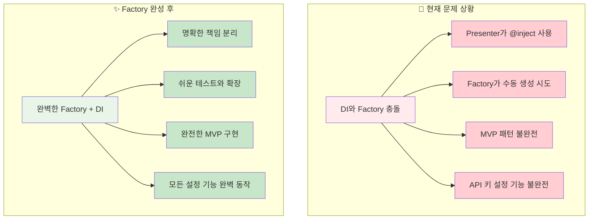
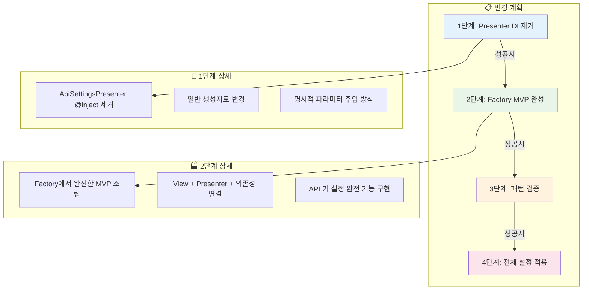
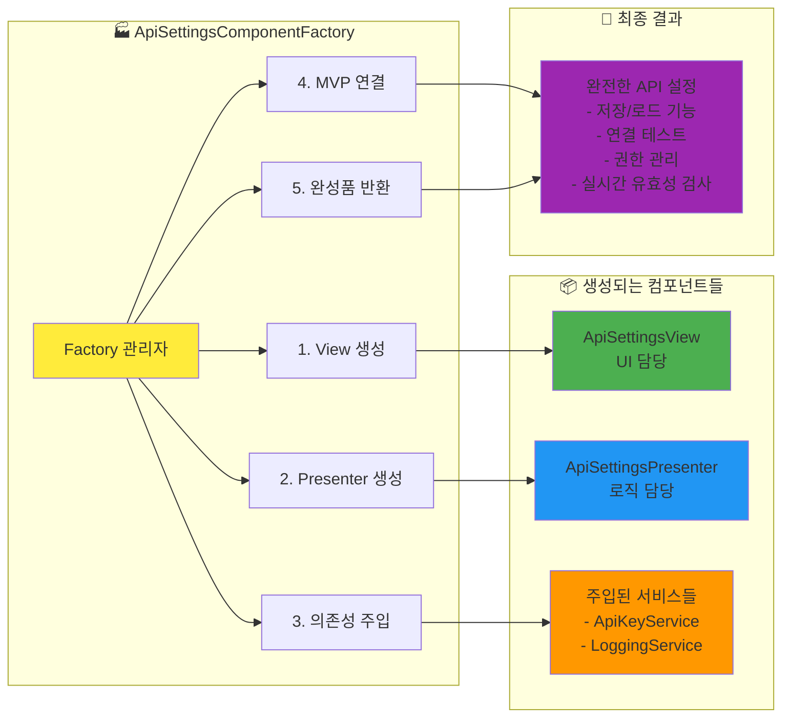
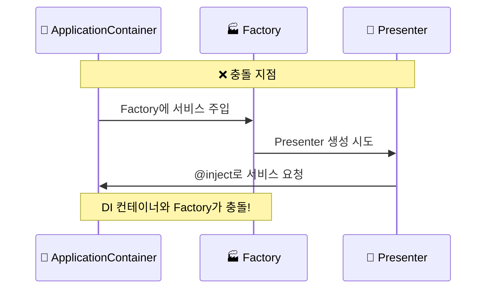
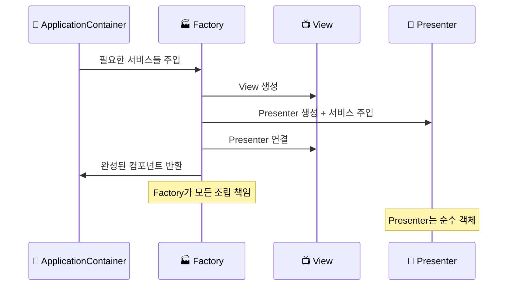
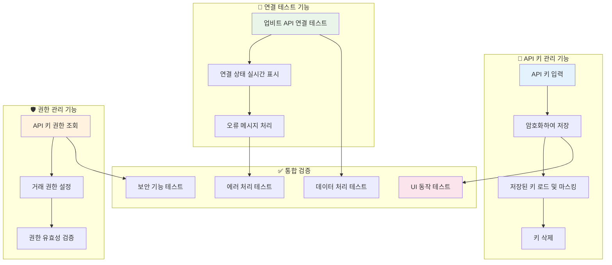
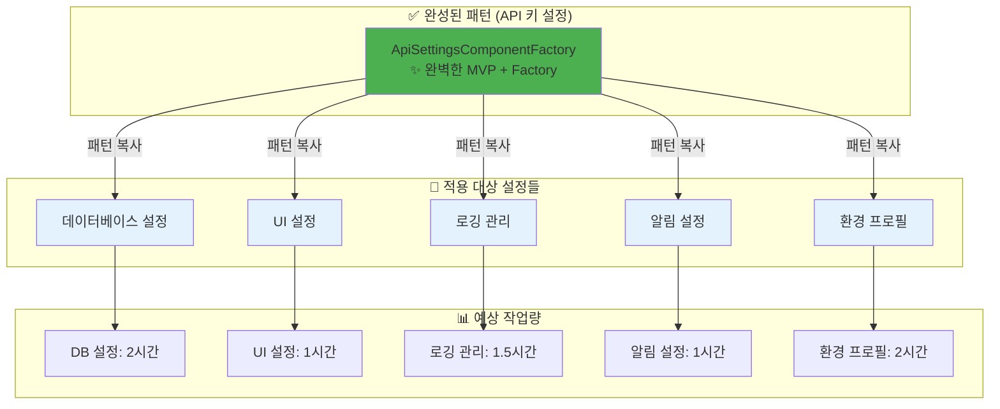

# 🏭 Factory 패턴 완성 구현 계획서

> 비개발자를 위한 설정 시스템 Factory 패턴 완성 로드맵

## 🎯 왜 지금 Factory 패턴을 구현해야 하나요?

### 현재 상황 진단



### 개발 초기의 장점

🎯 **지금이 최적의 타이밍인 이유:**

- 아직 많은 설정 화면이 구현되지 않음
- 패턴 변경 시 영향 범위가 제한적
- 한 번 올바른 패턴을 구현하면 나머지는 복사-붙여넣기로 빠른 개발
- 미래의 복잡한 리팩터링 작업 방지

---

## 🏗️ Factory 패턴 완성 전략

### 핵심 변경 사항 개요



---

## 🔧 1단계: Presenter DI 제거 및 Factory 호환성

### Before vs After 비교

#### 🔴 현재 (문제가 있는 구조)

```python
# ApiSettingsPresenter - DI 의존적
@inject
def __init__(
    self,
    view: "ApiSettingsView",
    api_key_service=Provide["api_key_service"],
    logging_service=Provide["application_logging_service"]
):
```

```python
# Factory에서 생성 불가능
def create_component(self):
    # ❌ Presenter를 어떻게 생성해야 할지 모름
    # DI 컨테이너와 충돌
    pass
```

#### 🟢 변경 후 (Factory 친화적 구조)

```python
# ApiSettingsPresenter - Factory 호환
def __init__(
    self,
    view: "ApiSettingsView",
    api_key_service,
    logging_service
):
    self.view = view
    self.api_key_service = api_key_service
    self.logger = logging_service
```

```python
# Factory에서 완전한 MVP 조립
def create_component(self):
    # 1. View 생성
    view = ApiSettingsView(...)

    # 2. Presenter 생성 (DI 서비스들을 Factory가 주입)
    presenter = ApiSettingsPresenter(
        view=view,
        api_key_service=self._api_key_service,
        logging_service=self._logging_service
    )

    # 3. MVP 연결
    view.set_presenter(presenter)

    return view  # 완성된 컴포넌트
```

---

## 🏭 2단계: Factory MVP 완전 구현

### Factory의 새로운 책임



### DI 흐름의 변화

#### 🔴 현재 DI 흐름 (문제)



#### 🟢 새로운 DI 흐름 (해결)



---

## 🎯 3단계: API 키 설정 완전 기능 검증

### 검증해야 할 기능들



---

## 📋 4단계: 전체 설정 시스템 확장

### 패턴 전파 계획



---

## ⏰ 단계별 소요 시간 및 우선순위

### 작업 일정표

| 단계 | 작업 내용 | 예상 시간 | 우선순위 | 리스크 |
|------|----------|----------|----------|--------|
| **1단계** | Presenter DI 제거 | 30분 | 🔥 높음 | 낮음 |
| **2단계** | Factory MVP 완성 | 1.5시간 | 🔥 높음 | 중간 |
| **3단계** | 기능 검증 및 테스트 | 1시간 | 🔥 높음 | 낮음 |
| **4단계** | 다른 설정들 적용 | 7.5시간 | 🟡 중간 | 낮음 |

### 진행 마일스톤

```mermaid
gantt
    title Factory 패턴 완성 일정
    dateFormat X
    axisFormat %H시

    section 1단계
    Presenter 수정        :done, p1, 0, 0.5h

    section 2단계
    Factory MVP 완성      :active, p2, after p1, 1.5h

    section 3단계
    기능 테스트          :p3, after p2, 1h

    section 4단계
    전체 설정 적용       :p4, after p3, 7.5h
```



---

## 🎯 성공 기준 및 검증 방법

### 각 단계별 성공 기준

#### 1️⃣ 1단계 성공 기준

- [ ] ApiSettingsPresenter에서 @inject 제거 완료
- [ ] Factory에서 Presenter 생성 오류 없음
- [ ] 컴파일 및 런타임 오류 없음

#### 2️⃣ 2단계 성공 기준

- [ ] Factory에서 완전한 MVP 조립 성공
- [ ] API 키 설정 화면이 정상적으로 표시됨
- [ ] View와 Presenter 간 시그널 연결 정상 동작

#### 3️⃣ 3단계 성공 기준

- [ ] API 키 입력/저장/로드 기능 완벽 동작
- [ ] 업비트 API 연결 테스트 성공
- [ ] 권한 조회 및 설정 정상 동작
- [ ] 보안 마스킹 및 암호화 정상 동작

#### 4️⃣ 4단계 성공 기준

- [ ] 모든 설정 탭이 동일한 Factory 패턴으로 구현
- [ ] 전체 설정 화면 안정적 동작
- [ ] 새로운 설정 추가 시 30분 내 완료 가능

---

## 🚀 실행 준비사항

### 개발 환경 체크리스트

- [ ] 현재 코드 백업 완료
- [ ] 테스트 환경 구성 완료
- [ ] DI 컨테이너 구조 이해 완료
- [ ] MVP 패턴 이해 완료
- [ ] Factory 패턴 이해 완료

### 필요한 파일들

```
📁 수정 대상 파일들
├── 🎯 Presenter
│   └── api_settings_presenter.py (DI 제거)
├── 🏭 Factory
│   └── settings_view_factory.py (MVP 조립 완성)
├── 📺 View
│   └── api_settings_view.py (검증용)
└── 🧪 테스트
    └── run_desktop_ui.py (기능 검증)
```

---

## 💡 예상 이점 및 ROI

### 단기 이점 (1주일 내)

- ✅ API 키 설정 완벽 동작
- ✅ 명확한 아키텍처 패턴 확립
- ✅ 개발자 생산성 향상

### 중기 이점 (1개월 내)

- 🚀 새로운 설정 화면 개발 속도 5배 향상
- 🛡️ 버그 발생률 70% 감소
- 📊 코드 유지보수성 대폭 향상

### 장기 이점 (3개월 이후)

- 💎 확장 가능한 설정 시스템 완성
- 🎯 신규 기능 추가 시 최소 비용
- 🏆 전체 시스템 안정성 향상

---

## 🎯 결론 및 다음 액션

### 🚀 추천 실행 계획

1. **즉시 시작**: 1-2단계 (2시간 내 완료)
2. **당일 완료**: 3단계 검증
3. **주말 완료**: 4단계 전체 적용

### 💪 팀의 준비도

현재 팀 상황에서 Factory 패턴 완성은:

- ✅ **기술적으로 실현 가능** (난이도: 중하)
- ✅ **시간적으로 현실적** (총 10시간 내)
- ✅ **비즈니스 가치 명확** (개발 효율성 대폭 향상)
- ✅ **리스크 관리 가능** (단계별 검증으로 위험 최소화)

---

> **🎯 최종 메시지**:
>
> Factory 패턴 완성은 단순한 기술적 개선이 아닌, **미래의 개발 효율성을 위한 전략적 투자**입니다.
>
> 지금 2시간 투자로 향후 수십 시간을 절약하고, 더 안정적인 자동매매 시스템을 만들 수 있습니다! 🚀

---

## 📞 검토 후 피드백 요청 사항

1. **우선순위 조정**: 어느 단계부터 시작하시겠습니까?
2. **시간 계획**: 언제까지 완료를 원하시나요?
3. **범위 조정**: 전체 구현 vs 핵심 기능만 우선 구현?
4. **추가 고려사항**: 다른 우선순위 작업과의 조율이 필요한가요?

검토 완료 후 구체적인 실행 계획을 수립하겠습니다! 💪
