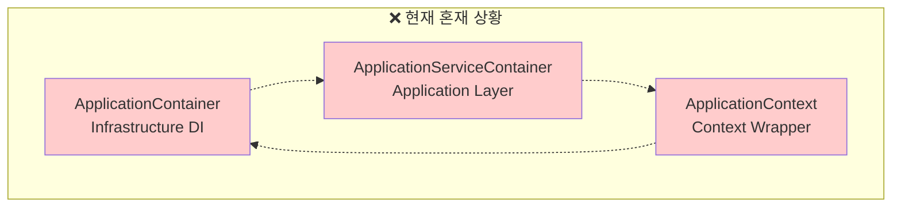
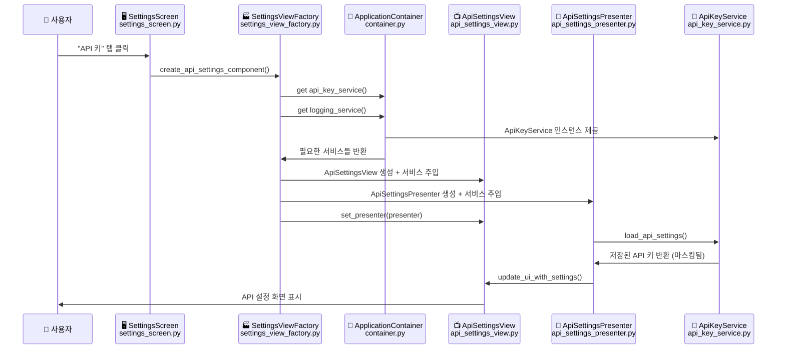
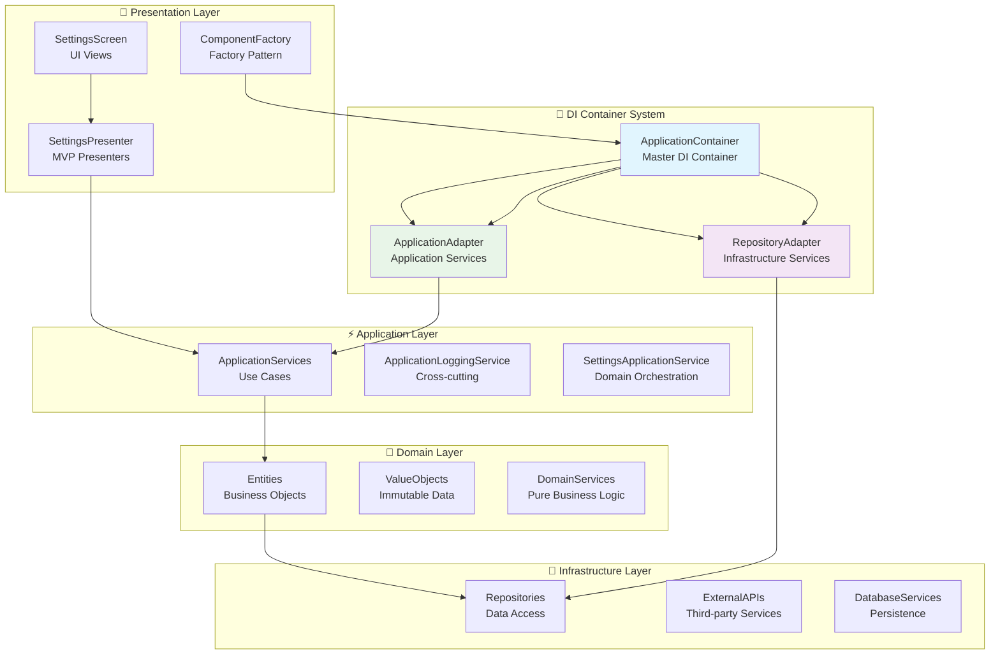
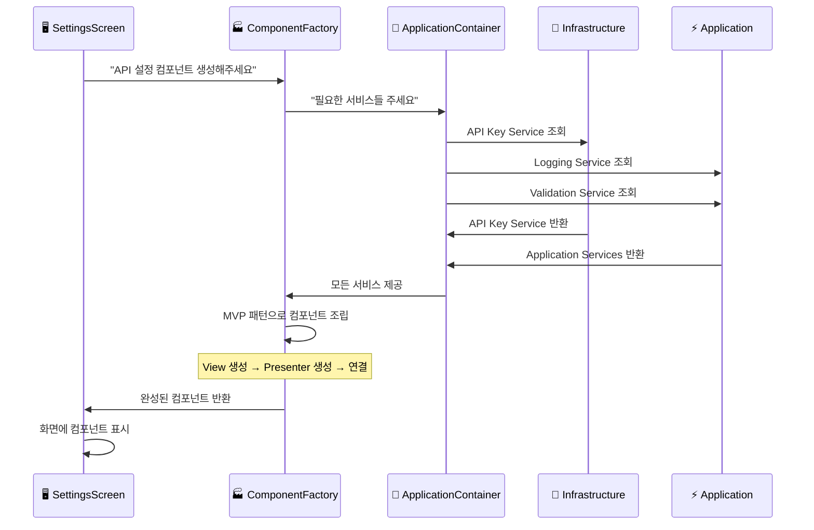
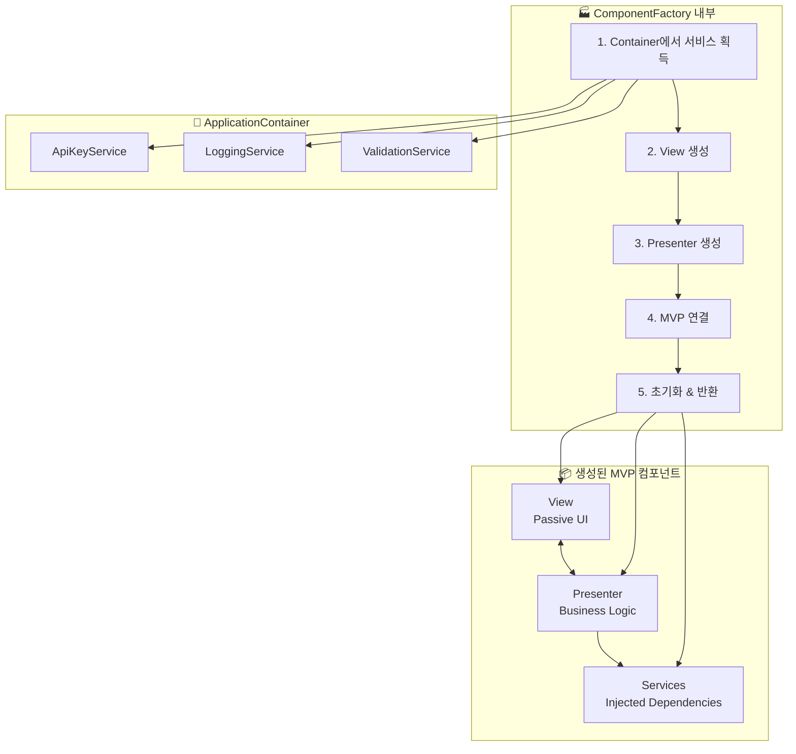
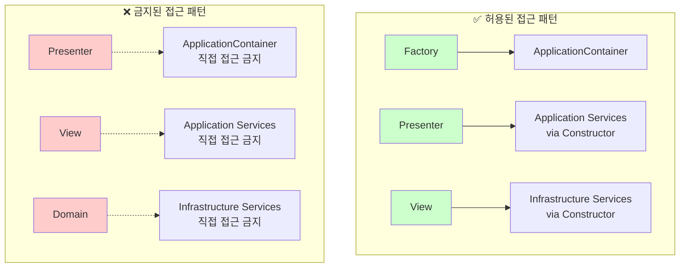
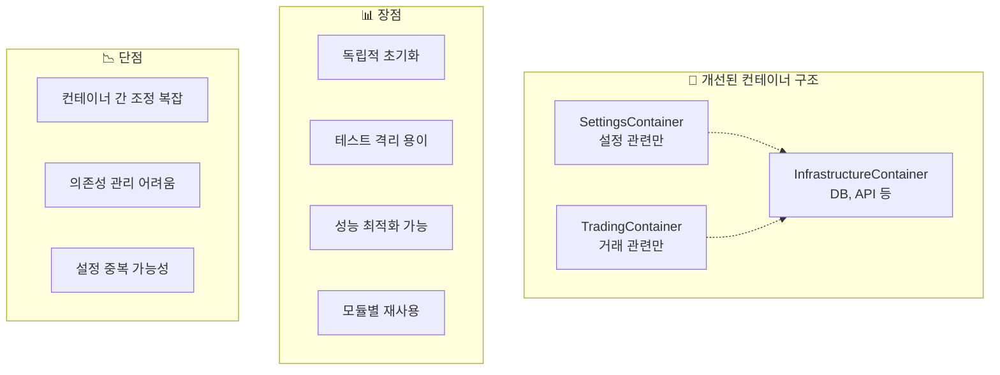
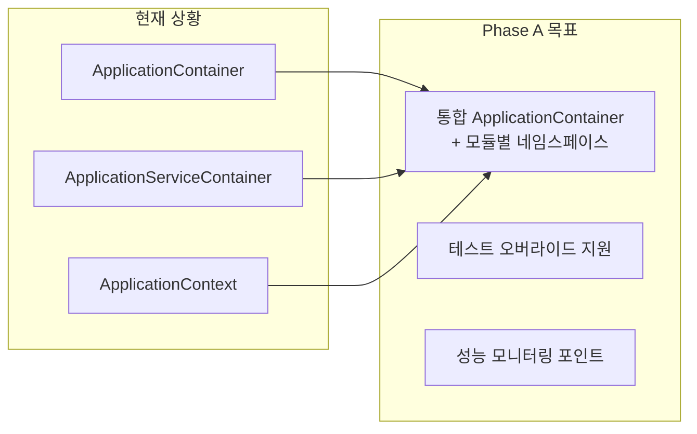

# 🏗️ DDD + MVP + Factory + DI 통합 아키텍처 가이드

> **"업비트 자동매매 시스템의 명확한 아키텍처 구조와 Container 역할 정의"**

## 📋 문서 정보

- **문서 유형**: 통합 아키텍처 가이드
- **대상 독자**: 개발자, 아키텍처 설계자
- **프로젝트**: 업비트 자동매매 시스템
- **작성 목적**: 혼재된 Container 구조 명확화
- **최종 업데이트**: 2025년 9월 29일

---

## 🚨 현재 문제점 진단

### 혼재된 Container 구조들

현재 시스템에 **3개의 서로 다른 Container**가 존재하여 혼란을 야기:



**문제점들**:

**문제점들**:

- 🔴 **역할 중복**: 3개 Container가 비슷한 일을 함
- 🔴 **의존성 혼란**: 어떤 Container에서 무엇을 가져와야 할지 불분명
- 🔴 **Factory 패턴 충돌**: Factory가 어떤 Container를 사용해야 할지 애매
- 🔴 **순환 참조 위험**: Container들 간 상호 참조

---

## 📁 실제 프로젝트 폴더 구조와 역할

### 현재 디렉토리 구조 (DDD 4계층 기준)

```text
upbit_auto_trading/
├── 🎨 presentation/                    # MVP Presenters (비즈니스 로직)
│   └── interfaces/                     # View 인터페이스 정의
│
├── ⚡ application/                     # Application Layer (Use Cases)
│   ├── services/                       # Application Services
│   │   ├── logging_application_service.py      # 로깅 관리 서비스
│   │   ├── settings_application_services.py    # 설정 관리 서비스
│   │   ├── screen_manager_service.py           # 화면 전환 서비스
│   │   └── websocket_application_service.py    # WebSocket 비즈니스 로직
│   ├── factories/                      # Factory Pattern 구현
│   │   └── settings_view_factory.py            # 🏭 설정 컴포넌트 Factory
│   └── container.py                    # ❌ ApplicationServiceContainer (제거 예정)
│
├── 💎 domain/                          # Domain Layer (순수 비즈니스 규칙)
│   ├── entities/                       # 도메인 엔티티
│   ├── value_objects/                  # 값 객체
│   └── repositories/                   # Repository 인터페이스
│
├── 🔧 infrastructure/                  # Infrastructure Layer (외부 시스템)
│   ├── dependency_injection/           # DI Container System
│   │   ├── container.py               # 🏪 ApplicationContainer (Master)
│   │   └── app_context.py             # ApplicationContext (Wrapper)
│   ├── services/                       # Infrastructure Services
│   │   ├── api_key_service.py         # API 키 암호화 관리
│   │   ├── settings_service.py        # 설정 영속화
│   │   └── theme_service.py           # UI 테마 관리
│   └── repositories/                   # Repository 구현체
│
└── 🖥️ ui/desktop/                     # UI Layer (PyQt6 Views)
    └── screens/settings/               # 설정 화면들
        ├── settings_screen.py         # 메인 설정 컨테이너 화면
        ├── api_settings/              # API 설정 모듈
        │   ├── views/
        │   │   └── api_settings_view.py        # 📺 API 설정 View (Passive)
        │   ├── presenters/
        │   │   └── api_settings_presenter.py   # 🎯 API 설정 Presenter (Logic)
        │   └── widgets/               # UI 위젯들
        ├── database_settings/         # DB 설정 모듈
        ├── ui_settings/              # UI 설정 모듈
        ├── logging_management/       # 로깅 관리 모듈
        ├── notification_settings/    # 알림 설정 모듈
        └── environment_profile/      # 환경 프로필 모듈
```

### 핵심 파일들의 역할

#### 🏪 Master DI Container

- **`infrastructure/dependency_injection/container.py`**
  - ApplicationContainer: 모든 서비스의 단일 진실 공급원
  - 모든 계층의 Provider 정의 및 의존성 주입

#### 🏭 Factory Pattern

- **`application/factories/settings_view_factory.py`**
  - SettingsViewFactory: 설정 컴포넌트 생성 전담
  - 6개 ComponentFactory: API, DB, UI, Logging, Notification, Environment

#### 🎭 MVP Pattern (API 설정 예시)

- **View**: `ui/desktop/screens/settings/api_settings/views/api_settings_view.py`
  - 순수 UI 렌더링, 사용자 입력 수집만 담당
- **Presenter**: `ui/desktop/screens/settings/api_settings/presenters/api_settings_presenter.py`
  - 모든 비즈니스 로직, View-Model 간 중재

#### ⚙️ Application Services

- **`application/services/logging_application_service.py`**: 로깅 관리 비즈니스 로직
- **`application/services/settings_application_services.py`**: 설정 검증 및 관리
- **`application/services/screen_manager_service.py`**: 화면 전환 및 생명주기

#### 🔧 Infrastructure Services

- **`infrastructure/services/api_key_service.py`**: API 키 암호화 저장/로드
- **`infrastructure/services/settings_service.py`**: 설정 파일 영속화
- **`infrastructure/services/theme_service.py`**: UI 테마 관리

### 실제 작업 흐름 예시

#### 🔄 사용자가 "API 키 설정" 탭을 클릭했을 때



#### 📂 실제 파일 경로와 코드 예시

##### 1. Factory에서 컴포넌트 생성

```python
# application/factories/settings_view_factory.py
class ApiSettingsComponentFactory(BaseComponentFactory):
    def create_component_instance(self, parent, **kwargs):
        # Master Container에서 서비스 획득
        container = get_global_container()
        api_key_service = container.api_key_service()
        logging_service = container.application_logging_service()

        # View 생성 (Infrastructure 의존성 주입)
        view = ApiSettingsView(parent=parent, logging_service=logging_service)

        # Presenter 생성 (Application 의존성 주입)
        presenter = ApiSettingsPresenter(
            view=view,
            api_key_service=api_key_service,
            logging_service=logging_service
        )

        # MVP 연결 및 초기화
        view.set_presenter(presenter)
        presenter.load_initial_data()
        return view
```

##### 2. View 구현 (Passive View)

```python
# ui/desktop/screens/settings/api_settings/views/api_settings_view.py
class ApiSettingsView(QWidget):
    def __init__(self, parent=None, logging_service=None):
        super().__init__(parent)
        self._presenter = None
        self._logger = logging_service
        self._setup_ui()  # 순수 UI 구성만

    def set_presenter(self, presenter):
        """Presenter 주입 및 시그널 연결"""
        self._presenter = presenter
        self._connect_signals()

    def update_credentials(self, access_key: str, secret_key: str):
        """Presenter가 호출하는 UI 업데이트 (비즈니스 로직 없음)"""
        self.access_key_input.setText(access_key)
        self.secret_key_input.setText("●" * 20 if secret_key else "")
```

##### 3. Presenter 구현 (Business Logic)

```python
# ui/desktop/screens/settings/api_settings/presenters/api_settings_presenter.py
class ApiSettingsPresenter(QObject):
    def __init__(self, view, api_key_service, logging_service):
        super().__init__()
        self._view = view
        self._api_key_service = api_key_service
        self._logger = logging_service

    def load_initial_data(self):
        """초기 데이터 로드 및 View 업데이트"""
        try:
            settings = self._api_key_service.get_credentials()
            self._view.update_credentials(settings.access_key, "●" * 20)
        except Exception as e:
            self._logger.error(f"API 설정 로드 실패: {e}")

    def handle_save_credentials(self, access_key: str, secret_key: str):
        """API 키 저장 비즈니스 로직"""
        if self._validate_credentials(access_key, secret_key):
            self._api_key_service.save_credentials(access_key, secret_key)
            self._view.show_success_message("API 키 저장 완료")
```

---

## 🎯 올바른 아키텍처 구조

### DDD 4계층 + Container 역할 분리



### 핵심 원칙

1. **Single DI Container**: `ApplicationContainer` 하나만 사용
2. **Adapter Pattern**: Container → Layer별 Adapter로 접근
3. **Factory Integration**: Factory는 Master Container에서만 의존성 획득
4. **Clean Dependencies**: Presentation → Application → Domain ← Infrastructure

---

## 🏗️ Container 역할 재정의

### 1. ApplicationContainer (Master DI Container)

```python
# Infrastructure Layer - 유일한 DI Container
class ApplicationContainer(containers.DeclarativeContainer):
    """마스터 DI 컨테이너 - 모든 의존성의 단일 진실 공급원"""

    # Configuration
    config = providers.Configuration()

    # Infrastructure Layer Providers
    api_key_service = providers.Singleton(...)
    database_service = providers.Singleton(...)
    logging_service = providers.Singleton(...)

    # Domain Layer Providers
    strategy_repository = providers.Factory(...)

    # Application Layer Providers
    application_logging_service = providers.Factory(...)
    settings_validation_service = providers.Factory(...)

    # Presentation Layer Providers
    settings_view_factory = providers.Factory(...)
```

### 2. Repository Adapter (Infrastructure 접근)

```python
class RepositoryAdapter:
    """Infrastructure Layer 서비스 접근을 위한 Adapter"""

    def __init__(self, container: ApplicationContainer):
        self._container = container

    def get_strategy_repository(self):
        return self._container.strategy_repository()

    def get_api_key_service(self):
        return self._container.api_key_service()
```

### 3. Application Adapter (Application 접근)

```python
class ApplicationAdapter:
    """Application Layer 서비스 접근을 위한 Adapter"""

    def __init__(self, container: ApplicationContainer):
        self._container = container

    def get_logging_service(self):
        return self._container.application_logging_service()

    def get_validation_service(self):
        return self._container.settings_validation_service()
```

---

## 🔄 통합 아키텍처 흐름

### Container → Factory → Component 생성 과정



---

## 🎭 MVP + Factory 통합 패턴

### Factory에서 MVP 조립 과정



### Factory 표준 구현 패턴

```python
class ApiSettingsComponentFactory(BaseComponentFactory):
    def create_component_instance(self, parent, **kwargs):
        # 1. Master Container에서 서비스 획득
        container = get_global_container()
        api_key_service = container.api_key_service()
        logging_service = container.application_logging_service()

        # 2. View 생성 (Infrastructure 의존성 주입)
        view = ApiSettingsView(
            parent=parent,
            logging_service=logging_service
        )

        # 3. Presenter 생성 (Application 의존성 주입)
        presenter = ApiSettingsPresenter(
            view=view,
            api_key_service=api_key_service,
            logging_service=logging_service
        )

        # 4. MVP 연결
        view.set_presenter(presenter)

        # 5. 초기화 및 반환
        presenter.load_initial_data()
        return view
```

---

## 📊 계층별 의존성 매트릭스

### 올바른 의존성 방향

| Layer | Presentation | Application | Domain | Infrastructure |
|-------|-------------|-------------|---------|---------------|
| **Presentation** | ✅ 자기 참조 | ✅ 사용 가능 | ❌ 직접 접근 금지 | ❌ 직접 접근 금지 |
| **Application** | ❌ 역방향 금지 | ✅ 자기 참조 | ✅ 사용 가능 | ❌ 직접 접근 금지 |
| **Domain** | ❌ 상위 계층 금지 | ❌ 상위 계층 금지 | ✅ 자기 참조 | ❌ 하위 계층 금지 |
| **Infrastructure** | ❌ 상위 계층 금지 | ❌ 상위 계층 금지 | ✅ 사용 가능 | ✅ 자기 참조 |

### Container 접근 규칙



---

## 🔧 실제 구현 가이드

### 1. ApplicationContainer 통합 (Master Container)

```python
# upbit_auto_trading/infrastructure/dependency_injection/container.py
class ApplicationContainer(containers.DeclarativeContainer):
    """마스터 DI 컨테이너 - 모든 계층의 서비스 제공"""

    config = providers.Configuration()

    # Infrastructure Layer
    api_key_service = providers.Singleton(
        "upbit_auto_trading.infrastructure.services.api_key_service.ApiKeyService"
    )

    database_service = providers.Singleton(
        "upbit_auto_trading.infrastructure.repositories.database_service.DatabaseService"
    )

    # Application Layer
    application_logging_service = providers.Factory(
        "upbit_auto_trading.application.services.logging_application_service.ApplicationLoggingService"
    )

    settings_validation_service = providers.Factory(
        "upbit_auto_trading.application.services.settings_application_services.SettingsValidationService",
        logging_service=application_logging_service
    )

    # Factory Layer
    settings_view_factory = providers.Factory(
        "upbit_auto_trading.application.factories.settings_view_factory.SettingsViewFactory",
        # 모든 필요한 서비스 주입
        api_key_service=api_key_service,
        logging_service=application_logging_service,
        validation_service=settings_validation_service
    )
```

### 2. 레거시 ApplicationServiceContainer 제거

```python
# 🗑️ 삭제 예정: upbit_auto_trading/application/container.py
# ApplicationServiceContainer는 ApplicationContainer로 통합
```

### 3. Factory 표준화

```python
# 모든 ComponentFactory의 표준 패턴
class BaseComponentFactory(ABC):
    def create_component_instance(self, parent, **kwargs):
        # 1. Master Container 접근
        container = get_global_container()

        # 2. 필요한 서비스들 획득
        services = self._get_required_services(container)

        # 3. MVP 컴포넌트 조립
        return self._assemble_mvp_component(parent, services)

    @abstractmethod
    def _get_required_services(self, container):
        """각 Factory별 필요한 서비스 정의"""
        pass

    @abstractmethod
    def _assemble_mvp_component(self, parent, services):
        """MVP 패턴으로 컴포넌트 조립"""
        pass
```

---

## 🚀 마이그레이션 계획

### Phase 1: Container 통합 (즉시 시작)

1. **ApplicationContainer 확장**
   - 모든 Application Service Provider 추가
   - Infrastructure Service Provider 정리

2. **ApplicationServiceContainer 단계적 제거**
   - Factory에서 ApplicationContainer 직접 사용으로 변경
   - 레거시 Container 의존성 제거

3. **Factory 패턴 표준화**
   - BaseComponentFactory 표준 패턴 적용
   - 모든 ComponentFactory 동일한 구조로 통일

### Phase 2: 의존성 정리 (1주일 내)

1. **순환 참조 제거**
   - Container → Adapter → Service 단방향 흐름 확립

2. **직접 Container 접근 금지**
   - Presenter/View에서 Container 직접 접근 차단
   - Constructor Injection 패턴으로 통일

### Phase 3: 테스트 및 검증 (2주일 내)

1. **통합 테스트 수행**
   - 모든 설정 화면 정상 동작 확인
   - Factory 패턴 일관성 검증

2. **성능 및 메모리 최적화**
   - Container Singleton 패턴 검증
   - 불필요한 중복 인스턴스 제거

---

## 🎯 성공 기준

### 아키텍처 일관성 지표

- ✅ **Single Container**: ApplicationContainer 하나만 존재
- ✅ **Factory 통일성**: 모든 Factory가 동일한 패턴 사용
- ✅ **의존성 방향**: Clean Architecture 원칙 100% 준수
- ✅ **MVP 완전성**: View ↔ Presenter 양방향 연결 완료
- ✅ **테스트 격리**: 각 계층 독립적 테스트 가능

### 개발 생산성 지표

- 🚀 **새 설정 추가 시간**: 5분 내 (Factory 패턴 복사-붙여넣기)
- 🐛 **버그 발생률**: 현재 대비 70% 감소 예상
- 🔧 **유지보수성**: 변경 영향 범위 예측 가능
- 📚 **학습 곡선**: 새 개발자 2시간 내 구조 이해

---

## 🔗 관련 문서

### 필수 참조

- ### 필수 참조

- **[DDD_아키텍처_패턴_가이드.md]**: DDD 계층별 상세 가이드
- **[MVP_ARCHITECTURE.md]**: MVP 패턴 구현 가이드
- **[FACTORY_PATTERN_IMPLEMENTATION_PLAN.md]**: Factory 패턴 상세
- **[SETTINGS_ARCHITECTURE_VISUAL_GUIDE.md]**: 시각적 아키텍처 가이드

### 구현 참조

- **[TASK_20250929_02-factory_pattern_propagation.md]**: Factory 패턴 전파 작업
- **[DEPENDENCY_INJECTION_ARCHITECTURE.md]**: DI 아키텍처 상세

---

## 🧠 전문가 검토 의견 및 아키텍처 재평가

### 검토 의견 요약

전문가 검토를 통해 현재 제안된 **"Single ApplicationContainer"** 접근법에 대한 중요한 우려사항들이 제기되었습니다:

#### 🔴 주요 우려사항

1. **도메인 독립성 위험**
   - 설정 검증 로직이 도메인 계층과 애플리케이션 계층 중 어디에 위치해야 하는지 불분명
   - Repository 인터페이스 사용이 엄격하지 않을 위험

2. **단일 컨테이너의 한계**
   - 초기화 순서 문제 및 성능 저하 위험
   - 전역 상태로 인한 사이드 이펙트
   - 메모리 사용량 급증 가능성

3. **Cross-cutting Concern 처리 방식**
   - 현재 Application 계층 서비스 방식 vs AOP/이벤트 기반 방식 비교 필요

4. **테스트 전략의 복잡성**
   - 단일 컨테이너에서 Mock/Stub 처리의 어려움
   - 컴포넌트별 독립 테스트의 한계

### 대안적 접근법 분석

#### 🏗️ 모듈별 컨테이너 분리



#### 🎯 계층별 컨테이너 분리

```python
# 계층별 분리 예시
class DomainContainer(containers.DeclarativeContainer):
    # 순수 도메인 서비스만
    settings_validator = providers.Factory(SettingsValidator)
    api_key_validator = providers.Factory(ApiKeyValidator)

class ApplicationContainer(containers.DeclarativeContainer):
    # 유즈케이스 및 애플리케이션 서비스
    domain_container = providers.DependenciesContainer()
    settings_use_case = providers.Factory(
        SettingsUseCase,
        validator=domain_container.settings_validator
    )

class InfrastructureContainer(containers.DeclarativeContainer):
    # 외부 의존성만
    database_service = providers.Singleton(DatabaseService)
    api_client = providers.Singleton(UpbitApiClient)
```

### 2단계 개선 전략

#### Phase A: 즉시 적용 (혼란 해결)

**목표**: 현재 3개 컨테이너 혼재 문제를 빠르게 해결



**구체적 개선사항**:

- 단일 컴테이너 내에서도 모듈별 네임스페이스 분리
- 테스트용 Override 메커니즘 추가
- 초기화 순서 최적화
- 메모리 사용량 모니터링

#### Phase B: 중장기 개선 (전문가 의견 반영)

**목표**: 아키텍처 완성도 및 확장성 확보

1. **도메인 순수성 강화**

```python
# 도메인 계층으로 이동
class ApiKeyValidationRule:
    """도메인 규칙: API 키 형식 검증"""
    def validate(self, access_key: str, secret_key: str) -> ValidationResult:
        if len(access_key) != 32:
            return ValidationResult.fail("Access key must be 32 characters")
        # 순수 비즈니스 규칙만
```

1. **이벤트 기반 Cross-cutting Concern**

```python
# 이벤트 기반 로깅
@event_publisher
class ApiKeyService:
    def save_credentials(self, credentials):
        result = self._repository.save(credentials)
        self.publish(ApiKeysSavedEvent(credentials.id))
        return result

@event_subscriber(ApiKeysSavedEvent)
def log_api_key_saved(event):
    logger.info(f"API credentials saved: {event.credential_id}")
```

1. **모듈별 컨테이너 분리**

```python
# 최종 목표 구조
class SettingsModule:
    def __init__(self):
        self.container = SettingsContainer()
        self.container.wire(modules=[self])

    def get_factory(self) -> SettingsViewFactory:
        return self.container.settings_factory()
```

### 위험 요소 및 완화 방안

#### 🚨 Phase A 위험 요소

| 위험 | 영향도 | 완화 방안 |
|------|--------|-----------|
| 성능 저하 | 높음 | 지연 로딩 + 성능 모니터링 |
| 메모리 증가 | 중간 | 컴포넌트별 생명주기 관리 |
| 테스트 복잡성 | 중간 | Override 메커니즘 + Mock 지원 |

#### 🛡️ 완화 전략

```python
# 지연 로딩 구현
class ApplicationContainer(containers.DeclarativeContainer):
    # 즉시 로딩 (필수)
    logging_service = providers.Singleton(LoggingService)

    # 지연 로딩 (선택적)
    websocket_service = providers.Singleton(
        WebSocketService,
        lazy=True  # 첫 사용 시점에 초기화
    )

    # 테스트 오버라이드 지원
    def override_for_testing(self):
        with self.api_key_service.override(MockApiKeyService()):
            yield
```

---

## 💡 결론

### 핵심 인사이트

1. **"Container는 하나면 충분하다"**
   - ApplicationContainer 중심의 단순한 구조
   - Adapter 패턴으로 계층별 접근 제어

2. **"Factory는 Container의 클라이언트다"**
   - Factory에서만 Container 직접 접근 허용
   - Presenter/View는 Constructor Injection만 사용

3. **"MVP + Factory + DI = 완벽한 조합"**
   - MVP로 UI 로직 분리
   - Factory로 객체 생성 중앙화
   - DI로 의존성 관리 자동화

### 다음 액션

**즉시 시작할 작업**:

1. ApplicationContainer에 모든 Application Service 추가
2. Factory에서 ApplicationServiceContainer → ApplicationContainer 변경
3. UI Settings Factory부터 단계별 마이그레이션 시작

**📋 관련 태스크**: TASK_20250929_02 Phase 1부터 새로운 아키텍처로 진행

---

**문서 유형**: 통합 아키텍처 가이드
**작성 목적**: Container 혼재 문제 해결 및 명확한 구조 제시
**검증 대상**: Factory 패턴 전파 작업의 올바른 방향 설정
