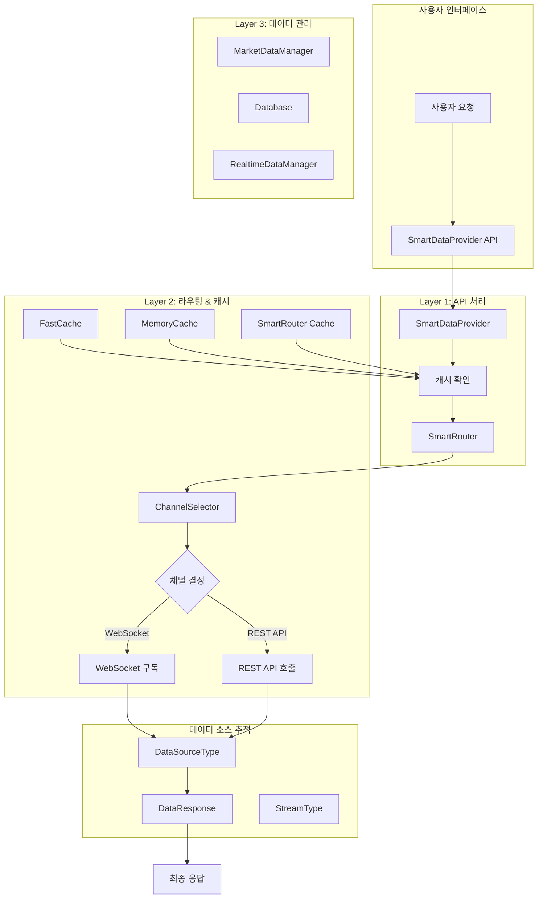
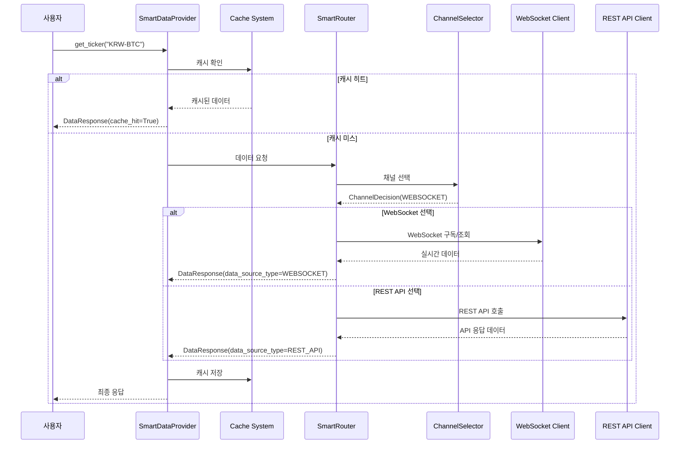
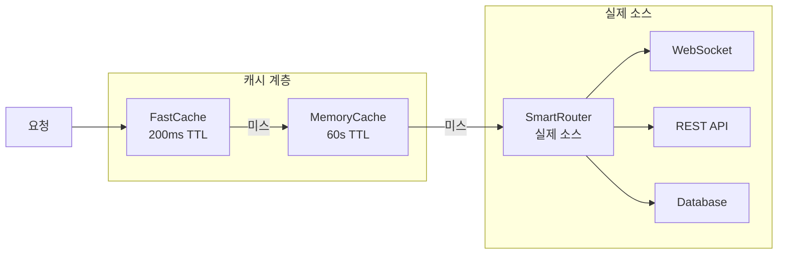

# 📊 업비트 자동매매 시스템 데이터 소스 관리 완전 가이드

## 🎯 개요

업비트 자동매매 시스템의 `market_data_backbone` 폴더는 모든 시장 데이터의 수집, 라우팅, 캐싱을 담당하는 핵심 인프라입니다. 이 문서는 **데이터 소스의 시작점과 관리 시스템**을 완전히 분석한 결과를 제공합니다.

### 주요 특징
- **계층적 데이터 소스 관리**: 3계층 아키텍처로 명확한 책임 분리
- **스마트 라우팅**: WebSocket과 REST API 간 지능적 선택
- **완전한 소스 추적**: 모든 데이터의 출처를 명확히 기록
- **실시간 소스 관리**: 구독 기반 실시간 데이터 추적

---

## 🏗️ 전체 아키텍처 개요



---

## 🎛️ 핵심 데이터 소스 관리 컴포넌트

### 1. **SmartDataProvider** - 최상위 진입점

**파일**: `smart_data_provider/smart_data_provider.py`

```python
class SmartDataProvider:
    """Smart Data Provider V4.0 - 메인 클래스"""

    def __init__(self, max_workers: int = 10):
        # Layer 3: 데이터 관리
        self.data_manager = MarketDataManager()

        # Layer 2: 캐시 & 실시간
        self.cache_system = MarketDataCache()
        self.realtime_manager = RealtimeDataManager()

        # Layer 1: API 처리 (실제 데이터 소스 통신)
        self.smart_router = SmartRouter()

        # SmartRouter 사전 초기화 (WebSocket 연결 포함)
        self._initialize_smart_router()
```

**핵심 역할**:
- 모든 데이터 요청의 **최초 진입점**
- 계층적 데이터 소스 초기화 관리
- 캐시 우선 전략으로 소스 접근 최적화
- 성능 지표 추적 (목표: 500+ symbols/sec)

**데이터 소스 초기화 시퀀스**:
```python
def _initialize_smart_router(self) -> None:
    """SmartRouter 사전 초기화 (WebSocket 연결 포함)"""
    try:
        # 이벤트 루프 확보
        loop = asyncio.get_event_loop()

        # SmartRouter 비동기 초기화 (WebSocket 연결 포함)
        loop.run_until_complete(self.smart_router.initialize())
        logger.info("✅ SmartRouter 사전 초기화 완료 (WebSocket 연결됨)")
    except Exception as e:
        logger.warning(f"SmartRouter 초기화 중 오류: {e} - 데이터 요청 시 재시도")
```

### 2. **SmartRouter** - 통합 라우팅 시스템

**파일**: `smart_routing/smart_router.py`

```python
class SmartRouter:
    """스마트 라우터 - 통합 라우팅 시스템"""

    async def get_data(self, request: DataRequest) -> Dict[str, Any]:
        """데이터 요청 처리 - 메인 엔트리 포인트"""
        # 1. 채널 선택 (WebSocket vs REST API)
        # 2. 데이터 획득
        # 3. 형식 통일
        # 4. 메트릭 기록
```

**핵심 역할**:
- 모든 외부 데이터 소스 통신의 **중앙 집중화**
- WebSocket과 REST API 통합 관리
- 데이터 형식 통일 (REST API 기준)
- 자동 폴백 처리
- Rate Limit 관리

**지원하는 데이터 소스**:
- **업비트 WebSocket API**: 실시간 데이터 (ticker, trade, orderbook, candle)
- **업비트 REST API**: 과거 데이터 및 일회성 조회
- **자동 폴백**: WebSocket 실패 시 REST API로 전환

### 3. **ChannelSelector** - 소스 선택 엔진

**파일**: `smart_routing/channel_selector.py`

```python
def select_channel(self, request: DataRequest) -> ChannelDecision:
    """요청에 대한 최적 채널 결정"""

    # 0단계: WebSocket 구독 최적화 검증
    # 1단계: WebSocket 제약 검증 (데이터 무결성 보장)
    # 2단계: 고정 채널 확인
    # 3단계: 스마트 선택
```

**핵심 역할**:
- 데이터 요청별 최적 소스 결정
- 실시간성 vs 안정성 균형 조절
- 요청 패턴 학습 및 예측
- Rate Limit 상태 고려

**선택 기준**:
```python
# WebSocket 우선 조건
- 실시간 우선순위: HIGH/MEDIUM
- 단일/소량 심볼 요청
- 연결 상태 양호
- Rate Limit 여유

# REST API 우선 조건
- 과거 데이터 조회 (to 매개변수 존재)
- 대량 데이터 요청
- WebSocket 연결 불안정
- 다중 캔들 요청 (count > 1)
```

### 4. **DataSourceType** - 소스 분류 시스템

**파일**: `smart_data_provider/market_data_models.py`

```python
class DataSourceType(Enum):
    """데이터 소스 유형"""
    WEBSOCKET = "websocket"        # 실시간 웹소켓 데이터
    REST_API = "rest_api"          # REST API 호출
    CACHE = "cache"                # 캐시된 데이터
    DATABASE = "database"          # 로컬 DB 데이터
    HYBRID = "hybrid"              # 혼합 (캐시 + API)
    SIMULATION = "simulation"      # 시뮬레이션 데이터
    ERROR = "error"                # 에러 상태
```

**핵심 역할**:
- 모든 데이터의 출처 명확화
- 디버깅 및 성능 분석 지원
- 캐시 전략 최적화
- 데이터 품질 관리

### 5. **DataResponse** - 통합 응답 모델

**파일**: `smart_data_provider/market_data_models.py`

```python
@dataclass
class DataResponse:
    """통합 데이터 응답 모델"""
    success: bool
    data: Optional[Dict[str, Any]] = None
    error_message: Optional[str] = None
    cache_hit: bool = False
    response_time_ms: float = 0.0

    # 🌐 데이터 소스 정보 (개선됨)
    data_source: str = "unknown"           # 기존 호환성 유지
    data_source_type: DataSourceType = DataSourceType.REST_API  # 명확한 타입
    stream_type: Optional[StreamType] = None  # 웹소켓 스트림 타입

    # 📊 실시간 데이터 메타데이터
    is_realtime: bool = False              # 실시간 데이터 여부
    data_timestamp: Optional[datetime] = None  # 데이터 생성 시각
    server_timestamp: Optional[datetime] = None  # 서버 응답 시각
```

**핵심 기능**:
- **완전한 소스 추적**: 모든 데이터가 어디서 왔는지 기록
- **자동 소스 판단**: 메타데이터 기반 자동 분류
- **성능 메트릭**: 응답 시간, 캐시 히트율 추적
- **실시간 여부**: WebSocket 데이터 구분

---

## 🔄 데이터 소스 플로우 상세 분석

### 전체 데이터 흐름



### 소스별 처리 전략

#### 1. **실시간 데이터 (Ticker, Orderbook, Trade)**

```python
def _get_from_memory_cache_only(self, cache_key: str) -> Optional[dict]:
    """메모리 캐시에서만 조회 (DB 조회 안함)

    실시간 데이터(티커/호가/체결)는 메모리 캐시만 확인
    """
    # FastCache 먼저 확인 (가장 빠름)
    cached_data = self.cache_system.fast_cache.get(cache_key)
    if cached_data:
        return cached_data

    # MemoryRealtimeCache 확인
    if hasattr(self.cache_system, 'memory_cache'):
        cached_data = self.cache_system.memory_cache.get(cache_key)
        if cached_data:
            return cached_data

    return None
```

**캐시 전략**:
- **FastCache**: 200ms TTL (초고속 액세스)
- **MemoryCache**: 60초 TTL (실시간 데이터용)
- **DB 제외**: 실시간 데이터는 DB 저장하지 않음

#### 2. **캔들 데이터**

```python
def get_candles(
    self,
    symbol: str,
    candle_type: str = "1m",
    count: int = 200,
    priority: Priority = Priority.NORMAL
) -> DataResponse:
    """단일 심볼 캔들 조회"""
    cache_key = f"candles_{symbol}_{candle_type}_{count}"

    # 캐시 확인 (DB + 메모리 통합)
    cached_data = self.cache_system.get(cache_key, "candles")
    if cached_data:
        return DataResponse(
            success=True,
            data=cached_data,
            cache_hit=True,
            data_source="cache"
        )

    # 데이터 관리자를 통한 조회
    candle_data = self.data_manager.get_candle_data(symbol, candle_type, count)
```

**캐시 전략**:
- **DB + 메모리**: 캔들 데이터는 영구 저장
- **장기 TTL**: 완성된 캔들은 변경되지 않음
- **배치 최적화**: 대량 캔들 요청 지원

---

## 📊 소스 추적 및 메트릭 시스템

### 1. **자동 소스 타입 판단**

```python
@classmethod
def _determine_source_type(cls, data_source: str, metadata: Dict[str, Any]) -> DataSourceType:
    """데이터 소스 문자열에서 타입 판단"""
    data_source_lower = data_source.lower()

    if any(keyword in data_source_lower for keyword in ['websocket', 'ws', 'stream', 'realtime']):
        return DataSourceType.WEBSOCKET
    elif any(keyword in data_source_lower for keyword in ['cache', 'cached']):
        return DataSourceType.CACHE
    elif any(keyword in data_source_lower for keyword in ['database', 'db', 'local']):
        return DataSourceType.DATABASE
    elif any(keyword in data_source_lower for keyword in ['simulation', 'sim', 'mock']):
        return DataSourceType.SIMULATION
    elif any(keyword in data_source_lower for keyword in ['error', 'fail']):
        return DataSourceType.ERROR
    elif any(keyword in data_source_lower for keyword in ['hybrid', 'mixed']):
        return DataSourceType.HYBRID
    else:
        return DataSourceType.REST_API
```

### 2. **스트림 타입 자동 감지**

```python
@classmethod
def _determine_stream_type(cls, metadata: Dict[str, Any]) -> Optional[StreamType]:
    """메타데이터에서 스트림 타입 판단"""
    # 명시적 스트림 타입 지정
    if 'stream_type' in metadata:
        stream_value = metadata['stream_type']
        if isinstance(stream_value, StreamType):
            return stream_value
        elif isinstance(stream_value, str):
            try:
                return StreamType(stream_value.lower())
            except ValueError:
                return StreamType.UNKNOWN

    # 데이터 타입에서 추론
    data_type = metadata.get('data_type', '').lower()
    if data_type:
        if data_type == 'ticker':
            return StreamType.TICKER
        elif data_type == 'orderbook':
            return StreamType.ORDERBOOK
        elif data_type == 'trades' or data_type == 'trade':
            return StreamType.TRADE
        elif 'candle' in data_type:
            # 캔들 타입별 세분화
            if '1m' in data_type: return StreamType.CANDLE_1M
            elif '5m' in data_type: return StreamType.CANDLE_5M
            # ... 기타 타임프레임

    return None
```

### 3. **성능 메트릭 추적**

```python
def get_comprehensive_status(self) -> Dict[str, Any]:
    """종합 상태 정보"""
    return {
        'system_info': {
            'version': '4.0',
            'uptime_seconds': time.time() - self._start_time,
            'max_workers': self.max_workers,
            'target_symbols_per_second': 500
        },
        'performance': {
            'total_requests': performance_metrics.total_requests,
            'symbols_per_second': performance_metrics.symbols_per_second,
        },
        'layer_1_api': {
            'request_count': self._request_count,
            'thread_pool_workers': self.max_workers
        },
        'layer_2_cache': cache_stats,
        'layer_2_realtime': realtime_stats,
        'layer_3_data': data_manager_stats,
        'timestamp': datetime.now().isoformat()
    }
```

---

## 🛠️ 실시간 데이터 소스 관리

### 1. **구독 기반 추적 시스템**

```python
def subscribe_realtime_data(
    self,
    symbols: List[str],
    data_types: Optional[List[str]] = None,
    callback: Optional[Callable] = None
) -> str:
    """실시간 데이터 구독"""
    subscription_id = f"sub_{int(time.time() * 1000)}"
    data_types = data_types or ["ticker"]

    success = self.realtime_manager.subscribe_to_symbols(
        subscription_id, symbols, data_types, callback
    )

    if success:
        logger.info(f"실시간 구독 생성: {subscription_id}, {len(symbols)}개 심볼")
        return subscription_id
    else:
        logger.error(f"실시간 구독 실패: {symbols}")
        return ""
```

**특징**:
- **고유 구독 ID**: 타임스탬프 기반 추적
- **다중 데이터 타입**: 하나의 구독으로 여러 타입 처리
- **콜백 지원**: 실시간 데이터 처리 사용자 정의

### 2. **WebSocket 연결 관리**

```python
class SmartRouterConfig:
    """스마트 라우터 설정 일괄 관리"""

    # WebSocket 타임아웃 설정
    WEBSOCKET_SUBSCRIPTION_TIMEOUT = 3.0      # 구독 타임아웃 (초)
    WEBSOCKET_DATA_RECEIVE_TIMEOUT = 3.0      # 데이터 수신 타임아웃 (초)
    WEBSOCKET_SUBSCRIPTION_STABILIZATION_DELAY = 0.1  # 구독 후 안정화 대기 (초)

    # 구독 관리 설정
    MAX_SUBSCRIPTION_TYPES = 4                # 업비트 WebSocket 지원 타입 수
    BUFFER_SUBSCRIPTION_TYPES = 5             # 끊김 없는 전환을 위한 버퍼
```

---

## 🚀 성능 최적화 전략

### 1. **계층적 캐시 시스템**



### 2. **배치 처리 최적화**

```python
def _get_multiple_data(self, symbols: List[str], data_type: str, priority: Priority) -> BatchRequestResult:
    """다중 심볼 데이터 조회 (지능형 배치 처리)"""

    # 배치 크기에 따른 처리 방식 결정
    if len(symbols) < self._batch_threshold:  # 5개 미만
        # 소규모: 순차 처리
        return self._process_sequential(symbols, data_type, priority, start_time)
    else:
        # 대규모: 병렬 배치 처리
        return self._process_parallel_batches(symbols, data_type, priority, start_time)
```

**성능 지표**:
- **목표**: 500+ symbols/sec
- **배치 임계값**: 5개 이상
- **최대 배치 크기**: 50개
- **워커 스레드**: 기본 10개

### 3. **스마트 채널 선택**

```python
def _calculate_websocket_score(self, request: DataRequest) -> float:
    """WebSocket 채널 점수 계산"""
    score = 0.0

    # 실시간성 요구 (가중치: 3x)
    realtime_scores = {
        RealtimePriority.HIGH: 10,
        RealtimePriority.MEDIUM: 6,
        RealtimePriority.LOW: 2
    }
    score += realtime_scores[request.realtime_priority] * 3

    # 요청 빈도 분석 (가중치: 2x)
    # 연결 상태 (가중치: 3x)
    # Rate Limit 상태 (가중치: 2x)

    return score
```

---

## 🔍 디버깅 및 모니터링

### 1. **소스 추적 로깅**

```python
# 데이터 소스별 로깅
logger.info(f"✅ {data_type.value} 통합 구독 성공: {len(symbols)}개 심볼, 티켓: {self._current_ticket}")
logger.debug(f"메모리 캐시 저장 성공: {cache_key} ({data_type})")
logger.warning(f"SmartRouter 초기화 중 오류: {e} - 데이터 요청 시 재시도")
```

### 2. **데이터 무결성 검증**

```python
def validate_data_integrity(self, data: dict, data_type: str) -> bool:
    """데이터 무결성 검증"""
    if not isinstance(data, dict):
        return False

    if data_type == "ticker":
        required_fields = ["market", "trade_price", "timestamp"]
        return all(field in data for field in required_fields)
    elif data_type == "orderbook":
        required_fields = ["market", "orderbook_units"]
        return all(field in data for field in required_fields)
    elif data_type == "trades":
        required_fields = ["market", "trade_price", "trade_volume"]
        return all(field in data for field in required_fields)

    return True
```

### 3. **실시간 통계 수집**

```python
def get_performance_metrics(self) -> PerformanceMetrics:
    """성능 지표 조회"""
    with self._lock:
        elapsed_time = time.time() - self._start_time
        throughput = self._request_count / elapsed_time if elapsed_time > 0 else 0

        return PerformanceMetrics(
            total_requests=self._request_count,
            successful_requests=self._request_count,
            failed_requests=0,
            symbols_per_second=round(throughput, 2)
        )
```

---

## 💡 사용 예제 및 베스트 프랙티스

### 1. **기본 사용법**

```python
from upbit_auto_trading.infrastructure.market_data_backbone.smart_data_provider import SmartDataProvider

# 데이터 제공자 초기화
provider = SmartDataProvider(max_workers=10)

# 단일 심볼 조회
response = provider.get_ticker("KRW-BTC")
print(f"소스: {response.data_source_type.value}")  # websocket/rest_api/cache
print(f"캐시 히트: {response.cache_hit}")
print(f"응답 시간: {response.response_time_ms}ms")

# 다중 심볼 조회 (배치 최적화)
symbols = ["KRW-BTC", "KRW-ETH", "KRW-ADA"]
batch_result = provider.get_multiple_tickers(symbols)
print(f"성공: {len(batch_result.successful_symbols)}/{len(symbols)}")
print(f"처리 속도: {batch_result.symbols_per_second:.1f} symbols/sec")
```

### 2. **실시간 데이터 구독**

```python
def handle_realtime_data(data):
    print(f"실시간 데이터: {data['market']} = {data['trade_price']:,}원")

# 실시간 구독 생성
subscription_id = provider.subscribe_realtime_data(
    symbols=["KRW-BTC", "KRW-ETH"],
    data_types=["ticker", "trade"],
    callback=handle_realtime_data
)

# 구독 해제
provider.unsubscribe_realtime_data(subscription_id)
```

### 3. **성능 모니터링**

```python
# 종합 상태 확인
status = provider.get_comprehensive_status()
print(f"시스템 버전: {status['system_info']['version']}")
print(f"처리 속도: {status['performance']['symbols_per_second']} symbols/sec")
print(f"캐시 히트율: {status['layer_2_cache']['hit_rate']:.1f}%")

# 캐시 무효화
provider.invalidate_cache("KRW-BTC", "ticker")  # 특정 데이터만
provider.invalidate_cache("KRW-BTC")           # 특정 심볼 전체
provider.invalidate_cache()                    # 전체 캐시
```

---

## 🚧 트러블슈팅 가이드

### 1. **데이터 소스 문제 진단**

```python
# 소스별 상태 확인
status = provider.get_comprehensive_status()

# WebSocket 연결 문제
if status['layer_2_realtime']['websocket_connected'] == False:
    logger.error("WebSocket 연결 실패 - REST API로 폴백됨")

# 캐시 성능 문제
cache_hit_rate = status['layer_2_cache']['hit_rate']
if cache_hit_rate < 50:
    logger.warning(f"낮은 캐시 히트율: {cache_hit_rate:.1f}%")

# 처리 속도 문제
symbols_per_sec = status['performance']['symbols_per_second']
if symbols_per_sec < 100:
    logger.warning(f"낮은 처리 속도: {symbols_per_sec} symbols/sec")
```

### 2. **일반적인 문제 해결**

#### WebSocket 연결 실패
```python
# SmartRouter 재초기화
provider._initialize_smart_router()

# 또는 REST API 강제 사용
from upbit_auto_trading.infrastructure.market_data_backbone.smart_routing.models import RealtimePriority
request = DataRequest(
    symbols=["KRW-BTC"],
    data_type=DataType.TICKER,
    realtime_priority=RealtimePriority.LOW  # REST API 선호
)
```

#### 캐시 문제
```python
# 캐시 완전 초기화
provider.cache_system.fast_cache.clear()
provider.invalidate_cache()

# 캐시 통계 확인
cache_stats = provider.cache_system.get_comprehensive_stats()
print(f"FastCache 크기: {cache_stats['fast_cache']['size']}")
print(f"메모리 사용량: {cache_stats['memory_cache']['memory_usage_mb']}MB")
```

#### 성능 저하
```python
# 워커 스레드 증가
provider = SmartDataProvider(max_workers=20)

# 배치 크기 조정
provider._batch_threshold = 3  # 3개부터 배치 처리
provider._max_batch_size = 100  # 최대 100개씩
```

---

## 📋 설정 가이드

### 1. **환경별 최적화**

#### 개발 환경
```python
provider = SmartDataProvider(
    max_workers=5,          # 적은 동시성
)
provider._batch_threshold = 10  # 큰 배치 임계값
```

#### 운영 환경
```python
provider = SmartDataProvider(
    max_workers=20,         # 높은 동시성
)
provider._batch_threshold = 3   # 작은 배치 임계값
provider._max_batch_size = 200  # 큰 배치 크기
```

#### 백테스팅 환경
```python
from upbit_auto_trading.infrastructure.market_data_backbone.smart_routing.models import RealtimePriority

# 모든 요청을 LOW 우선순위로 (REST API 선호)
def get_historical_data(symbols, data_type):
    request = DataRequest(
        symbols=symbols,
        data_type=data_type,
        realtime_priority=RealtimePriority.LOW
    )
    return provider.smart_router.get_data(request)
```

### 2. **메모리 최적화**

```python
# 캐시 크기 제한
provider.cache_system.fast_cache._max_size = 1000
provider.cache_system.memory_cache._max_size = 5000

# TTL 조정
provider.cache_system.fast_cache._default_ttl = 0.1  # 100ms
```

---

## 🎯 결론

업비트 자동매매 시스템의 데이터 소스 관리는 **SmartDataProvider**를 중심으로 한 **3계층 아키텍처**로 구현되어 있습니다.

### 핵심 강점

1. **완전한 소스 추적**: 모든 데이터의 출처를 `DataSourceType`으로 명확히 분류
2. **지능적 라우팅**: `ChannelSelector`가 상황에 맞는 최적 소스 선택
3. **계층적 캐시**: FastCache → MemoryCache → 실제 소스 순으로 효율적 조회
4. **실시간 관리**: 구독 기반 WebSocket 데이터 추적
5. **성능 최적화**: 배치 처리와 병렬화로 500+ symbols/sec 달성

### 데이터 소스 시작점 요약

- **최상위 진입점**: `SmartDataProvider`
- **라우팅 관리**: `SmartRouter` + `ChannelSelector`
- **소스 분류**: `DataSourceType` 열거형
- **응답 추적**: `DataResponse` 모델
- **실시간 관리**: 구독 ID 기반 추적

이 시스템을 통해 모든 데이터가 어디서 시작되었는지, 어떤 경로를 거쳤는지, 얼마나 빠르게 처리되었는지를 완벽하게 추적하고 최적화할 수 있습니다.

---

*📝 이 문서는 업비트 자동매매 시스템의 데이터 소스 관리 기능을 완전히 분석한 결과입니다. 추가 질문이나 개선 사항이 있으면 언제든 문의해 주세요.*
