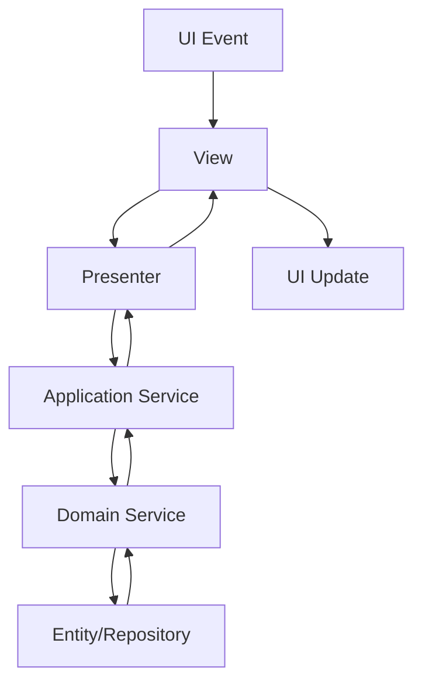

# 📋 MVP 패턴 아키텍처 완전 가이드

## 🎯 개요

### 비개발자 친화적 설명

MVP 패턴을 **"역할 분담이 명확한 팀워크"**라고 생각해보세요.

- **View (화면 담당자)**: "사용자에게 보여주고, 입력받는 것만 담당해요. 계산이나 판단은 못해요."
- **Presenter (중간 관리자)**: "View에서 받은 정보로 비즈니스 로직을 처리하고, Model에서 데이터를 가져와 View에 전달해요."
- **Model (데이터 전문가)**: "데이터 저장, 검색, 계산만 담당해요. 화면이나 사용자는 몰라요."

이렇게 **각자 전문 영역에만 집중**하면 코드가 깔끔해지고, 문제가 생겼을 때 어디를 고쳐야 할지 명확해집니다.

### 기술적 개요

**MVP(Model-View-Presenter) 패턴**은 Presentation Layer의 관심사를 분리하는 아키텍처 패턴입니다.

- **View**: Passive View로 구현, 순수하게 UI 렌더링과 사용자 입력 수집만 담당
- **Presenter**: View와 Model 사이의 중재자, 모든 비즈니스 로직과 UI 로직 처리
- **Model**: 도메인 데이터와 비즈니스 규칙, View에 대한 의존성 없음

본 프로젝트에서는 **DDD + MVP + PyQt6 + 의존성 주입** 조합으로 구현합니다.

## 🔄 방법론 비교

### MVC vs MVP vs MVVM 비교

| 패턴 | Controller/Presenter/ViewModel | View 역할 | 데이터 바인딩 | 테스트 용이성 |
|------|-------------------------------|----------|-------------|-------------|
| **MVC** | Controller가 View/Model 모두 조작 | Active View (비즈니스 로직 포함) | 수동 | 어려움 |
| **MVP** ⭐ | Presenter가 View 완전 제어 | Passive View (순수 UI만) | 수동 (시그널/슬롯) | 쉬움 |
| **MVVM** | ViewModel과 View 양방향 바인딩 | 반자동 Active View | 자동 | 중간 |

### 우리가 MVP를 선택한 이유

1. **PyQt6 환경 최적화**: 시그널/슬롯과 MVP가 자연스럽게 조합됨
2. **테스트 용이성**: Passive View로 인한 완벽한 UI 로직 분리
3. **DDD 통합**: Presentation 계층에서 Application Service와 완벽 연동
4. **의존성 제어**: 명확한 의존성 방향 (View → Presenter → Model)

### DDD + MVP 조합의 장점



- **계층별 책임 분리**: UI ↔ Application ↔ Domain 완전 격리
- **테스트 전략**: 각 계층을 독립적으로 테스트 가능
- **변경 영향 최소화**: UI 변경이 Domain에 영향 없음

## 🏗️ 구축 개요

### 파일 구조

```text
upbit_auto_trading/
├── presentation/              # MVP Presentation Layer
│   ├── interfaces/           # View 인터페이스 정의
│   │   └── settings_view_interface.py
│   ├── presenters/           # Presenter 구현체들
│   │   ├── settings_presenter.py
│   │   └── strategy_maker_presenter.py
│   ├── views/               # Passive View 구현체들 (별도 경로)
│   ├── view_models/         # View 데이터 모델들
│   └── mvp_container.py     # MVP 의존성 주입 컨테이너
│
├── ui/desktop/screens/       # PyQt6 UI 구현 (View 레이어)
│   └── settings/
│       ├── settings_screen.py        # 메인 설정 View
│       ├── api_settings/
│       │   └── views/
│       │       └── api_settings_view.py
│       └── logging_management/
│           └── logging_management_view.py
```

### 핵심 구성 요소

#### 1. View 인터페이스 (Protocol 기반)

```python
# presentation/interfaces/settings_view_interface.py
from typing import Protocol
from PyQt6.QtCore import pyqtSignal

@runtime_checkable
class ISettingsView(Protocol):
    # 시그널 정의 (View → Presenter 통신)
    settings_changed: pyqtSignal = pyqtSignal()
    save_all_requested: pyqtSignal = pyqtSignal()

    def show_loading_state(self, loading: bool) -> None: ...
    def show_save_success_message(self) -> None: ...
    def show_save_error_message(self, error: str) -> None: ...
```

#### 2. MVP 컨테이너 (의존성 주입)

```python
# presentation/mvp_container.py
class MVPContainer:
    def create_settings_mvp(self, parent=None):
        # Application Service 주입
        settings_service = self._app_container.get_settings_service()

        # View 생성
        settings_view = SettingsScreen(parent=parent)

        # Presenter 생성 (View와 Service 연결)
        settings_presenter = SettingsPresenter(
            view=settings_view,
            settings_service=settings_service
        )

        return settings_view, settings_presenter
```

#### 3. 시그널 기반 통신

```python
# View → Presenter 시그널 연결
self.save_all_requested.connect(presenter.handle_save_all_settings)

# Presenter → View 시그널 연결
presenter.settings_loaded.connect(self.update_ui_with_settings)
```

## 🎯 적용 상황 가이드

### MVP 패턴이 **필요한** 경우 ✅

- [ ] **복잡한 UI 로직**: 다수의 위젯이 상호작용하는 화면
- [ ] **비즈니스 로직 포함**: 설정 검증, 데이터 변환, 상태 관리가 필요한 경우
- [ ] **테스트 필요성**: UI 로직을 독립적으로 테스트해야 하는 경우
- [ ] **재사용성 요구**: 동일한 비즈니스 로직을 다른 View에서 사용할 경우
- [ ] **비동기 처리**: 네트워크 요청, 파일 I/O 등 비동기 작업이 포함된 경우

### MVP 패턴이 **불필요한** 경우 ❌

- [ ] **단순한 표시용 UI**: 데이터를 단순히 보여주기만 하는 화면
- [ ] **정적 다이얼로그**: 확인/취소만 있는 메시지 박스
- [ ] **단일 기능 위젯**: 하나의 간단한 기능만 하는 위젯
- [ ] **즉시 적용 설정**: 실시간으로 바로 반영되는 간단한 설정

### 판단 기준

```python
# MVP 적용 여부 판단 체크리스트
def should_use_mvp(component_info: dict) -> bool:
    score = 0

    # 복잡도 점수
    if component_info["widget_count"] > 5: score += 2
    if component_info["has_business_logic"]: score += 3
    if component_info["has_async_operations"]: score += 2
    if component_info["needs_testing"]: score += 2
    if component_info["will_be_reused"]: score += 1

    # MVP 적용 기준: 5점 이상
    return score >= 5
```

## ✅ 체크포인트와 체크리스트

### Phase 1: 설계 체크포인트

- [ ] **View 순수성 확인**: View에 비즈니스 로직이 포함되지 않았는가?
- [ ] **인터페이스 정의**: View 인터페이스(Protocol)가 명확히 정의되었는가?
- [ ] **시그널 설계**: View ↔ Presenter 통신이 시그널 기반으로 설계되었는가?
- [ ] **의존성 방향**: View → Presenter → Application Service 방향이 맞는가?

### Phase 2: 구현 체크포인트

- [ ] **MVP 컨테이너 활용**: 의존성 주입 컨테이너를 통해 생성되는가?
- [ ] **순환 참조 회피**: View와 Presenter 간 순환 참조가 없는가?
- [ ] **초기화 순서**: Presenter → View 연결 → 시그널 연결 순서가 맞는가?
- [ ] **에러 처리**: 각 계층에서 적절한 에러 처리가 되고 있는가?

### Phase 3: 테스트 체크포인트

- [ ] **View 테스트**: UI 렌더링과 시그널 발생을 독립적으로 테스트할 수 있는가?
- [ ] **Presenter 테스트**: Mock View를 사용하여 비즈니스 로직을 테스트할 수 있는가?
- [ ] **통합 테스트**: 전체 MVP 흐름이 정상 동작하는가?

### 품질 검증 체크리스트

```powershell
# MVP 패턴 위반 탐지 (PowerShell)

# 1. View에 비즈니스 로직 포함 여부 체크
Get-ChildItem upbit_auto_trading\ui\desktop -Recurse -Include *_view.py | Select-String -Pattern "import.*service|import.*repository"

# 2. Presenter에서 UI 직접 조작 여부 체크
Get-ChildItem upbit_auto_trading\presentation\presenters -Recurse -Include *.py | Select-String -Pattern "\.setText\(|\.setEnabled\(|\.show\("

# 3. 순환 참조 탐지
Get-ChildItem upbit_auto_trading\presentation -Recurse -Include *.py | Select-String -Pattern "from.*ui\.desktop"
```

## 🛠️ 패턴 가이드

### 올바른 MVP 구현 템플릿

#### ✅ 올바른 View 구현

```python
class SettingsView(QWidget):
    """MVP 패턴 - Passive View 구현"""

    # 시그널 정의 (View → Presenter)
    settings_changed = pyqtSignal(dict)
    save_requested = pyqtSignal()

    def __init__(self, parent=None):
        super().__init__(parent)
        self.presenter = None  # Presenter는 외부에서 주입
        self._setup_ui()
        self._connect_internal_signals()

    def set_presenter(self, presenter):
        """Presenter 주입 (DI 패턴)"""
        self.presenter = presenter
        self._connect_presenter_signals()

    def _setup_ui(self):
        """순수 UI 구성만"""
        # 위젯 생성 및 레이아웃만
        pass

    def _connect_internal_signals(self):
        """View 내부 시그널만 연결"""
        # 위젯 간 시그널 연결만
        pass

    def _connect_presenter_signals(self):
        """Presenter와 시그널 연결"""
        if not self.presenter:
            return

        # View → Presenter
        self.save_requested.connect(self.presenter.handle_save)

        # Presenter → View
        self.presenter.settings_loaded.connect(self.update_ui)

    # === UI 상태 업데이트 메서드들 (Presenter가 호출) ===
    def update_ui(self, settings: dict):
        """UI 상태 업데이트 (비즈니스 로직 없음)"""
        # 단순히 UI 반영만
        pass

    def show_loading(self, loading: bool):
        """로딩 상태 표시"""
        # 로딩 UI 업데이트만
        pass
```

#### ✅ 올바른 Presenter 구현

```python
class SettingsPresenter(QObject):
    """MVP 패턴 - Presenter 구현"""

    # Presenter → View 시그널
    settings_loaded = pyqtSignal(dict)
    loading_state_changed = pyqtSignal(bool)

    def __init__(self, view, settings_service):
        super().__init__()
        self._view = view  # View 인터페이스
        self._settings_service = settings_service

        # View에 Presenter 주입
        self._view.set_presenter(self)

    def handle_save(self):
        """저장 요청 처리 (비즈니스 로직)"""
        try:
            self.loading_state_changed.emit(True)

            # Application Service 호출
            settings = self._collect_settings_from_view()
            self._settings_service.save_settings(settings)

            # View에 결과 알림
            self._view.show_save_success_message()

        except Exception as e:
            self._view.show_save_error_message(str(e))
        finally:
            self.loading_state_changed.emit(False)

    def _collect_settings_from_view(self) -> dict:
        """View에서 설정 수집"""
        # View의 getter 메서드 호출
        return self._view.get_current_settings()
```

### ❌ 잘못된 구현 (안티패턴)

#### ❌ View에서 직접 Presenter 생성

```python
class BadSettingsView(QWidget):
    """잘못된 예시 - DI 패턴 위반"""

    def __init__(self):
        super().__init__()

        # ❌ View에서 직접 Presenter 생성 (DI 위반)
        self.presenter = SettingsPresenter(self)

        # ❌ View에서 Service 직접 접근
        self.settings_service = SettingsService()
```

#### ❌ View에 비즈니스 로직 포함

```python
def on_save_clicked(self):
    """❌ View에 비즈니스 로직 포함"""

    # ❌ View에서 검증 로직 수행
    if not self.validate_api_key():
        QMessageBox.warning(self, "오류", "API 키가 올바르지 않습니다")
        return

    # ❌ View에서 직접 DB/파일 저장
    self.save_to_database()
```

#### ❌ Presenter에서 UI 직접 조작

```python
class BadPresenter:
    def handle_save(self):
        """❌ Presenter에서 UI 직접 조작"""

        # ❌ Presenter에서 위젯 직접 조작
        self._view.status_label.setText("저장 중...")
        self._view.save_button.setEnabled(False)

        # ❌ Presenter에서 다이얼로그 직접 표시
        QMessageBox.information(None, "성공", "저장 완료")
```

### 순환 참조 해결 패턴

```python
# MVPContainer에서 순환 참조 해결
def create_settings_mvp(self):
    """순환 참조 해결 패턴"""

    # 1. View 먼저 생성
    view = SettingsView()

    # 2. Presenter 생성 시 View 주입
    presenter = SettingsPresenter(view, self._settings_service)

    # 3. View에 Presenter 주입 (순환 참조 해결)
    view.set_presenter(presenter)

    return view, presenter
```

## 🎓 전문가 조언

### 성공 요인

#### 1. **의존성 주입 원칙 준수**

```python
# ✅ 올바른 방법 - 컨테이너에서 주입
mvp_container = get_mvp_container()
view, presenter = mvp_container.create_settings_mvp()

# ❌ 잘못된 방법 - 직접 생성
view = SettingsView()
presenter = SettingsPresenter(view)  # 하드코딩된 의존성
```

#### 2. **초기화 순서 엄수**

```python
# 올바른 초기화 순서
def proper_initialization():
    # 1. View 생성 (UI 구성)
    view = SettingsView()

    # 2. Presenter 생성 (비즈니스 로직 준비)
    presenter = SettingsPresenter(view, service)

    # 3. View-Presenter 연결
    view.set_presenter(presenter)

    # 4. 시그널 연결
    view._connect_presenter_signals()

    # 5. 초기 데이터 로드
    presenter.load_initial_data()
```

#### 3. **시그널 기반 비동기 통신**

```python
# PyQt6 시그널을 활용한 느슨한 결합
class AsyncPresenter(QObject):
    data_loaded = pyqtSignal(dict)

    @pyqtSlot()
    def load_data_async(self):
        """비동기 데이터 로드"""
        def worker():
            try:
                data = self._service.load_heavy_data()
                self.data_loaded.emit(data)  # 시그널로 결과 전달
            except Exception as e:
                self.error_occurred.emit(str(e))

        QTimer.singleShot(0, worker)  # 비동기 실행
```

### 안티패턴 회피

#### 1. **God View 방지**

```python
# ❌ God View - 너무 많은 책임
class GodView(QWidget):
    def __init__(self):
        # 수십 개의 위젯 관리
        # 다양한 비즈니스 로직 처리
        # 여러 서비스와 직접 통신
        pass

# ✅ 해결: View 분해 + Composite 패턴
class MainView(QWidget):
    def __init__(self):
        self.api_settings_view = ApiSettingsView()
        self.db_settings_view = DatabaseSettingsView()
        # 각 View는 단일 책임만
```

#### 2. **Presenter 비대화 방지**

```python
# ❌ Fat Presenter - 모든 로직 집중
class FatPresenter:
    def handle_everything(self):
        # 검증 + 변환 + 저장 + 알림 + 로깅 + ...
        pass

# ✅ 해결: Application Service 활용
class LeanPresenter:
    def handle_save(self):
        # 단순히 Service에 위임
        self._settings_service.save_all_settings(settings)
```

#### 3. **Interface Segregation 준수**

```python
# ✅ 인터페이스 분리
class IApiSettingsView(Protocol):
    """API 설정 전용 View 인터페이스"""
    def update_api_status(self, connected: bool): ...
    def show_api_error(self, error: str): ...

class IDatabaseSettingsView(Protocol):
    """DB 설정 전용 View 인터페이스"""
    def update_connection_status(self, status: str): ...
    def show_tables_list(self, tables: list): ...
```

### 장기 관점 고려사항

#### 1. **확장성 설계**

- **Plugin 아키텍처**: 새로운 설정 탭을 쉽게 추가할 수 있도록
- **View 교체**: Web UI로 전환 시 Presenter 재사용 가능하도록
- **테스트 자동화**: UI 테스트와 로직 테스트 분리

#### 2. **성능 최적화**

- **Lazy Loading**: 복잡한 View는 필요할 때만 초기화
- **메모리 관리**: Presenter 캐시와 View 생명주기 관리
- **시그널 최적화**: 불필요한 시그널 연결 방지

#### 3. **유지보수성**

- **로깅 전략**: MVP 각 계층별 적절한 로깅
- **문서화**: View 인터페이스와 Presenter 계약 명세
- **코드 리뷰**: MVP 패턴 준수 여부 자동 체크

---

## 📚 참고 파일

### 성공 사례

- `upbit_auto_trading/ui/desktop/screens/settings/logging_management/logging_management_view.py`
- `upbit_auto_trading/presentation/presenters/settings_presenter.py`
- `upbit_auto_trading/presentation/mvp_container.py`

### 개선 필요 사례

- `upbit_auto_trading/ui/desktop/screens/settings/settings_screen.py` (View에서 직접 Presenter 생성)

### 핵심 인프라

- `upbit_auto_trading/presentation/interfaces/settings_view_interface.py`
- `upbit_auto_trading/application/container.py` (Application Service 컨테이너)

---

**🎯 핵심 원칙**: "View는 바보처럼, Presenter는 똑똑하게, Model은 독립적으로"

**💡 성공 기준**: MVP 패턴으로 구현된 컴포넌트는 View 없이도 Presenter 로직을 완벽히 테스트할 수 있어야 합니다.
