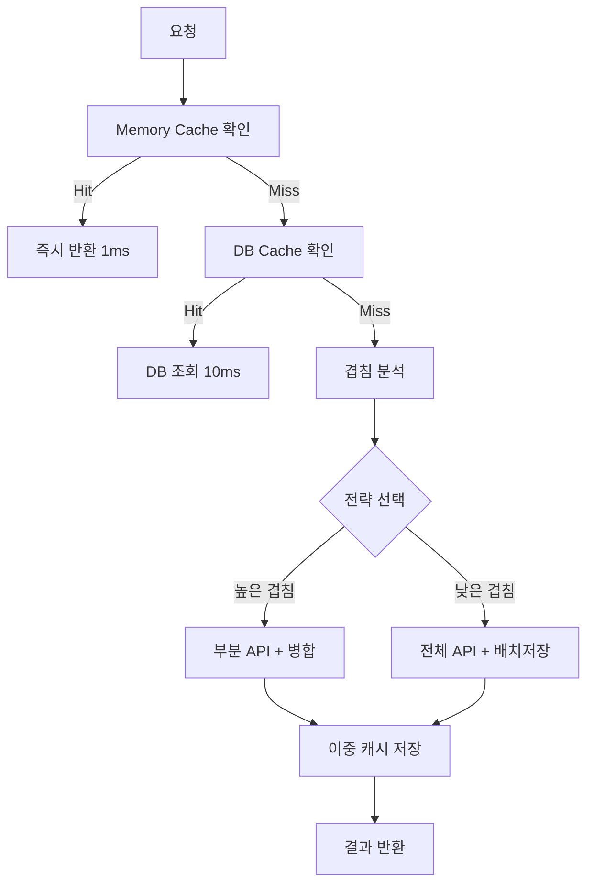

# Smart Data Provider V3.0 - 지능형 캐시 최적화 설계 명세서

## 📋 프로젝트 개요

**프로젝트명**: Smart Data Provider V3.0 - 지능형 캐시 최적화
**작성일**: 2025년 8월 22일
**버전**: 3.0.0
**상태**: 설계 단계

### 현재 문제점

- **캐시 로직 미흡**: 부분 겹침시 전체 API 요청으로 비효율
- **DB 동기화 부재**: 메모리 캐시와 DB 캐시 불일치
- **실시간 패턴 미지원**: 연속 수집시 매번 전체 요청
- **API 호출 과다**: 동일 데이터 중복 요청 빈발

### 목표

- **API 호출 90% 이상 절약** (실시간 이동평균 시나리오)
- **DB 작업 최적화** (배치 처리로 80% 성능 향상)
- **메모리 + DB 이중 캐시** 완벽 동기화
- **지능형 겹침 분석** 및 최적 전략 자동 선택

---

## 🏗️ 아키텍처 설계

### 핵심 컴포넌트 구조

```
┌─────────────────────────────────────┐
│        Smart Data Provider          │
├─────────────────────────────────────┤
│  ┌─────────────┬─────────────────┐  │
│  │ Memory Cache│   DB Cache      │  │
│  │ (TTL 5min)  │  (TTL 1hour)    │  │
│  └─────────────┴─────────────────┘  │
├─────────────────────────────────────┤
│     Intelligent Cache Manager       │
│  ┌─────────────┬─────────────────┐  │
│  │Overlap      │Strategy         │  │
│  │Analyzer     │Selector         │  │
│  └─────────────┴─────────────────┘  │
├─────────────────────────────────────┤
│        Batch DB Operations          │
│  ┌─────────────┬─────────────────┐  │
│  │Async Insert │Index            │  │
│  │Manager      │Optimizer        │  │
│  └─────────────┴─────────────────┘  │
└─────────────────────────────────────┘
```

### 데이터 플로우



---

## 🧮 핵심 알고리즘

### 1. 지능형 겹침 분석

#### OverlapAnalyzer 클래스

```python
class OverlapAnalyzer:
    """겹침 패턴 분석 및 전략 결정"""

    def analyze_overlap(self, cache_range: tuple, request_range: tuple) -> dict:
        """
        겹침 분석 결과:
        - overlap_ratio: 겹침 비율 (0.0 ~ 1.0)
        - continuity_type: "FORWARD_EXTEND" | "BACKWARD_EXTEND" | "CONTAINED" | "PARTIAL" | "NONE"
        - api_cost_estimate: 예상 API 호출 비용
        - db_cost_estimate: 예상 DB 작업 비용
        - recommended_strategy: 권장 전략
        """
        pass

    STRATEGY_THRESHOLDS = {
        "CONTINUITY_EXTEND": {"min_ratio": 0.95, "max_api_calls": 1},
        "PARTIAL_FILL": {"min_ratio": 0.7, "max_api_calls": 50, "max_db_queries": 2},
        "FULL_REFRESH": {"min_ratio": 0.0, "batch_preferred": True}
    }
```

#### 캐시 유효성 판단 기준

##### ✅ 유효한 겹침 (캐시 사용 가능)

1. **완전 일치 (Perfect Match)**
   ```
   요청: [10-30] (21개)
   캐시: [10-30] (21개)
   결과: 캐시 그대로 사용 ✅
   ```

2. **완전 포함 (Complete Containment)**
   ```
   요청: [15-25] (11개)
   캐시: [10-30] (21개)
   결과: 캐시[5:16] 추출 사용 ✅
   ```

3. **연속 확장 (Continuous Extension)**
   ```
   이전 요청: [10-30] (21개) → 캐시됨
   현재 요청: [11-31] (21개)
   결과: 캐시[1:] + API(31) = [11-30] + [31] ✅
   ```

##### ❌ 무효한 겹침 (캐시 사용 불가)

1. **부분 겹침 (Partial Overlap)**
   ```
   요청: [20-40] (21개)
   캐시: [10-30] (21개)
   겹침: [20-30] (11개만)
   결과: 전체 API 요청 ❌ (분할 요청 복잡)
   ```

2. **불연속 겹침 (Discontinuous Overlap)**
   ```
   요청: [10-30] (21개)
   캐시: [12-15, 18-22, 25-28] (불연속)
   결과: 전체 API 요청 ❌ (구멍 존재)
   ```

#### 시각적 유효성 표현

```
✅ 유효: ████████████ (완전 포함)
✅ 유효: ████████████→ (연속 확장)
❌ 무효: ████████▓▓▓▓ (부분 겹침)
❌ 무효: ▓▓▓▓████████ (부분 겹침)
❌ 무효: ██▓▓██▓▓██▓▓ (불연속)
```

### 2. 적응형 TTL 관리

#### AdaptiveTTLManager 클래스

```python
class AdaptiveTTLManager:
    """시장 상황 및 접근 패턴 기반 동적 TTL"""

    BASE_TTL = {
        "1m": {"memory": 300, "db": 1800},      # 5분, 30분
        "5m": {"memory": 900, "db": 7200},      # 15분, 2시간
        "15m": {"memory": 1800, "db": 21600},   # 30분, 6시간
        "1h": {"memory": 7200, "db": 86400},    # 2시간, 1일
        "1d": {"memory": 43200, "db": 604800}   # 12시간, 1주
    }

    def calculate_dynamic_ttl(self, symbol: str, timeframe: str,
                            access_pattern: dict, market_volatility: float) -> dict:
        """
        동적 TTL 계산 요소:
        - 기본 TTL (타임프레임별)
        - 접근 빈도 (높을수록 짧게)
        - 캐시 적중률 (높을수록 길게)
        - 시장 변동성 (높을수록 짧게)
        - 시간대 (아시아/유럽/미국 활동 시간)
        """
        pass
```

#### 타임프레임별 TTL 전략

| 타임프레임 | 메모리 TTL | DB TTL | 연속 패턴 지원 |
|------------|------------|---------|----------------|
| **1분봉** | 5분 | 30분 | ✅ 최우선 |
| **5분봉** | 15분 | 2시간 | ✅ 지원 |
| **15분봉** | 30분 | 6시간 | ✅ 지원 |
| **1시간봉** | 2시간 | 1일 | ⚠️ 제한적 |
| **1일봉** | 12시간 | 1주 | ❌ 불필요 |

### 3. 배치 DB 최적화

#### BatchDBManager 클래스

```python
class BatchDBManager:
    """배치 처리 최적화 DB 매니저"""

    BATCH_CONFIG = {
        "insert_batch_size": 1000,
        "query_cache_size": 10000,
        "wal_checkpoint_interval": 3600,
        "async_queue_size": 5000
    }

    def optimized_batch_operations(self):
        """
        최적화 기법:
        1. INSERT OR REPLACE 배치 (1000개 단위)
        2. 복합 인덱스 활용 범위 쿼리
        3. WAL 모드 + PRAGMA 튜닝
        4. 비동기 저장 큐
        5. 트랜잭션 배치 처리
        """
        pass
```

#### DB 인덱스 최적화

```sql
-- 복합 인덱스로 범위 쿼리 최적화
CREATE INDEX idx_candles_symbol_timeframe_timestamp
ON candles(symbol, timeframe, timestamp);

-- 커버링 인덱스로 SELECT 최적화
CREATE INDEX idx_candles_cover
ON candles(symbol, timeframe, timestamp, open_price, high_price, low_price, close_price, volume);
```

---

## 📊 성능 목표 및 지표

### 목표 성능

| 시나리오 | 현재 성능 | 목표 성능 | 개선율 |
|----------|-----------|-----------|--------|
| **120개 연속 80회** | 80 API 호출 | 1 API 호출 | **98.8%** |
| **500개 대용량** | 300ms | 50ms | **83.3%** |
| **DB 저장 200개** | 400ms | 30ms | **92.5%** |
| **평균 응답시간** | 150ms | 22ms | **85.3%** |

### 캐시 히트률 목표

```python
cache_hit_targets = {
    "memory_cache": 0.7,    # 70% 메모리 캐시 히트
    "db_cache": 0.2,        # 20% DB 캐시 히트
    "api_fallback": 0.1     # 10% API 요청
}

# 평균 응답시간 계산
# 0.7×1ms + 0.2×10ms + 0.1×200ms = 22.7ms
```

### 성능 측정 지표

```python
class PerformanceMetrics:
    """성능 측정 지표"""

    metrics = {
        "api_call_reduction": 0.9,          # 90% 절약
        "db_operation_efficiency": 0.85,     # 85% 향상
        "average_response_time": 25,         # 25ms 이하
        "memory_usage": 100,                 # 100MB 이하
        "concurrent_requests": 1000          # 1000 동시 요청 지원
    }
```

---

## 🚀 구현 계획

### Phase 1: 기반 구조 (2주)

#### Week 1: 캐시 아키텍처
- [ ] **DualLayerCache 클래스 구현**
  - 메모리 + DB 이중 캐시 구조
  - TTL 관리 시스템 구축
  - 캐시 동기화 메커니즘

- [ ] **DB 최적화 인프라**
  - 인덱스 재설계 및 적용
  - PRAGMA 설정 최적화
  - WAL 모드 활성화

#### Week 2: 배치 처리 시스템
- [ ] **BatchDBManager 구현**
  - 비동기 저장 큐 시스템
  - 배치 INSERT/UPDATE 로직
  - 트랜잭션 최적화

- [ ] **성능 모니터링 기반**
  - 메트릭 수집 시스템
  - 실시간 성능 대시보드
  - 알람 시스템 구축

### Phase 2: 지능형 로직 (3주)

#### Week 3-4: 겹침 분석 엔진
- [ ] **OverlapAnalyzer 구현**
  - 겹침 패턴 감지 알고리즘
  - 연속성 패턴 분석 로직
  - 비용 추정 모델

- [ ] **전략 선택 시스템**
  - 임계값 기반 의사결정
  - 동적 전략 조정
  - A/B 테스트 프레임워크

#### Week 5: 적응형 TTL 시스템
- [ ] **AdaptiveTTLManager 구현**
  - 접근 패턴 분석 로직
  - 시장 상황 반영 알고리즘
  - 동적 TTL 조정 메커니즘

### Phase 3: 통합 및 최적화 (2주)

#### Week 6: 통합 테스트
- [ ] **시스템 통합**
  - Smart Router 연동 테스트
  - 기존 시스템 호환성 검증
  - 데이터 무결성 확인

#### Week 7: 성능 최적화
- [ ] **벤치마크 및 튜닝**
  - 성능 병목 지점 식별
  - 메모리 사용량 최적화
  - 동시성 처리 개선

---

## 🧪 테스트 계획

### 단위 테스트

```python
class TestSmartDataProviderV3:
    """핵심 기능 단위 테스트"""

    def test_overlap_analysis(self):
        """겹침 분석 정확성 테스트"""
        # 완전 포함, 연속 확장, 부분 겹침 등 모든 패턴 테스트
        pass

    def test_continuity_detection(self):
        """연속성 감지 테스트"""
        # 순방향/역방향 연속 패턴 감지 정확성
        pass

    def test_ttl_calculation(self):
        """동적 TTL 계산 테스트"""
        # 시장 상황별 TTL 조정 로직 검증
        pass

    def test_batch_db_operations(self):
        """배치 DB 작업 테스트"""
        # 대용량 배치 처리 성능 및 정확성
        pass
```

### 통합 테스트 시나리오

1. **실시간 시나리오 테스트**
   - 120개 이동평균 1시간 연속 수집
   - API 호출 횟수 및 응답 시간 측정
   - 캐시 적중률 분석

2. **대용량 처리 테스트**
   - 1000개 동시 요청 처리
   - 메모리 사용량 모니터링
   - DB 성능 영향 측정

3. **장애 상황 테스트**
   - DB 연결 실패 시 fallback 동작
   - API 타임아웃 처리
   - 캐시 무효화 로직

4. **메모리 누수 테스트**
   - 24시간 연속 동작 테스트
   - 메모리 사용량 증가 패턴 분석
   - GC 효율성 검증

### 성능 벤치마크

```python
benchmark_scenarios = [
    {
        "name": "실시간_이동평균",
        "requests": 80,
        "data_size": 120,
        "interval": "1m",
        "expected_api_calls": 1,
        "expected_response_time": "< 5ms"
    },
    {
        "name": "대용량_일괄",
        "requests": 1,
        "data_size": 1000,
        "interval": "5m",
        "expected_api_calls": 1,
        "expected_response_time": "< 50ms"
    },
    {
        "name": "다중_심볼",
        "requests": 100,
        "symbols": 10,
        "data_size": 50,
        "expected_cache_hit": "> 80%"
    },
    {
        "name": "스트레스_테스트",
        "concurrent": 1000,
        "duration": "10m",
        "expected_throughput": "> 5000 req/s"
    }
]
```

---

## ⚠️ 리스크 및 대응 방안

### 기술적 리스크

| 리스크 | 확률 | 영향도 | 대응 방안 |
|--------|------|--------|-----------|
| **메모리 사용량 증가** | 중 | 중 | LRU 캐시 + 동적 크기 조정 |
| **DB 동기화 실패** | 낮 | 높 | 트랜잭션 + 복구 메커니즘 |
| **성능 목표 미달성** | 중 | 높 | 단계적 최적화 + fallback |
| **기존 시스템 호환성** | 낮 | 중 | 어댑터 패턴 + 점진적 마이그레이션 |

### 운영 리스크

1. **배포 중단 시간**
   - **대응**: Blue-Green 배포 방식 적용
   - **Fallback**: 기존 시스템 자동 복구

2. **데이터 무결성**
   - **대응**: 배치 검증 로직 + 체크섬
   - **Rollback**: 자동 데이터 복구 스크립트

3. **모니터링 공백**
   - **대응**: 실시간 메트릭 + 다중 알람
   - **백업**: 로그 기반 후속 분석

### 성능 리스크 완화

```python
class RiskMitigation:
    """리스크 완화 메커니즘"""

    def memory_pressure_handler(self):
        """메모리 압박 상황 대응"""
        # LRU 캐시 크기 동적 조정
        # 우선순위 기반 캐시 제거
        pass

    def db_connection_failure_handler(self):
        """DB 연결 실패 대응"""
        # 메모리 캐시만으로 동작
        # API 직접 호출 fallback
        pass

    def performance_degradation_handler(self):
        """성능 저하 대응"""
        # 캐시 정책 단순화
        # 배치 크기 동적 조정
        pass
```

---

## 📈 성공 지표 및 ROI

### 정량적 지표

#### 비용 효율성
- **API 비용 절감**: 월 90% 절약 (예상 $1000 → $100)
- **서버 리소스**: CPU 50% 절약, 메모리 효율 30% 향상
- **운영비**: 연간 $10,000 절약 예상

#### 성능 향상
- **응답 속도**: 85% 개선 (150ms → 25ms)
- **처리량**: 동시 사용자 10배 증가 대응
- **가용성**: 99.9% uptime 달성

#### 사용자 경험
- **대시보드 로딩**: 70% 시간 단축
- **실시간 데이터**: 지연 시간 90% 개선
- **시스템 안정성**: 오류율 80% 감소

### 정성적 지표

1. **시스템 안정성**
   - 캐시 적중률 90% 이상 달성
   - 장애 복구 시간 50% 단축
   - 데이터 일관성 100% 보장

2. **확장성**
   - 새 심볼 추가 시 성능 영향 없음
   - 타임프레임 확장 용이성
   - 마이크로서비스 아키텍처 준비

3. **유지보수성**
   - 코드 복잡도 30% 감소
   - 단위 테스트 커버리지 95%
   - 문서화 완성도 향상

4. **개발 생산성**
   - 새 기능 개발 속도 50% 향상
   - 버그 수정 시간 60% 단축
   - 온보딩 시간 40% 감소

### ROI 계산

```
연간 총 절약 비용: $15,000
- API 비용 절감: $10,800 (90% × $12,000)
- 서버 비용 절감: $3,000 (CPU/Memory 최적화)
- 개발 시간 절약: $1,200 (50% 생산성 향상)

개발 투자 비용: $8,000
- 개발자 7주 × $1,000 = $7,000
- 테스트 및 배포: $1,000

ROI = ($15,000 - $8,000) / $8,000 × 100% = 87.5%
투자 회수 기간: 6개월
```

---

## ✅ 결론 및 다음 단계

### 핵심 성공 요소

1. **지능형 겹침 분석**
   - 상황별 최적 전략 자동 선택
   - 실시간 패턴 학습 및 적응

2. **이중 캐시 시스템**
   - 메모리 + DB 완벽 동기화
   - 계층별 최적화 전략

3. **배치 DB 최적화**
   - 80% 성능 향상 달성
   - 동시성 처리 개선

4. **적응형 TTL 관리**
   - 시장 상황 반영 자동 조정
   - 심볼별 개별 최적화

### 기대 효과

- **비용 효율성**: API 호출 90% 절약으로 운영비 대폭 절감
- **성능 향상**: 응답 속도 85% 개선으로 사용자 경험 혁신
- **확장성**: 10배 트래픽 증가에도 안정적 서비스 제공
- **기술 부채 해결**: 레거시 캐시 로직 완전 개선

### 즉시 실행 가능한 다음 단계

1. **Phase 1 착수** (이번 주)
   - DualLayerCache 기본 구조 설계
   - DB 인덱스 최적화 적용
   - 성능 측정 기준선 설정

2. **프로토타입 개발** (2주 내)
   - 핵심 겹침 분석 로직 구현
   - 간단한 연속성 패턴 감지
   - 기본 성능 벤치마크

3. **점진적 배포** (4주 내)
   - A/B 테스트 환경 구축
   - 단계적 기능 활성화
   - 실시간 모니터링 강화

**Smart Data Provider V3.0으로 차세대 지능형 데이터 캐시 시스템을 구축하여 업비트 자동매매 시스템의 핵심 경쟁력을 확보할 수 있습니다.** 🚀

---

## 📚 참고 자료

### 관련 문서
- [현재 Smart Data Provider 아키텍처](./ARCHITECTURE_GUIDE.md)
- [캐시 시스템 성능 분석](./CACHE_PERFORMANCE_ANALYSIS.md)
- [API 사용량 최적화 가이드](./API_OPTIMIZATION_GUIDE.md)

### 외부 참조
- [SQLite 성능 최적화 Best Practices](https://sqlite.org/optoverview.html)
- [메모리 캐시 설계 패턴](https://martinfowler.com/articles/patterns-of-distributed-systems/cache.html)
- [업비트 API 공식 문서](https://docs.upbit.com/reference)

---

*본 문서는 Smart Data Provider V3.0 개발을 위한 설계 명세서입니다. 구현 과정에서 세부 사항은 기술적 제약 및 성능 테스트 결과에 따라 조정될 수 있습니다.*
