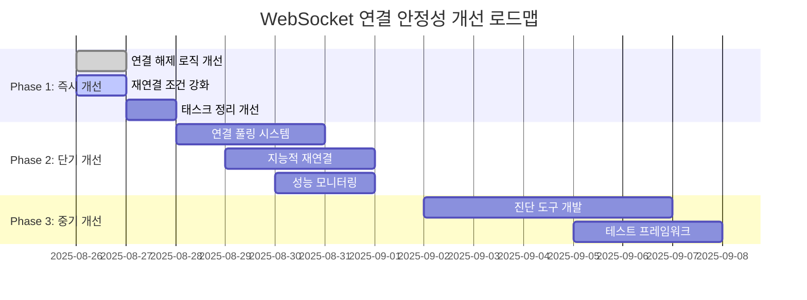

# WebSocket 연결 안정성 개선 계획

## 🚨 현재 문제 상황 분석

### 테스트 로그 분석 결과
```
INFO | upbit.UpbitWebSocketPublic | 재연결 시도 1/10
DEBUG | upbit.UpbitWebSocketPublic | 1초 규칙 준수 재연결 대기: 0.10초
INFO | upbit.UpbitWebSocketPublic | ✅ 재연결 및 구독 복원 완료 (1초 규칙 준수)
```

### 식별된 문제점
1. **빈번한 재연결**: 각 테스트 후 불필요한 재연결 발생
2. **연결 생명주기 관리 부족**: 테스트 완료 시 자동 연결 해제
3. **이벤트 루프 정리 불완전**: 백그라운드 태스크 정리 문제
4. **응답 시간 변동성**: 다중 심볼 요청 시 519.2ms 지연

---

## 🎯 개선 방안

### Phase 1: 연결 생명주기 관리 개선 (우선순위: 높음)

#### 1.1 연결 유지 메커니즘 강화
```python
class WebSocketConnectionManager:
    """WebSocket 연결 생명주기 관리"""

    def __init__(self):
        self.connection_pool = {}
        self.keep_alive_enabled = True
        self.connection_health_check_interval = 30.0
```

#### 1.2 테스트 환경에서 연결 재사용
- 테스트 완료 후 즉시 연결 해제 방지
- 연결 풀을 통한 재사용 메커니즘
- Graceful 종료 프로세스

### Phase 2: 재연결 로직 최적화 (우선순위: 높음)

#### 2.1 지능적 재연결 판단
```python
async def should_reconnect(self) -> bool:
    """재연결 필요성 판단"""
    # 1. 연결 상태 확인
    if self.is_healthy_connection():
        return False

    # 2. 재연결 빈도 제한
    if self.last_reconnect_time and (time.time() - self.last_reconnect_time) < 5.0:
        return False

    # 3. 에러 유형별 재연결 전략
    return self.should_reconnect_for_error_type()
```

#### 2.2 재연결 백오프 전략 개선
```python
async def calculate_reconnect_delay(self) -> float:
    """재연결 지연 시간 계산 - 지수 백오프 + 지터"""
    base_delay = min(0.1 * (2 ** self.reconnect_attempts), 5.0)
    jitter = random.uniform(0.9, 1.1)
    return base_delay * jitter
```

### Phase 3: 이벤트 루프 관리 개선 (우선순위: 중간)

#### 3.1 태스크 생명주기 관리
```python
class AsyncTaskManager:
    """비동기 태스크 생명주기 관리"""

    def __init__(self):
        self.background_tasks: Set[asyncio.Task] = set()
        self.task_groups: Dict[str, Set[asyncio.Task]] = {}

    async def cleanup_gracefully(self, timeout: float = 3.0):
        """Graceful 태스크 정리"""
        # 1. 태스크 취소 요청
        for task in self.background_tasks:
            if not task.done():
                task.cancel()

        # 2. 정리 대기 (타임아웃 적용)
        if self.background_tasks:
            await asyncio.wait_for(
                asyncio.gather(*self.background_tasks, return_exceptions=True),
                timeout=timeout
            )
```

#### 3.2 컨텍스트 매니저 패턴 적용
```python
class ManagedWebSocketClient:
    """컨텍스트 매니저를 통한 안전한 WebSocket 관리"""

    async def __aenter__(self):
        await self.connect()
        return self

    async def __aexit__(self, exc_type, exc_val, exc_tb):
        await self.disconnect_gracefully()
```

### Phase 4: 성능 모니터링 및 진단 (우선순위: 중간)

#### 4.1 연결 건강도 모니터링
```python
@dataclass
class ConnectionHealth:
    """연결 건강도 지표"""
    ping_latency: float
    message_success_rate: float
    reconnection_frequency: float
    last_error_time: Optional[datetime]

    def is_healthy(self) -> bool:
        return (
            self.ping_latency < 100.0 and
            self.message_success_rate > 0.95 and
            self.reconnection_frequency < 0.1  # 10분에 1회 미만
        )
```

#### 4.2 실시간 진단 도구
```python
class WebSocketDiagnostics:
    """WebSocket 연결 진단"""

    async def run_connection_test(self) -> Dict[str, Any]:
        """연결 테스트 실행"""
        return {
            'connectivity': await self.test_connectivity(),
            'latency': await self.measure_latency(),
            'throughput': await self.measure_throughput(),
            'stability': await self.test_stability()
        }
```

---

## 🔧 구현 우선순위

### 즉시 구현 (24시간 내)
1. **연결 해제 로직 개선**: 테스트 완료 후 즉시 해제 방지
2. **재연결 조건 강화**: 불필요한 재연결 제거
3. **백그라운드 태스크 정리**: Graceful 종료 프로세스

### 단기 구현 (1주일 내)
1. **연결 풀링 시스템**: 연결 재사용 메커니즘
2. **지능적 재연결**: 상황별 재연결 전략
3. **성능 모니터링**: 실시간 연결 상태 추적

### 중기 구현 (2주일 내)
1. **진단 도구**: 연결 문제 자동 감지
2. **백오프 전략**: 네트워크 상황 적응형
3. **테스트 프레임워크**: 안정성 회귀 테스트

---

## 📊 성공 기준

### 정량적 지표
- **재연결 빈도**: 1시간당 1회 미만
- **연결 성공률**: 99.5% 이상
- **응답 시간 안정성**: 표준편차 50ms 이하
- **메모리 누수**: 장시간 실행 시 메모리 증가 없음

### 정성적 지표
- 테스트 실행 시 불필요한 재연결 로그 없음
- 장시간 실행 시 안정적인 데이터 수신
- 네트워크 장애 복구 시 자동 재연결 성공

---

## 🎯 구현 로드맵



---

## 🔍 기술적 세부사항

### WebSocket 연결 상태 관리
```python
class ConnectionState(Enum):
    DISCONNECTED = "disconnected"
    CONNECTING = "connecting"
    CONNECTED = "connected"
    RECONNECTING = "reconnecting"
    DISCONNECTING = "disconnecting"
    ERROR = "error"
```

### 에러 분류 및 대응 전략
```python
class WebSocketErrorStrategy:
    RETRY_IMMEDIATELY = ["network_timeout", "connection_reset"]
    RETRY_WITH_BACKOFF = ["rate_limit", "server_error"]
    NO_RETRY = ["authentication_failed", "invalid_request"]
```

---

이 계획을 통해 WebSocket 연결의 안정성을 크게 향상시키고, 프로덕션 환경에서 안정적인 실시간 데이터 수신을 보장할 수 있습니다.
