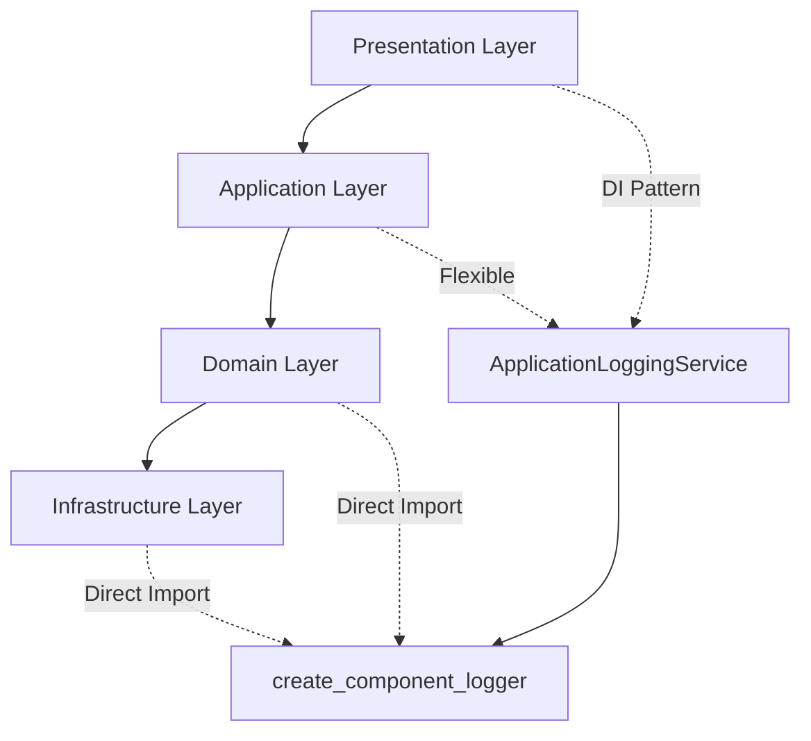

# 📋 DDD 아키텍처 계층별 로거 사용 패턴 가이드

## 🎯 개요

DDD(Domain-Driven Design) Clean Architecture에서 각 계층별로 로거를 사용하는 최적의 패턴을 정의합니다. 이 가이드는 계층별 특성과 요구사항에 맞는 차별화된 로깅 전략을 제시합니다.

---

## 🏗️ 계층별 로거 사용 패턴

### 📊 패턴 매트릭스

| 계층 | 패턴 | 이유 | 장점 | 사용 예시 |
|------|------|------|------|-----------|
| **Domain Layer** | Direct Import | 순수성 유지 | 독립성, 단순성, 성능 | Domain Services, Entities |
| **Infrastructure Layer** | Direct Import | 기술적 관심사 | 직접성, 명확성 | Containers, Managers |
| **Application Layer** | 상황별 선택 | 유연성 | 컨텍스트 적응 | Business Services |
| **Presentation Layer** | Dependency Injection | 테스트 용이성 | 유연성, 제어 가능성 | UI Components, Views |

---

## 1️⃣ Direct Import 패턴

### 📍 **적용 계층:** Domain Layer, Infrastructure Layer

#### 🔧 구현 방식

```python
from upbit_auto_trading.infrastructure.logging import create_component_logger

logger = create_component_logger("ComponentName")

class DomainService:
    def execute_business_rule(self):
        logger.info("비즈니스 규칙 실행")
        # 비즈니스 로직...
```

#### ✅ **사용 사례**

- **Domain Services**: `StrategySimulationService`, `TradingRuleEngine`
- **Infrastructure Containers**: `ExternalDependencyContainer`, `PresentationContainer`
- **System Managers**: `DILifecycleManager`, `PathConfigurationService`

#### 🎯 **선택 이유**

1. **Domain 순수성 유지**: DI 복잡성을 Domain에 추가하지 않음
2. **독립성**: 외부 의존 없이 자체 완결적 로깅
3. **성능**: DI Overhead 없는 직접적 접근
4. **단순성**: 명확하고 직관적인 로깅 패턴

#### 📋 **코드 예시**

```python
# Domain Layer - 전략 시뮬레이션 도메인 서비스
from upbit_auto_trading.infrastructure.logging import create_component_logger

logger = create_component_logger("StrategySimulationService")

class StrategySimulationService:
    """전략 시뮬레이션 도메인 서비스"""

    def __init__(self):
        logger.debug("전략 시뮬레이션 도메인 서비스 초기화")

    def select_optimal_data_source(self) -> Optional[DataSource]:
        logger.info("최적 데이터 소스 선택 시작")
        # 비즈니스 로직...
        logger.debug(f"선택된 데이터 소스: {source.name}")
        return source
```

---

## 2️⃣ Dependency Injection 패턴

### 📍 **적용 계층:** Presentation Layer, 일부 Application Layer

#### 🔧 구현 방식

```python
from upbit_auto_trading.application.services.logging_application_service import ApplicationLoggingService

class UIComponent:
    def __init__(self, logging_service: ApplicationLoggingService):
        self.logger = logging_service.get_component_logger("UIComponent")
        self.logger.info("UI 컴포넌트 초기화")
```

#### ✅ **사용 사례**

- **UI Views**: `SettingsScreen`, `UISettingsView`, `LoggingManagementView`
- **UI Widgets**: `ThemeSelectorWidget`, `AnimationSettingsWidget`
- **UI Components**: `ConsoleViewerWidget`, `ComponentSelectorDialog`

#### 🎯 **선택 이유**

1. **테스트 용이성**: Mock Logger 주입으로 단위 테스트 가능
2. **유연성**: 런타임에 로거 교체 및 설정 변경
3. **중앙 관리**: ApplicationLoggingService를 통한 통합 제어
4. **동적 설정**: UI 설정에 따른 실시간 로깅 레벨 변경

#### 📋 **코드 예시**

```python
# Presentation Layer - Settings Screen
class SettingsScreen(QWidget):
    def __init__(self, logging_service: ApplicationLoggingService):
        super().__init__()

        # DI 패턴으로 로거 주입
        if logging_service:
            self._logging_service = logging_service
            self.logger = logging_service.get_component_logger("SettingsScreen")
            self.logger.info("🔧 SettingsScreen (MVP View + Application Layer 로깅) 초기화 시작")
        else:
            raise ValueError("SettingsScreen에 logging_service가 주입되지 않았습니다")

        self._init_ui()

    def _init_ui(self):
        self.logger.debug("UI 컴포넌트 초기화 중...")
        # UI 구성 로직...
```

---

## 3️⃣ Application Layer의 유연한 패턴 선택

### 📍 **상황별 적응형 접근**

#### 🔄 **선택 기준**

1. **UI와 강하게 결합된 Service** → **DI 패턴**
2. **독립적인 Business Service** → **Direct Import 패턴**
3. **테스트가 중요한 Service** → **DI 패턴**
4. **성능이 중요한 Core Service** → **Direct Import 패턴**

#### 📋 **예시 분류**

```python
# Case 1: UI 연동 Service (DI 패턴)
class ScreenManagerService:
    def __init__(self, application_container, logging_service: ApplicationLoggingService):
        self.logger = logging_service.get_component_logger("ScreenManager")

# Case 2: Core Business Service (Direct Import 패턴)
from upbit_auto_trading.infrastructure.logging import create_component_logger

logger = create_component_logger("TradingStrategy")

class TradingStrategyService:
    def execute_strategy(self):
        logger.info("매매 전략 실행")
```

---

## 🔍 Clean Architecture 준수성 검증

### ✅ **의존성 방향 확인**



**모든 패턴이 Clean Architecture 의존성 방향을 준수합니다:**

- **Domain → Infrastructure**: ✅ 허용 (횡단 관심사)
- **Application → Infrastructure**: ✅ 허용 (서비스 레이어)
- **Presentation → Application → Infrastructure**: ✅ DI를 통한 제어 역전

---

## 🧪 테스트 전략

### 1️⃣ **Direct Import 패턴 테스트**

```python
# Domain Service 테스트
def test_strategy_simulation_service():
    service = StrategySimulationService()

    # 로거는 비즈니스 로직에 영향 없음
    result = service.select_optimal_data_source()

    assert result is not None
    # 로깅은 비즈니스 검증과 분리
```

### 2️⃣ **DI 패턴 테스트**

```python
# UI Component 테스트
def test_settings_screen():
    mock_logging_service = Mock(spec=ApplicationLoggingService)
    mock_logger = Mock()
    mock_logging_service.get_component_logger.return_value = mock_logger

    screen = SettingsScreen(logging_service=mock_logging_service)

    # 로거 주입 검증
    mock_logging_service.get_component_logger.assert_called_with("SettingsScreen")
    mock_logger.info.assert_called()
```

---

## 🛠️ 구현 가이드라인

### ✅ **DO (권장사항)**

1. **계층별 패턴 준수**

   ```python
   # Domain Layer - Direct Import
   from upbit_auto_trading.infrastructure.logging import create_component_logger
   logger = create_component_logger("DomainService")

   # Presentation Layer - DI Pattern
   def __init__(self, logging_service: ApplicationLoggingService):
       self.logger = logging_service.get_component_logger("UIComponent")
   ```

2. **컴포넌트 이름 명확화**

   ```python
   logger = create_component_logger("StrategySimulationService")  # ✅ 명확
   logger = create_component_logger("Service")  # ❌ 모호
   ```

3. **로깅 레벨 적절히 사용**

   ```python
   logger.debug("상세 실행 과정")      # 개발/디버깅용
   logger.info("주요 비즈니스 이벤트")  # 일반 정보
   logger.warning("주의가 필요한 상황") # 경고
   logger.error("오류 발생")          # 에러
   ```

### ❌ **DON'T (금지사항)**

1. **계층별 패턴 혼용 금지**

   ```python
   # Domain Layer에서 DI 패턴 사용 금지
   class DomainService:
       def __init__(self, logging_service: ApplicationLoggingService):  # ❌
           pass
   ```

2. **중복 로거 정의 금지**

   ```python
   # 모듈 레벨 정의
   logger = create_component_logger("Component")

   class SomeClass:
       def some_method(self):
           logger = create_component_logger("Component")  # ❌ 중복
   ```

3. **비즈니스 로직에 로깅 의존 금지**

   ```python
   def calculate_profit(self):
       if not logger.isEnabledFor(logging.INFO):  # ❌ 로깅에 의존적
           return None
       # 비즈니스 로직...
   ```

---

## 🔧 실제 프로젝트 적용 예시

### 📁 **파일별 패턴 매핑**

#### Domain Layer (Direct Import)

```
upbit_auto_trading/domain/
├── strategy_simulation/services/strategy_simulation_service.py ✅
├── trading_rules/services/rule_engine_service.py ✅
└── market_analysis/services/technical_analysis_service.py ✅
```

#### Infrastructure Layer (Direct Import)

```
upbit_auto_trading/infrastructure/
├── dependency_injection/di_lifecycle_manager.py ✅
├── dependency_injection/external_dependency_container.py ✅
└── services/path_configuration_service.py ✅
```

#### Presentation Layer (DI Pattern)

```
upbit_auto_trading/ui/desktop/screens/
├── settings/settings_screen.py ✅
├── settings/ui_settings/views/ui_settings_view.py ✅
└── settings/logging_management/logging_management_view.py ✅
```

#### Application Layer (상황별)

```
upbit_auto_trading/application/services/
├── screen_manager_service.py → DI Pattern (UI 연동)
├── strategy_application_service.py → Direct Import (Core Business)
└── notification_service.py → DI Pattern (UI 알림)
```

---

## 📚 참고 자료

### 🔗 **관련 문서**

- `docs/architecture_patterns/logging/optimized_logging_architecture_guide.md`
- `docs/architecture_patterns/logging/quick_reference.md`
- `docs/DEPENDENCY_INJECTION_ARCHITECTURE.md`
- `docs/DDD_아키텍처_패턴_가이드.md`

### 🏷️ **태그**

`#DDD` `#CleanArchitecture` `#Logging` `#DependencyInjection` `#ArchitecturePatterns`

---

## 📋 체크리스트

### ✅ **새로운 컴포넌트 개발 시**

- [ ] 계층 식별 (Domain/Application/Infrastructure/Presentation)
- [ ] 적절한 로거 패턴 선택 (Direct Import vs DI)
- [ ] 컴포넌트 이름 명확화
- [ ] 로깅 레벨 적절히 배치
- [ ] 테스트에서 로깅 검증 (DI 패턴의 경우)
- [ ] Clean Architecture 의존성 방향 확인

### ✅ **코드 리뷰 시**

- [ ] 계층별 로거 패턴 준수 여부
- [ ] 중복 로거 정의 없음
- [ ] 비즈니스 로직과 로깅 분리
- [ ] 적절한 로깅 레벨 사용
- [ ] 테스트 가능성 확보 (DI 패턴)

---

**문서 버전**: v1.0
**작성일**: 2025년 10월 1일
**작성자**: GitHub Copilot Agent
**검토**: 3-Container 아키텍처 기반 실제 프로젝트 분석 완료

---

> 💡 **핵심 메시지**: "각 계층의 특성과 요구사항에 맞는 최적의 로깅 패턴 선택이 핵심입니다. 과도한 순수성이 아닌 적재적소의 아키텍처 설계입니다!"
