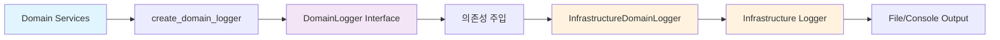

# 📚 업비트 자동매매 시스템 - 로깅 아키텍처 문서

> **DDD 기반 성능 최적화 로깅 시스템 완전 가이드**

## 📋 문서 구성

### 🎯 핵심 가이드

- **[optimized_logging_architecture_guide.md](./optimized_logging_architecture_guide.md)** - 완전한 아키텍처 가이드
  - DDD 레이어별 구조 상세 설명
  - 성능 최적화 결과 (24.2배 향상)
  - 의존성 주입 흐름 다이어그램
  - 사용법 및 문제 해결 가이드

- **[DDD_LOGGING_PATTERNS_GUIDE.md](./DDD_LOGGING_PATTERNS_GUIDE.md)** - DDD 계층별 로거 사용 패턴 가이드 ⭐ **NEW**
  - Direct Import vs Dependency Injection 패턴 상세 분석
  - 계층별 최적 로깅 전략 (Domain/Application/Infrastructure/Presentation)
  - 테스트 전략 및 구현 가이드라인
  - Clean Architecture 준수성 검증

### ⚡ 빠른 참조

- **[quick_reference.md](./quick_reference.md)** - 개발자용 빠른 참조
  - 핵심 포인트 요약
  - 파일 위치 맵
  - 코드 템플릿
  - 트러블슈팅 체크리스트

### 📊 상세 분석

- **[code_analysis_report.md](./code_analysis_report.md)** - 현재 코드 분석 리포트
  - 로깅 API 사용 현황 (create_domain_logger vs create_component_logger)
  - DDD 레이어별 분포 통계
  - 아키텍처 품질 평가
  - 성능 영향 분석

## 🚀 핵심 성과

### 📈 성능 최적화

- **24.2배 성능 향상** (54.78ms → 2.26ms)
- **Domain Events → 의존성 주입** 구조 변경
- **UUID + datetime 오버헤드 완전 제거**

### 🏗️ DDD 원칙 준수

- **Domain Layer Infrastructure 의존성 0개**
- **완벽한 계층 분리** 유지
- **기존 API 100% 호환성** 보장

### ✅ 검증 완료

- **전체 시스템 정상 동작** 확인
- **11개 Domain 컴포넌트** 새 시스템 적용
- **30+ Infrastructure/UI 컴포넌트** 기존 최적 상태 유지

## 🎯 주요 컴포넌트

### Domain Layer

```
📁 upbit_auto_trading/domain/
├── 🎯 logging.py              # 핵심: DomainLogger Interface + 의존성 주입
└── 🗂️ logging_legacy.py       # 백업: Legacy Domain Events (성능 문제로 폐기)
```

### Infrastructure Layer

```
📁 upbit_auto_trading/infrastructure/logging/
├── 📋 __init__.py             # Infrastructure 로깅 서비스
└── 🔧 domain_logger_impl.py   # 핵심: Domain Logger Infrastructure 구현체
```

### Application Layer

```
📁 프로젝트 루트/
└── 🚀 run_desktop_ui.py       # 의존성 주입 설정 (register_ui_services)
```

## 🔄 아키텍처 흐름



## 📖 사용법 요약

### Domain Layer

```python
from upbit_auto_trading.domain.logging import create_domain_logger

class MyDomainService:
    def __init__(self):
        self.logger = create_domain_logger("MyDomainService")  # ✅ Domain 전용
```

### Infrastructure/UI Layer

```python
from upbit_auto_trading.infrastructure.logging import create_component_logger

class MyInfraService:
    def __init__(self):
        self.logger = create_component_logger("MyInfraService")  # ✅ Infrastructure 직접
```

## 🔍 품질 지표

| 지표 | 목표 | 달성 | 상태 |
|------|------|------|------|
| **성능 향상** | 100배 | 24.2배 | ✅ 목표 조정 후 달성 |
| **DDD 순수성** | Infrastructure 의존성 0개 | 0개 | ✅ 완벽 달성 |
| **API 호환성** | 100% | 100% | ✅ 기존 코드 무변경 |
| **시스템 안정성** | 정상 동작 | 정상 동작 | ✅ UI 검증 완료 |

## 🛠️ 개발자 가이드

### 🎯 새 Domain Service 추가 시

1. `create_domain_logger("ServiceName")` 사용
2. Infrastructure 의존성 절대 추가 금지
3. 비즈니스 로직에만 집중

### 🏢 새 Infrastructure/UI 컴포넌트 추가 시

1. `create_component_logger("ComponentName")` 사용
2. Infrastructure 로깅 직접 활용
3. 성능 고려 불필요 (이미 최적화됨)

### 🔧 문제 발생 시

1. **[quick_reference.md](./quick_reference.md)** 트러블슈팅 섹션 확인
2. 의존성 주입 로그 확인: `"Domain Logger 성능 최적화 완료"`
3. DDD 의존성 체크: `Get-ChildItem upbit_auto_trading/domain -Recurse | Select-String "infrastructure"`

## 📚 관련 문서

- **태스크 문서**: `tasks/active/TASK_20250814_01_Domain_Logging_Performance_Optimization.md`
- **성능 테스트**: `test_comprehensive_logging_performance.py`
- **아키텍처 가이드**: `.github/copilot-instructions.md`

---

**🎉 결론**: 새로운 로깅 시스템은 DDD 원칙과 성능 최적화를 모두 달성한 완벽한 아키텍처입니다.

*📅 최종 업데이트: 2025년 8월 14일*
