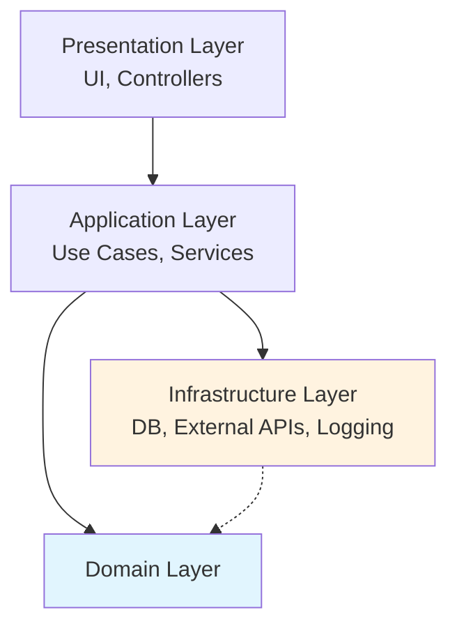
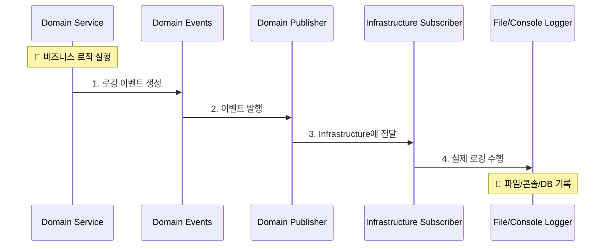
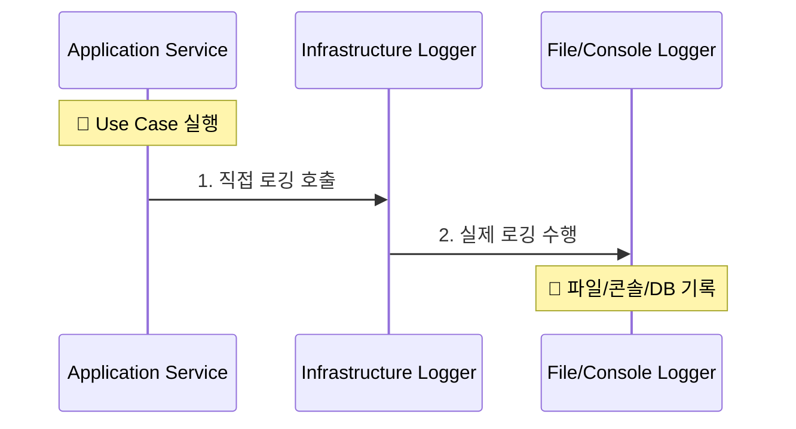
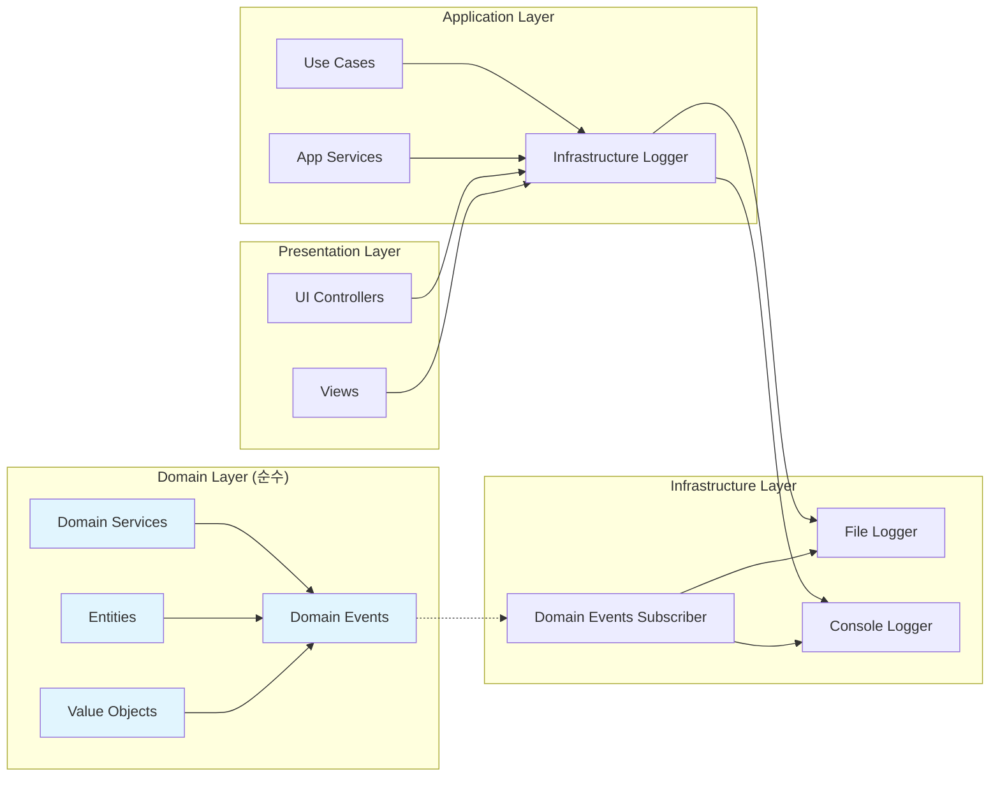

# 🏗️ DDD 로깅 시스템 계층별 데이터 흐름

> **Domain-Driven Design에서 로깅 시스템의 올바른 계층 배치와 의존성 방향**

## 🎯 DDD 핵심 원칙: "모든 기능이 Domain에 있어야 하는가?"

### ❌ **잘못된 이해**
"모든 비즈니스 로직이 Domain Layer에 있어야 한다"

### ✅ **올바른 이해**
"Domain Layer는 외부 기술에 의존하지 않고 순수해야 한다"

## 📊 DDD 4계층 구조와 책임



### 🔍 **계층별 로깅 책임**

| 계층 | 로깅 용도 | 올바른 의존성 |
|------|-----------|---------------|
| **Domain** | 비즈니스 규칙 추적 | ✅ Domain Events만 발행 |
| **Application** | Use Case 실행 추적 | ✅ Infrastructure Logger 직접 사용 가능 |
| **Presentation** | UI 상호작용 추적 | ✅ Infrastructure Logger 직접 사용 가능 |
| **Infrastructure** | 외부 시스템 연동 추적 | ✅ 실제 로깅 구현체 보유 |

## 🔄 로깅 시스템 데이터 흐름

### 1. **Domain Layer에서 시작하는 흐름**



### 2. **Application/Presentation Layer에서 직접 로깅**



## 📂 현재 구현된 계층별 흐름

### **Domain Layer → Infrastructure (Domain Events 패턴)**

```python
# Domain Layer: 순수한 이벤트 발행
class StrategyDomainService:
    def __init__(self):
        self.logger = create_domain_logger("StrategyService")

    def execute_trade_logic(self):
        # 비즈니스 로직 실행
        self.logger.info("매매 신호 생성", context_data={
            "symbol": "KRW-BTC",
            "signal": "BUY"
        })
        # → Domain Events 발행 → Infrastructure에서 실제 로깅
```

### **Application Layer → Infrastructure (직접 의존)**

```python
# Application Layer: Infrastructure 직접 사용 (정상)
class TradeExecutionService:
    def __init__(self):
        self.logger = create_component_logger("TradeExecutionService")

    def execute_trade(self):
        # Use Case 실행
        self.logger.info("거래 실행 시작")
        # → Infrastructure Logger 직접 호출
```

### **Presentation Layer → Infrastructure (직접 의존)**

```python
# Presentation Layer: Infrastructure 직접 사용 (정상)
class TradingDashboard:
    def __init__(self):
        self.logger = create_component_logger("TradingDashboard")

    def handle_user_action(self):
        # UI 이벤트 처리
        self.logger.info("사용자 매매 버튼 클릭")
        # → Infrastructure Logger 직접 호출
```

## 🎯 핵심 의존성 규칙

### ✅ **허용되는 의존성**

```
✅ Presentation → Infrastructure (로깅)
✅ Application → Infrastructure (로깅)
✅ Domain → Domain Events (순수)
✅ Infrastructure → Domain Events (구독)
```

### ❌ **금지되는 의존성**

```
❌ Domain → Infrastructure (직접 의존)
❌ Domain → Application
❌ Domain → Presentation
❌ Infrastructure → Application
❌ Infrastructure → Presentation
```

## 📊 현재 시스템 의존성 맵



## 🔍 DDD 원칙 검증

### **Domain Layer 순수성 체크**

```powershell
# ✅ Domain Layer에 Infrastructure 의존성이 없는지 확인
Get-ChildItem upbit_auto_trading/domain -Recurse -Include *.py |
    Select-String -Pattern "from upbit_auto_trading.infrastructure"

# 결과: 매치 없음 (완벽한 순수성)
```

### **정상적인 Application/Presentation 의존성**

```powershell
# ✅ Application/Presentation이 Infrastructure 사용하는 것은 정상
Get-ChildItem upbit_auto_trading/application -Recurse -Include *.py |
    Select-String -Pattern "create_component_logger"

# 결과: 10+ 매치 (정상적인 의존성)
```

## 🏆 결론: 완벽한 DDD 준수

### **현재 상태 요약**
- ✅ **Domain Layer**: 완전 순수 (Infrastructure 의존성 0개)
- ✅ **Application Layer**: Infrastructure Logger 직접 사용 (DDD 원칙상 정상)
- ✅ **Presentation Layer**: Infrastructure Logger 직접 사용 (DDD 원칙상 정상)
- ✅ **Infrastructure Layer**: 모든 외부 연동 책임 (올바른 배치)

### **DDD 핵심 달성**
1. **의존성 방향**: 모든 계층이 Domain을 향하고 있음
2. **Domain 순수성**: 외부 기술 의존성 완전 제거
3. **관심사 분리**: 각 계층이 명확한 책임을 가짐
4. **테스트 용이성**: Domain 로직이 Infrastructure 없이 테스트 가능

**"모든 기능이 Domain에 있을 필요는 없다. Domain이 순수하면 된다."** 🎯

---

**문서 타입**: 아키텍처 흐름 가이드
**업데이트**: 2025년 8월 14일
