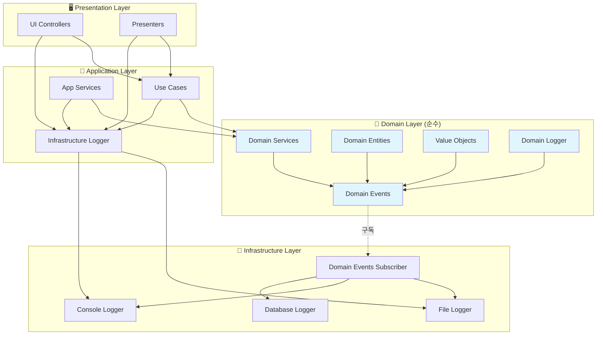

# 🎯 이상적인 DDD 로깅 아키텍처 설계

> **순수 DDD 원칙을 따라 처음부터 설계했을 때의 완벽한 로깅 시스템 구조**

## 🏗️ 완벽한 DDD 로깅 시스템 구조

### 📂 이상적인 폴더 구조

```
upbit_auto_trading/
├── domain/                           # 🎯 Domain Layer (완전 순수)
│   ├── events/
│   │   ├── __init__.py              # Domain Events 인터페이스 노출
│   │   ├── base_domain_event.py     # 기본 Domain Event 추상 클래스
│   │   ├── domain_event_publisher.py # 순수 이벤트 발행자 (Singleton)
│   │   └── logging_events.py        # 로깅 관련 5개 Domain Events
│   │
│   ├── logging/
│   │   ├── __init__.py              # Domain Logger 인터페이스 노출
│   │   ├── domain_logger.py         # Domain Events 기반 로거
│   │   └── log_level.py             # 로그 레벨 Value Object
│   │
│   └── services/                    # Domain Services
│       ├── strategy_domain_service.py
│       └── trade_domain_service.py
│
├── application/                      # 🔧 Application Layer
│   ├── services/
│   │   ├── trade_execution_service.py # Use Case 실행, Infrastructure Logger 직접 사용
│   │   └── portfolio_service.py
│   │
│   └── use_cases/
│       ├── execute_trade_use_case.py
│       └── update_portfolio_use_case.py
│
├── ui/                              # 🖥️ Presentation Layer
│   ├── desktop/
│   │   ├── screens/
│   │   │   ├── trading_screen.py    # UI 이벤트, Infrastructure Logger 직접 사용
│   │   │   └── dashboard_screen.py
│   │   │
│   │   └── presenters/
│   │       ├── trading_presenter.py
│   │       └── dashboard_presenter.py
│   │
│   └── widgets/
│       ├── chart_widget.py
│       └── order_widget.py
│
└── infrastructure/                   # 🔌 Infrastructure Layer
    ├── logging/
    │   ├── __init__.py              # Infrastructure 로깅 인터페이스
    │   ├── component_logger.py     # 기존 Infrastructure Logger
    │   ├── domain_event_subscriber.py # Domain Events 구독자
    │   ├── file_logger.py          # 파일 로깅 구현체
    │   ├── console_logger.py       # 콘솔 로깅 구현체
    │   └── database_logger.py      # DB 로깅 구현체 (선택)
    │
    ├── repositories/               # 데이터 저장소
    └── external_apis/              # 외부 API 연동
```

## 🔄 완벽한 의존성 흐름

### **계층별 의존성 규칙**



## 📋 완벽한 Domain Events 설계

### **1. Base Domain Event (순수 추상 클래스)**

```python
# domain/events/base_domain_event.py
from abc import ABC, abstractmethod
from dataclasses import dataclass, field
from datetime import datetime
from typing import Any, Dict
import uuid

@dataclass(frozen=True)
class DomainEvent(ABC):
    """순수 Domain Event 기본 클래스"""

    # 이벤트 메타데이터 (Infrastructure가 아닌 Domain 관심사)
    _event_id: str = field(init=False)
    _occurred_at: datetime = field(init=False)

    def __post_init__(self):
        # frozen=True 환경에서 안전한 초기화
        object.__setattr__(self, '_event_id', str(uuid.uuid4()))
        object.__setattr__(self, '_occurred_at', datetime.now())

    @property
    @abstractmethod
    def event_type(self) -> str:
        """이벤트 타입 식별자"""
        pass

    @property
    @abstractmethod
    def aggregate_id(self) -> str:
        """집합 루트 식별자"""
        pass

    @property
    def event_id(self) -> str:
        return self._event_id

    @property
    def occurred_at(self) -> datetime:
        return self._occurred_at
```

### **2. 로깅 관련 Domain Events**

```python
# domain/events/logging_events.py
from dataclasses import dataclass
from typing import Optional, Dict, Any
from .base_domain_event import DomainEvent
from ..logging.log_level import LogLevel

@dataclass(frozen=True)
class DomainLogRequested(DomainEvent):
    """Domain에서 로그 요청 이벤트"""
    component_name: str
    log_level: LogLevel
    message: str
    context_data: Optional[Dict[str, Any]] = None
    exception_info: Optional[str] = None

    @property
    def event_type(self) -> str:
        return "DomainLogRequested"

    @property
    def aggregate_id(self) -> str:
        return f"logging:{self.component_name}"

@dataclass(frozen=True)
class DomainOperationStarted(DomainEvent):
    """Domain 작업 시작 추적 이벤트"""
    component_name: str
    operation_name: str
    operation_id: str
    context_data: Optional[Dict[str, Any]] = None

    @property
    def event_type(self) -> str:
        return "DomainOperationStarted"

    @property
    def aggregate_id(self) -> str:
        return f"operation:{self.operation_id}"

@dataclass(frozen=True)
class DomainOperationCompleted(DomainEvent):
    """Domain 작업 완료 추적 이벤트"""
    component_name: str
    operation_name: str
    operation_id: str
    success: bool
    duration_ms: Optional[int] = None
    result_data: Optional[Dict[str, Any]] = None

    @property
    def event_type(self) -> str:
        return "DomainOperationCompleted"

    @property
    def aggregate_id(self) -> str:
        return f"operation:{self.operation_id}"

@dataclass(frozen=True)
class DomainErrorOccurred(DomainEvent):
    """Domain 오류 발생 이벤트"""
    component_name: str
    error_message: str
    error_type: str
    context_data: Optional[Dict[str, Any]] = None
    stack_trace: Optional[str] = None

    @property
    def event_type(self) -> str:
        return "DomainErrorOccurred"

    @property
    def aggregate_id(self) -> str:
        return f"error:{self.component_name}"

@dataclass(frozen=True)
class DomainComponentInitialized(DomainEvent):
    """Domain 컴포넌트 초기화 이벤트"""
    component_name: str
    component_type: str
    initialization_data: Optional[Dict[str, Any]] = None

    @property
    def event_type(self) -> str:
        return "DomainComponentInitialized"

    @property
    def aggregate_id(self) -> str:
        return f"component:{self.component_name}"
```

### **3. Domain Event Publisher (순수 구현)**

```python
# domain/events/domain_event_publisher.py
from typing import Dict, List, Callable, TypeVar
from threading import Lock
from .base_domain_event import DomainEvent

EventHandler = Callable[[DomainEvent], None]
T = TypeVar('T', bound=DomainEvent)

class DomainEventPublisher:
    """순수 Domain Layer 이벤트 발행자 (Thread-safe Singleton)"""

    _instance = None
    _lock = Lock()

    def __new__(cls):
        if cls._instance is None:
            with cls._lock:
                if cls._instance is None:
                    cls._instance = super().__new__(cls)
                    cls._instance._initialized = False
        return cls._instance

    def __init__(self):
        if not self._initialized:
            self._subscribers: Dict[str, List[EventHandler]] = {}
            self._subscribers_lock = Lock()
            self._initialized = True

    def subscribe(self, event_type: str, handler: EventHandler) -> None:
        """이벤트 구독 등록 (Infrastructure Layer에서 호출)"""
        with self._subscribers_lock:
            if event_type not in self._subscribers:
                self._subscribers[event_type] = []
            self._subscribers[event_type].append(handler)

    def unsubscribe(self, event_type: str, handler: EventHandler) -> None:
        """이벤트 구독 해제"""
        with self._subscribers_lock:
            if event_type in self._subscribers:
                self._subscribers[event_type].remove(handler)

    def publish(self, event: DomainEvent) -> None:
        """이벤트 발행 (Domain Layer에서 호출)"""
        event_type = event.event_type

        # 구독자가 없어도 오류 없이 처리 (Domain 순수성 유지)
        with self._subscribers_lock:
            subscribers = self._subscribers.get(event_type, [])

        # 구독자들에게 이벤트 전달 (비동기는 Infrastructure 책임)
        for subscriber in subscribers:
            try:
                subscriber(event)
            except Exception:
                # Domain Layer에서는 Infrastructure 오류를 무시
                # Infrastructure Layer에서 오류 처리 책임
                pass

    def clear_all_subscribers(self) -> None:
        """모든 구독자 제거 (테스트용)"""
        with self._subscribers_lock:
            self._subscribers.clear()

# 전역 접근 함수 (Domain Layer 내부용)
def get_domain_event_publisher() -> DomainEventPublisher:
    """Domain Event Publisher 인스턴스 반환"""
    return DomainEventPublisher()

def publish_domain_event(event: DomainEvent) -> None:
    """Domain Event 발행 (편의 함수)"""
    get_domain_event_publisher().publish(event)
```

### **4. Domain Logger (Events 기반)**

```python
# domain/logging/domain_logger.py
from typing import Optional, Dict, Any
from ..events.logging_events import (
    DomainLogRequested, DomainOperationStarted,
    DomainOperationCompleted, DomainErrorOccurred,
    DomainComponentInitialized
)
from ..events.domain_event_publisher import publish_domain_event
from .log_level import LogLevel

class DomainEventsLogger:
    """Domain Events 기반 순수 로거"""

    def __init__(self, component_name: str):
        self.component_name = component_name

        # 컴포넌트 초기화 이벤트 발행
        init_event = DomainComponentInitialized(
            component_name=component_name,
            component_type="DomainLogger"
        )
        publish_domain_event(init_event)

    def debug(self, message: str, context_data: Optional[Dict[str, Any]] = None) -> None:
        self._log(LogLevel.DEBUG, message, context_data)

    def info(self, message: str, context_data: Optional[Dict[str, Any]] = None) -> None:
        self._log(LogLevel.INFO, message, context_data)

    def warning(self, message: str, context_data: Optional[Dict[str, Any]] = None) -> None:
        self._log(LogLevel.WARNING, message, context_data)

    def error(self, message: str, context_data: Optional[Dict[str, Any]] = None, exception_info: Optional[str] = None) -> None:
        self._log(LogLevel.ERROR, message, context_data, exception_info)

        # 추가로 오류 이벤트 발행
        error_event = DomainErrorOccurred(
            component_name=self.component_name,
            error_message=message,
            error_type="DomainError",
            context_data=context_data,
            stack_trace=exception_info
        )
        publish_domain_event(error_event)

    def critical(self, message: str, context_data: Optional[Dict[str, Any]] = None, exception_info: Optional[str] = None) -> None:
        self._log(LogLevel.CRITICAL, message, context_data, exception_info)

        # 추가로 오류 이벤트 발행
        error_event = DomainErrorOccurred(
            component_name=self.component_name,
            error_message=message,
            error_type="CriticalError",
            context_data=context_data,
            stack_trace=exception_info
        )
        publish_domain_event(error_event)

    def _log(self, level: LogLevel, message: str, context_data: Optional[Dict[str, Any]] = None, exception_info: Optional[str] = None) -> None:
        """내부 로그 이벤트 발행"""
        event = DomainLogRequested(
            component_name=self.component_name,
            log_level=level,
            message=message,
            context_data=context_data,
            exception_info=exception_info
        )
        publish_domain_event(event)

# 편의 함수 (기존 API 호환성)
def create_domain_logger(component_name: str) -> DomainEventsLogger:
    """Domain Events 기반 로거 생성"""
    return DomainEventsLogger(component_name)
```

### **5. Log Level Value Object**

```python
# domain/logging/log_level.py
from enum import Enum

class LogLevel(Enum):
    """로그 레벨 Value Object"""
    DEBUG = "DEBUG"
    INFO = "INFO"
    WARNING = "WARNING"
    ERROR = "ERROR"
    CRITICAL = "CRITICAL"

    @property
    def numeric_value(self) -> int:
        """숫자 값 반환 (Infrastructure에서 활용)"""
        mapping = {
            LogLevel.DEBUG: 10,
            LogLevel.INFO: 20,
            LogLevel.WARNING: 30,
            LogLevel.ERROR: 40,
            LogLevel.CRITICAL: 50
        }
        return mapping[self]

    def __str__(self) -> str:
        return self.value
```

## 🔌 완벽한 Infrastructure 구현

### **Domain Events Subscriber**

```python
# infrastructure/logging/domain_event_subscriber.py
from typing import Dict, Any, Optional
from upbit_auto_trading.domain.events import (
    DomainLogRequested, DomainErrorOccurred, DomainOperationStarted,
    DomainOperationCompleted, DomainComponentInitialized, get_domain_event_publisher
)
from .component_logger import create_component_logger
from .file_logger import FileLogger
from .console_logger import ConsoleLogger

class DomainLoggingSubscriber:
    """Domain Events를 Infrastructure 로깅으로 연결하는 구독자"""

    def __init__(self):
        self.infrastructure_logger = create_component_logger("DomainEventsSubscriber")
        self.file_logger = FileLogger()
        self.console_logger = ConsoleLogger()

        # Domain Events 구독 설정
        self._setup_subscriptions()

        self.infrastructure_logger.info("🔗 Domain Events 로깅 구독자 초기화 완료")

    def _setup_subscriptions(self):
        """Domain Events 구독 설정"""
        publisher = get_domain_event_publisher()

        # 모든 로깅 관련 이벤트 구독
        publisher.subscribe("DomainLogRequested", self._handle_log_request)
        publisher.subscribe("DomainErrorOccurred", self._handle_error_occurred)
        publisher.subscribe("DomainOperationStarted", self._handle_operation_started)
        publisher.subscribe("DomainOperationCompleted", self._handle_operation_completed)
        publisher.subscribe("DomainComponentInitialized", self._handle_component_initialized)

    def _handle_log_request(self, event: DomainLogRequested) -> None:
        """일반 로그 요청 처리"""
        level = event.log_level.value
        message = event.message
        component = event.component_name
        context = event.context_data

        # Infrastructure Logger로 실제 로깅
        formatted_message = f"{message}"
        if context:
            formatted_message += f" | Context: {context}"

        # 레벨별 분기
        if level == "DEBUG":
            self.infrastructure_logger.debug(f"[{component}] {formatted_message}")
        elif level == "INFO":
            self.infrastructure_logger.info(f"[{component}] {formatted_message}")
        elif level == "WARNING":
            self.infrastructure_logger.warning(f"[{component}] {formatted_message}")
        elif level == "ERROR":
            self.infrastructure_logger.error(f"[{component}] {formatted_message}")
        elif level == "CRITICAL":
            self.infrastructure_logger.critical(f"[{component}] {formatted_message}")

    def _handle_error_occurred(self, event: DomainErrorOccurred) -> None:
        """Domain 오류 이벤트 처리"""
        component = event.component_name
        error_msg = event.error_message
        error_type = event.error_type

        formatted_message = f"[{component}] {error_type}: {error_msg}"
        if event.context_data:
            formatted_message += f" | Context: {event.context_data}"

        self.infrastructure_logger.error(formatted_message)

        # 추가: 알림 시스템 연동 (Critical 오류 시)
        if error_type == "CriticalError":
            self._send_alert(formatted_message)

    def _handle_operation_started(self, event: DomainOperationStarted) -> None:
        """Domain 작업 시작 추적"""
        message = f"[{event.component_name}] Operation Started: {event.operation_name} (ID: {event.operation_id})"
        if event.context_data:
            message += f" | Context: {event.context_data}"

        self.infrastructure_logger.info(message)

    def _handle_operation_completed(self, event: DomainOperationCompleted) -> None:
        """Domain 작업 완료 추적"""
        status = "SUCCESS" if event.success else "FAILED"
        message = f"[{event.component_name}] Operation {status}: {event.operation_name} (ID: {event.operation_id})"

        if event.duration_ms:
            message += f" | Duration: {event.duration_ms}ms"
        if event.result_data:
            message += f" | Result: {event.result_data}"

        if event.success:
            self.infrastructure_logger.info(message)
        else:
            self.infrastructure_logger.error(message)

    def _handle_component_initialized(self, event: DomainComponentInitialized) -> None:
        """Domain 컴포넌트 초기화 추적"""
        message = f"[{event.component_name}] Component Initialized: {event.component_type}"
        if event.initialization_data:
            message += f" | Data: {event.initialization_data}"

        self.infrastructure_logger.info(message)

    def _send_alert(self, message: str) -> None:
        """Critical 오류 알림 (확장 가능)"""
        # TODO: 슬랙, 이메일, SMS 등 알림 시스템 연동
        self.infrastructure_logger.critical(f"🚨 ALERT: {message}")

# 초기화 함수
def initialize_domain_logging_subscriber() -> DomainLoggingSubscriber:
    """Domain Events 로깅 구독자 초기화"""
    return DomainLoggingSubscriber()
```

## 🎯 완벽한 사용 예시

### **Domain Service 사용**

```python
# domain/services/strategy_domain_service.py
from ..logging import create_domain_logger
from ..events.domain_event_publisher import publish_domain_event
from ..events.logging_events import DomainOperationStarted, DomainOperationCompleted

class StrategyDomainService:
    """매매 전략 Domain Service"""

    def __init__(self):
        self.logger = create_domain_logger("StrategyDomainService")

    def analyze_market_signal(self, symbol: str) -> dict:
        """시장 신호 분석 (순수 비즈니스 로직)"""
        operation_id = f"analysis_{symbol}_{datetime.now().timestamp()}"

        # 작업 시작 이벤트
        start_event = DomainOperationStarted(
            component_name="StrategyDomainService",
            operation_name="analyze_market_signal",
            operation_id=operation_id,
            context_data={"symbol": symbol}
        )
        publish_domain_event(start_event)

        try:
            # 비즈니스 로직 실행
            self.logger.info("시장 신호 분석 시작", context_data={"symbol": symbol})

            # 실제 분석 로직...
            signal = {
                "symbol": symbol,
                "signal": "BUY",
                "confidence": 0.85,
                "reason": "RSI 과매도 구간"
            }

            self.logger.info("시장 신호 분석 완료", context_data=signal)

            # 작업 완료 이벤트
            complete_event = DomainOperationCompleted(
                component_name="StrategyDomainService",
                operation_name="analyze_market_signal",
                operation_id=operation_id,
                success=True,
                result_data=signal
            )
            publish_domain_event(complete_event)

            return signal

        except Exception as e:
            self.logger.error(f"시장 신호 분석 실패: {str(e)}",
                            context_data={"symbol": symbol})

            # 작업 실패 이벤트
            complete_event = DomainOperationCompleted(
                component_name="StrategyDomainService",
                operation_name="analyze_market_signal",
                operation_id=operation_id,
                success=False
            )
            publish_domain_event(complete_event)

            raise
```

### **Application Service 사용**

```python
# application/services/trade_execution_service.py
from upbit_auto_trading.infrastructure.logging import create_component_logger
from upbit_auto_trading.domain.services.strategy_domain_service import StrategyDomainService

class TradeExecutionService:
    """거래 실행 Application Service"""

    def __init__(self):
        # Application Layer는 Infrastructure Logger 직접 사용 (정상)
        self.logger = create_component_logger("TradeExecutionService")
        self.strategy_service = StrategyDomainService()

    def execute_trade(self, symbol: str, amount: float):
        """거래 실행 Use Case"""
        self.logger.info(f"거래 실행 시작: {symbol}, {amount}")

        try:
            # Domain Service 호출 (Domain Events 발행됨)
            signal = self.strategy_service.analyze_market_signal(symbol)

            # 실제 거래 로직...
            self.logger.info(f"거래 실행 완료: {signal}")

        except Exception as e:
            self.logger.error(f"거래 실행 실패: {str(e)}")
            raise
```

## 🏆 완벽한 DDD 달성 상태

### ✅ **Domain Layer 순수성**
- Infrastructure 의존성: **0개**
- 외부 기술 의존성: **0개**
- Domain Events만으로 외부 연동

### ✅ **올바른 의존성 방향**
- Domain ← Application ← Presentation
- Domain ← Infrastructure (Events 구독만)

### ✅ **계층별 명확한 책임**
- **Domain**: 비즈니스 로직 + Events 발행
- **Application**: Use Case + Infrastructure 로깅
- **Presentation**: UI + Infrastructure 로깅
- **Infrastructure**: 모든 외부 연동

### ✅ **테스트 용이성**
- Domain 로직: Infrastructure 없이 단위 테스트
- Application/Presentation: Infrastructure 모킹 가능

**"완벽한 DDD 로깅 아키텍처: 순수성과 실용성의 균형"** 🎯

---

**문서 타입**: 이상적 아키텍처 설계서
**업데이트**: 2025년 8월 14일
