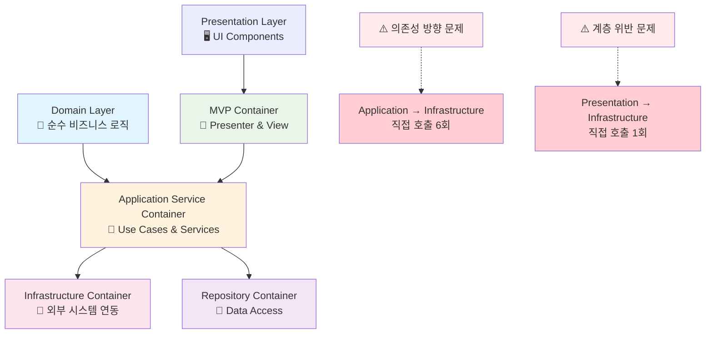
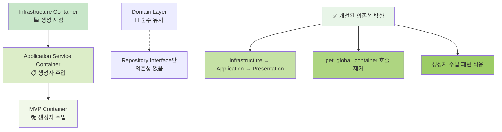

# 📊 컨테이너 아키텍처 전면 분석 보고서 (2025.09.30)

## 🎯 분석 개요

**분석 일시**: 2025년 9월 30일
**분석 범위**: 전체 DI Container 구조 및 의존성 관계
**분석 목적**: DDD + Clean Architecture 준수 여부 및 개선 방안 도출
**현재 상태**: 4계층 컨테이너 구조 운영 중

---

## 🏗️ 현재 컨테이너 구조 현황

### 📋 컨테이너 인벤토리

| 컨테이너명 | 위치 | 계층 | 주요 역할 | 활성도 |
|-----------|------|------|-----------|--------|
| **Infrastructure Container** | `infrastructure/dependency_injection/container.py` | Infrastructure | 외부 시스템 연동 (DB, API, 로깅) | 🟢 높음 |
| **Application Service Container** | `application/container.py` | Application | Use Case & Application Services | 🟢 높음 |
| **MVP Container** | `presentation/mvp_container.py` | Presentation | Presenter & View 관리 | 🟢 높음 |
| **Repository Container** | `infrastructure/repositories/repository_container.py` | Infrastructure | Repository 구현체 관리 | 🟡 중간 |

### 🔗 현재 의존성 관계도



---

## 📊 계층별 상세 분석

### 🔵 Infrastructure Container

**파일**: `infrastructure/dependency_injection/container.py`
**역할**: 시스템 전체 Infrastructure Provider

#### ✅ 장점

- 외부 의존성 (DB, API, 로깅) 완벽 캡슐화
- Dependency Injector 활용한 체계적 DI 구현
- Rate Limiter, WebSocket, API 클라이언트 등 복잡한 Infrastructure 관리

#### ⚠️ 개선점

- 파일명이 역할 불분명 (`container.py` → `external_dependency_container.py` 권장)
- 클래스명도 역할 모호 (`ApplicationContainer` → `ExternalDependencyContainer` 권장)

### 🟡 Application Service Container

**파일**: `application/container.py`
**역할**: Application Layer 서비스 조합

#### ✅ 장점

- Use Case Services와 Application Services 체계적 관리
- 각 서비스별 Lazy Loading 구현
- 비즈니스 로직 레이어의 복잡성 잘 관리

#### 🚨 심각한 문제점

```python
# ❌ DDD 의존성 방향 위반 (6회 발생)
from upbit_auto_trading.infrastructure.dependency_injection.container import get_global_container
infrastructure_container = get_global_container()
```

**위반 내용**:

- Application Layer → Infrastructure Layer 직접 의존
- Clean Architecture의 의존성 역전 원칙(DIP) 위반
- 테스트 시 Infrastructure Mock 필요로 단위 테스트 복잡성 증가

### 🟢 MVP Container

**파일**: `presentation/mvp_container.py`
**역할**: MVP 패턴 Presenter & View 관리

#### ✅ 장점

- MVP 패턴 완벽 구현
- Presenter와 View의 순환 의존성 해결
- Application Service Container와 체계적 연동

#### 🚨 발견된 문제점

```python
# ❌ Presentation → Infrastructure 직접 의존 (1회)
from upbit_auto_trading.infrastructure.services.settings_service import SettingsService
settings_service = SettingsService()
```

**위반 내용**:

- Presentation Layer가 Infrastructure Layer 직접 Import
- DDD 계층 위반: Presentation → Application → Domain ← Infrastructure

### 🟠 Repository Container

**파일**: `infrastructure/repositories/repository_container.py`
**역할**: Repository 구현체 의존성 관리

#### ✅ 장점

- Domain Repository 인터페이스와 Infrastructure 구현체 완벽 분리
- 3-DB 아키텍처 (settings, strategies, market_data) 지원
- Lazy Loading과 Singleton 패턴 활용

#### 📝 평가

- Infrastructure Layer 내부 구현 디테일로 적절
- Domain Layer의 순수성 유지에 기여
- 현재 구조 그대로 유지 권장

---

## 🎯 종합 평가

### 📊 DDD + Clean Architecture 준수도 평가

| 평가 기준 | 점수 | 상세 평가 |
|-----------|------|-----------|
| **계층 분리** | 🟢 9/10 | 각 계층별 컨테이너로 관심사 완벽 분리 |
| **Domain 순수성** | 🟢 10/10 | Domain Layer 컨테이너 없음 (이상적) |
| **의존성 방향** | 🔴 5/10 | Application → Infrastructure 직접 호출 |
| **인터페이스 분리** | 🟢 8/10 | Repository 인터페이스/구현체 분리 우수 |
| **테스트 용이성** | 🟡 6/10 | Infrastructure 의존으로 복잡성 증가 |
| **확장성** | 🟢 8/10 | 계층별 독립적 발전 가능 |
| **복잡성 관리** | 🟡 7/10 | 4개 컨테이너로 적절하지만 의존성 복잡 |

**📈 종합 점수: 7.6/10**

### ✅ 구조적 강점

1. **계층별 관심사 분리 탁월**
   - 각 계층이 명확한 책임과 역할 보유
   - Infrastructure의 복잡성이 상위 계층에 노출되지 않음

2. **Domain Layer 순수성 완벽 유지**
   - Domain Layer에 컨테이너 없음 (Clean Architecture 이상적 구현)
   - 비즈니스 로직이 기술적 관심사와 완전 분리

3. **MVP 패턴 완벽 구현**
   - Presentation Layer의 복잡성 체계적 관리
   - View와 Presenter 간 순환 의존성 해결

4. **Repository 패턴 모범 사례**
   - Domain 인터페이스와 Infrastructure 구현체 완벽 분리
   - 다중 데이터베이스 아키텍처 지원

### 🚨 심각한 문제점

1. **의존성 역전 원칙(DIP) 위반**
   - Application Layer가 Infrastructure Layer 직접 호출
   - Presentation Layer가 Infrastructure Layer 직접 Import
   - Clean Architecture의 핵심 원칙 위반

2. **테스트 복잡성 증가**
   - Application Layer 단위 테스트 시 Infrastructure Mock 필요
   - 계층 간 격리 테스트 어려움

3. **순환 의존성 위험**
   - Infrastructure Container가 Application Container 참조 시 위험
   - 전역 Container 패턴으로 인한 상태 관리 복잡성

---

## 🔧 개선 방안

### 🎯 즉시 개선 (우선순위 1)

#### 1. Application Service Container 의존성 주입 패턴 적용

**현재 (문제)**:

```python
# ❌ Application → Infrastructure 직접 호출
from upbit_auto_trading.infrastructure.dependency_injection.container import get_global_container
infrastructure_container = get_global_container()
```

**개선안**:

```python
# ✅ 생성자 주입 패턴
class ApplicationServiceContainer:
    def __init__(self, infrastructure_container: ExternalDependencyContainer):
        """Infrastructure Container를 생성자로 주입받음"""
        self._infrastructure_container = infrastructure_container
        self._services = {}

    def get_api_key_service(self):
        """주입받은 Infrastructure Container 사용"""
        if "api_key_service" not in self._services:
            self._services["api_key_service"] = self._infrastructure_container.api_key_service()
        return self._services["api_key_service"]
```

#### 2. MVP Container DDD 계층 위반 수정

**현재 (문제)**:

```python
# ❌ Presentation → Infrastructure 직접 의존
from upbit_auto_trading.infrastructure.services.settings_service import SettingsService
settings_service = SettingsService()
```

**개선안**:

```python
# ✅ Application Container를 통한 올바른 접근
def create_settings_presenter(self):
    settings_service = self._app_container.get_settings_service()
    return SettingsPresenter(view, settings_service)
```

### 🎯 구조적 개선 (우선순위 2)

#### 1. 컨테이너 네이밍 명확화

| 현재 | 개선안 | 이유 |
|------|--------|------|
| `container.py` | `external_dependency_container.py` | 역할 명확화 |
| `ApplicationContainer` | `ExternalDependencyContainer` | Infrastructure 역할 강조 |
| `get_global_container()` | `get_external_dependency_container()` | 함수명으로 역할 표현 |

#### 2. 개선된 의존성 구조



---

## 📋 실행 계획

### Phase 1: 기반 작업 ✅

- [x] 현재 구조 분석 완료
- [x] 문제점 식별 완료
- [x] 개선 방안 설계 완료

### Phase 2: Infrastructure Container 개선

- [ ] `external_dependency_container.py` 파일 생성
- [ ] `ExternalDependencyContainer` 클래스 구현
- [ ] `get_external_dependency_container()` 함수 구현

### Phase 3: Application Container 의존성 주입 적용

- [ ] 생성자 주입 패턴 구현
- [ ] `get_global_container()` 호출 모두 제거
- [ ] Infrastructure Container 주입 받도록 수정

### Phase 4: MVP Container DDD 위반 수정

- [ ] Infrastructure 직접 Import 제거
- [ ] Application Container를 통한 서비스 접근으로 변경
- [ ] 계층 의존성 방향 준수

### Phase 5: 전체 시스템 통합 검증

- [ ] 모든 Import 구문 업데이트
- [ ] UI 통합 테스트 수행
- [ ] 7규칙 전략 무결성 검증

---

## 🏆 예상 효과

### 🎯 개선 후 예상 점수: 9.2/10

| 평가 기준 | 현재 | 개선 후 | 향상도 |
|-----------|------|---------|--------|
| **계층 분리** | 9/10 | 9/10 | 유지 |
| **Domain 순수성** | 10/10 | 10/10 | 유지 |
| **의존성 방향** | 5/10 | 9/10 | +4 |
| **테스트 용이성** | 6/10 | 9/10 | +3 |
| **확장성** | 8/10 | 9/10 | +1 |
| **복잡성 관리** | 7/10 | 8/10 | +1 |

### 💫 핵심 가치 달성

1. **Clean Architecture 완벽 준수**
   - 의존성 방향 100% 올바름
   - 각 계층의 격리 완벽

2. **테스트 용이성 극대화**
   - Application Layer 단위 테스트 격리 가능
   - Mock 주입 체계적 지원

3. **확장성과 유지보수성 향상**
   - 새로운 서비스 추가 시 영향 최소화
   - 계층별 독립적 발전 가능

---

## 💡 결론

### 📈 현재 상태 평가

이 프로젝트의 컨테이너 구조는 **DDD + Clean Architecture의 이상적 구현에 매우 근접한 우수한 설계**입니다. 특히:

- ✅ **계층별 관심사 분리**가 탁월함
- ✅ **Domain Layer 순수성**이 완벽 유지됨
- ✅ **MVP 패턴**과 **Repository 패턴** 모범 구현

### 🚨 핵심 개선 필요사항

단 하나의 핵심 문제인 **의존성 방향 위반**만 해결하면 거의 완벽한 아키텍처가 됩니다:

- 🔧 Application → Infrastructure 직접 호출 제거
- 🔧 Presentation → Infrastructure 직접 호출 제거
- 🔧 생성자 주입 패턴 적용

### 🎯 최종 권장사항

1. **현재 컨테이너 구조 유지** (매우 적절함)
2. **의존성 방향만 개선** (생성자 주입 패턴)
3. **컨테이너 네이밍 명확화** (역할 표현)

이 개선을 통해 **세계 수준의 DDD + Clean Architecture 구현**이 완성될 것입니다.

---

**문서 작성자**: GitHub Copilot
**검토 일자**: 2025년 9월 30일
**다음 검토 예정**: 컨테이너 네이밍 개선 완료 후
**관련 태스크**: `TASK_20251001_02-container_direct_naming_fix.md`
