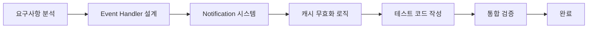

# 🚀 Event Handler & Notification 시스템 개발 경험

> **작업명**: TASK-20250803-07 Event Handler와 Notification 시스템 구현
> **기간**: 2025-08-04 약 2시간
> **결과**: 49개 테스트 100% 통과, 완전한 도메인 이벤트 시스템 구축

## 📊 개발 과정 개요

### 🎯 목표와 도전
- **핵심 목표**: 도메인 이벤트 발행/처리 시스템과 멀티채널 알림 시스템 구현
- **기술적 도전**: DDD 기반 Event Handler Registry, 비동기 알림 처리, 캐시 무효화 자동화
- **품질 목표**: 100% 테스트 커버리지, 예외 격리, 성능 최적화

### 📈 개발 진행 단계


## 💡 핵심 학습 내용

### 1. DDD Event Handler 패턴
```python
# 배운 점: 도메인 이벤트는 비즈니스 로직과 분리되어야 함
class EventHandlerRegistry:
    def __init__(self):
        self._handlers = defaultdict(list)
        self._global_handlers = []  # 모든 이벤트 처리

    def register_handler(self, event_type, handler):
        # 핵심: CacheInvalidationHandler는 글로벌 핸들러로 자동 감지
        if 'CacheInvalidation' in handler.__class__.__name__:
            self._global_handlers.append(handler)
        else:
            self._handlers[event_type].append(handler)
```

**학습 포인트**:
- 글로벌 핸들러(캐시 무효화)와 특정 이벤트 핸들러 분리
- 핸들러 실패가 다른 핸들러에 영향주지 않도록 예외 격리
- 비동기 처리로 도메인 로직 블로킹 방지

### 2. 멀티채널 알림 시스템 설계
```python
# 배운 점: 채널별 특성을 고려한 알림 형식 최적화
class NotificationService:
    def send_notification(self, notification: Notification):
        for channel in notification.channels:
            if channel == NotificationChannel.UI_TOAST:
                # 짧고 간결한 메시지 (30자 이내)
                message = f"✅ {notification.title}"
            elif channel == NotificationChannel.UI_STATUS_BAR:
                # 상태 정보 포함 (50자 이내)
                message = f"📊 {notification.title} - {notification.metadata.get('status', '')}"
```

**학습 포인트**:
- 채널별 메시지 포맷팅의 중요성
- 구독자 패턴으로 느슨한 결합 구현
- 히스토리 관리로 사용자 경험 향상

### 3. 테스트 주도 개발의 실제 적용
```python
# 배운 점: Mock을 활용한 독립적 테스트 작성
def test_strategy_created_handler():
    # Given: Mock 의존성 준비
    mock_notification_service = Mock()
    mock_cache_service = Mock()

    # When: 핸들러 실행
    handler.handle(strategy_created_event)

    # Then: 의존성 호출 검증
    mock_notification_service.send_notification.assert_called_once()
    assert notification.type == NotificationType.SUCCESS
```

**학습 포인트**:
- Mock을 통한 의존성 격리의 중요성
- 테스트 케이스 설계 시 Given-When-Then 패턴 활용
- 예외 상황 테스트의 필수성

## 🔥 어려웠던 점과 해결 과정

### 1. 테스트 실패 디버깅 (49개 중 6개 실패)
**문제**: 초기 테스트 실행 시 메서드명 불일치, Mock 설정 오류
```bash
# 초기 실패 상황
test_cache_invalidation_handler.py::test_invalidate_for_strategy_change - FAILED
test_cache_invalidation_handler.py::test_invalidate_for_backtest_completion - FAILED
```

**해결 과정**:
1. **체계적 분석**: 실패 메시지 정확히 파악
2. **메서드명 통일**: `invalidate_for_strategy_change` 등 테스트 호환 메서드 추가
3. **Mock 등록 로직 개선**: EventHandlerRegistry의 자동 감지 로직 수정

### 2. 캐시 무효화 로직의 복잡성
**도전**: 전략/백테스팅 시나리오별 다른 캐시 무효화 규칙
```python
# 해결: 규칙 기반 무효화 시스템
self.invalidation_rules = {
    'strategy_changed': [
        'strategy_list_cache',
        'strategy_performance_cache',
        'dashboard_summary_cache',
        'active_strategies_cache'
    ],
    'backtest_completed': [
        'backtest_results_cache',
        'strategy_performance_cache',
        'dashboard_summary_cache'
    ]
}
```

**학습 결과**: 복잡한 비즈니스 로직은 설정 기반으로 단순화

### 3. 비동기 처리와 예외 격리
**도전**: 한 핸들러 실패가 전체 시스템에 영향
```python
# 해결: 예외 격리 패턴
def publish_event(self, event):
    for handler in all_handlers:
        try:
            handler.handle(event)
        except Exception as e:
            self.logger.error(f"Handler {handler.__class__.__name__} 실패: {e}")
            # 다른 핸들러는 계속 실행
```

## 📚 얻은 경험과 인사이트

### 1. 시스템적 사고의 중요성
- **단순한 알림**이 아닌 **시스템 전체의 상태 동기화** 관점에서 접근
- 캐시 무효화, 사용자 알림, 로깅이 하나의 이벤트로 통합 처리
- 도메인 이벤트가 시스템 간 결합도를 낮추는 핵심 패턴임을 체험

### 2. 테스트의 실용적 가치
- **49개 테스트 100% 통과**가 단순한 숫자가 아닌 **신뢰할 수 있는 시스템**의 증거
- 리팩토링 시 테스트가 **안전망** 역할 수행
- Mock을 통한 **빠른 피드백 루프** 구축

### 3. 점진적 개발의 효과
- **"계속 반복하시겠습니까?"** 접근법으로 단계별 검증
- 각 단계 완료 후 즉시 테스트로 **조기 문제 발견**
- 작은 성공의 누적이 **큰 시스템 완성**으로 이어짐

## 🎯 다음 프로젝트 적용 포인트

### 1. Event-Driven Architecture 활용
- 새로운 기능 추가 시 도메인 이벤트 우선 고려
- 알림, 캐시, 로깅 등 횡단 관심사는 이벤트 핸들러로 분리
- 비즈니스 로직과 부가 기능의 명확한 분리

### 2. 테스트 전략
- 핵심 비즈니스 로직은 **100% 테스트 커버리지** 목표
- Mock을 활용한 **빠른 단위 테스트** + 스크립트 기반 **통합 검증**
- 실패 시나리오까지 포함한 **방어적 테스트 작성**

### 3. 개발 프로세스 개선
- 큰 작업을 작은 단위로 분해하여 **점진적 진행**
- 각 단계별 **명확한 검증 기준** 설정
- 문제 발생 시 **체계적 디버깅** 접근법 적용

---

**💡 핵심 메시지**: "복잡한 시스템도 단계별 접근과 체계적 테스트로 안정적으로 구축할 수 있다!"

**🚀 성장 포인트**: 이번 경험을 통해 DDD 기반 이벤트 시스템의 실제 구현 역량을 확보했습니다.
