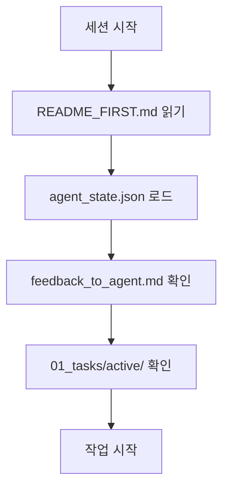
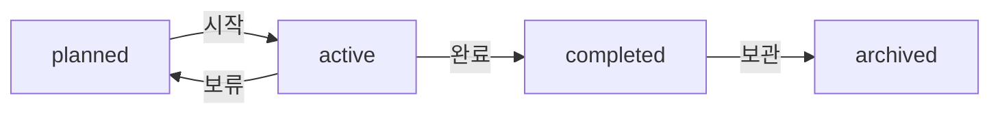

# LLM 에이전트 개발 방법론 및 프로젝트 구조

> **목적**: 이 문서는 LLM 에이전트가 복잡한 소프트웨어 개발 프로젝트를 중단 없이, 효율적으로 수행하기 위한 표준 방법론을 정의합니다.

---

## 📋 목차

1. [방법론 개요](#1-방법론-개요)
2. [핵심 원칙](#2-핵심-원칙)
3. [프로젝트 구조](#3-프로젝트-구조)
4. [작업 흐름](#4-작업-흐름)
5. [상태 관리](#5-상태-관리)
6. [실제 적용 가이드](#6-실제-적용-가이드)
7. [문제 해결](#7-문제-해결)

---

## 1. 방법론 개요

### 🎯 목표
- **연속성 보장**: 세션 간 작업 맥락 유지
- **효율성 극대화**: 중복 작업 방지, 빠른 상황 파악
- **품질 보장**: 체계적 테스트, 문서화 병행
- **협업 최적화**: 인간-AI 간 명확한 소통 구조

### 🏗️ 핵심 구성요소
1. **시작점 표준화** - `README_FIRST.md`
2. **구조화된 폴더 시스템** - 숫자 기반 우선순위
3. **상태 관리 시스템** - JSON 기반 세션 연속성
4. **소통 채널** - 인간-AI 피드백 루프
5. **활동 로깅** - 모든 개발 과정 기록

---

## 2. 핵심 원칙

### 2.1 시작 규칙 (START Protocol)
에이전트는 **모든 개발 세션**에서 다음 순서를 따라야 합니다:

```
S - Start with README_FIRST.md 읽기
T - Tasks 폴더 상태 확인
A - Agent_state.json 복원
R - Reference 문서 확인
T - Test 상태 점검
```

### 2.2 작업 우선순위 (Priority Hierarchy)
```
00_ - 핵심 명세 (거의 불변)
01_ - 현재 작업 (주 활동 영역)  
02_ - 상세 문서 (참고용)
03_ - 외부 자료 (레퍼런스)
04_ - 테스트 자료
99_ - 로그 및 히스토리
```

### 2.3 연속성 보장 (Continuity Guarantee)
- **상태 저장**: 모든 중요 정보를 JSON 형태로 저장
- **맥락 복원**: 이전 세션의 정확한 상태 복원
- **진행 추적**: 태스크 단위의 세밀한 진행률 관리

---

## 3. 프로젝트 구조

### 3.1 필수 파일 구조

```
프로젝트루트/
├── README_FIRST.md              # 🚀 시작점 (필수)
├── agent_state.json             # 🔄 상태 관리 (필수)
├── feedback_to_agent.md         # 💬 소통 채널 (필수)
│
├── 00_specs/                    # 📋 핵심 명세
│   ├── requirements.md
│   ├── design.md
│   └── tasks.md
│
├── 01_tasks/                    # 📝 작업 관리 (칸반)
│   ├── active/
│   ├── planned/
│   ├── completed/
│   └── archived/
│
├── 02_docs/                     # 📚 상세 문서
├── 03_reference/                # 🔗 외부 참조
├── 04_tests/                    # 🧪 테스트 자료
├── 99_logs/                     # 📊 활동 로그
└── src/                         # 💻 소스 코드
```

### 3.2 각 폴더의 역할

| 폴더 | 역할 | 갱신 빈도 | 중요도 |
|------|------|-----------|--------|
| `00_specs/` | 프로젝트 핵심 명세 | 낮음 | 최고 |
| `01_tasks/` | 일일 작업 관리 | 높음 | 높음 |
| `02_docs/` | 개발 가이드 | 중간 | 중간 |
| `03_reference/` | 외부 참조 자료 | 낮음 | 낮음 |
| `99_logs/` | 개발 히스토리 | 높음 | 중간 |

---

## 4. 작업 흐름

### 4.1 세션 시작 절차



### 4.2 태스크 관리 워크플로



### 4.3 파일 명명 규칙

#### 태스크 파일
```
TASK_YYYYMMDD_###_설명.md

예시:
- TASK_20250722_001_로그인-API-개발.md
- TASK_20250722_002_UI-대시보드-구현.md
```

#### 로그 파일
```
agent_log_YYYY-MM.md

예시:
- agent_log_2025-07.md
- agent_log_2025-08.md
```

---

## 5. 상태 관리

### 5.1 agent_state.json 구조

```json
{
  "last_session_time": "YYYY-MM-DDTHH:MM:SSZ",
  "current_task_id": "TASK_20250722_001_로그인-API-개발.md",
  "last_edited_file": "src/auth/login.controller.js",
  "short_term_goal": "JWT 토큰 생성 로직 구현",
  "completed_tasks": [
    "TASK_20250721_001_프로젝트-초기화",
    "TASK_20250721_002_DB-스키마-설계"
  ],
  "next_priority_tasks": [
    "사용자 인증 API 테스트",
    "프론트엔드 로그인 화면",
    "보안 강화"
  ],
  "current_system_state": {
    "database": "구성완료",
    "api_server": "개발중",
    "frontend": "미시작"
  },
  "technical_context": {
    "architecture": "Node.js + React",
    "database": "PostgreSQL",
    "testing": "Jest 기반"
  }
}
```

### 5.2 상태 업데이트 타이밍

- **세션 시작시**: 상태 로드
- **태스크 변경시**: current_task_id 업데이트
- **중요 파일 수정시**: last_edited_file 업데이트
- **목표 변경시**: short_term_goal 업데이트
- **세션 종료시**: 전체 상태 저장

### 5.3 feedback_to_agent.md 활용

#### 인간 개발자가 작성하는 내용
```markdown
### YYYY-MM-DD 지시사항
- [ ] 우선순위 작업 지시
- [ ] 기술적 방향 수정 요청
- [ ] 코드 리뷰 피드백
- [ ] 새로운 요구사항 추가

### 개발 방향성 피드백
✅ 잘 진행된 점:
- 구체적인 성과 인정

💡 개선 제안:
- 구체적인 개선 방향
```

---

## 6. 실제 적용 가이드

### 6.1 프로젝트 초기 설정

#### Step 1: 기본 구조 생성
```bash
mkdir 00_specs 01_tasks 02_docs 03_reference 04_tests 99_logs
mkdir 01_tasks/active 01_tasks/planned 01_tasks/completed 01_tasks/archived
```

#### Step 2: 필수 파일 생성
1. `README_FIRST.md` - 프로젝트 지도
2. `agent_state.json` - 초기 상태
3. `feedback_to_agent.md` - 소통 채널
4. `00_specs/requirements.md` - 요구사항
5. `00_specs/tasks.md` - 최상위 작업 목록

#### Step 3: 첫 번째 태스크 생성
```markdown
# TASK_20250722_001_프로젝트-초기화.md

## 목표
프로젝트 기본 구조 및 개발 환경 설정

## 체크리스트
- [ ] 프로젝트 폴더 구조 생성
- [ ] 기본 설정 파일 작성
- [ ] 개발 도구 설정
- [ ] 첫 번째 테스트 실행

## 완료 기준
- 모든 체크리스트 완료
- 기본 빌드/테스트 성공
```

### 6.2 에이전트 작업 가이드

#### 세션 시작시 체크리스트
- [ ] `README_FIRST.md` 읽기
- [ ] `agent_state.json` 로드
- [ ] `feedback_to_agent.md` 확인
- [ ] `01_tasks/active/` 폴더 확인
- [ ] 마지막 작업 상태 파악

#### 작업 진행시 체크리스트
- [ ] 태스크 파일의 체크리스트 따라가기
- [ ] 코드 변경시 즉시 테스트
- [ ] 중요한 변경사항 즉시 커밋
- [ ] 진행상황 태스크 파일에 업데이트

#### 세션 종료시 체크리스트
- [ ] `agent_state.json` 업데이트
- [ ] 로그 파일에 활동 기록
- [ ] 태스크 파일 상태 업데이트
- [ ] 다음 세션 준비사항 정리

### 6.3 태스크 생성 템플릿

```markdown
# TASK_YYYYMMDD_###_작업명.md

**📅 생성일**: YYYY-MM-DD
**⏰ 예상 소요시간**: X시간
**🏷️ 카테고리**: BACKEND/FRONTEND/DB/TEST
**👤 담당자**: AI Agent
**🎯 상태**: 📅 계획됨
**🔗 선행 태스크**: 이전 태스크 목록

## 📋 작업 내용

### 목표
이 태스크로 달성하고자 하는 명확한 목표

### 세부 작업
- [ ] 구체적인 작업 1
- [ ] 구체적인 작업 2
- [ ] 구체적인 작업 3

## 🎯 완료 기준
- [ ] 기능 구현 완료
- [ ] 테스트 통과
- [ ] 문서 업데이트
- [ ] 코드 리뷰 완료

## 📎 관련 파일
- `src/components/xxx.js` (생성)
- `tests/xxx.test.js` (생성)
- `docs/xxx.md` (수정)

## 📝 작업 로그
### YYYY-MM-DD HH:MM - 작업 시작
- 초기 상황 분석
- 구현 방향 결정

### YYYY-MM-DD HH:MM - 진행 상황
- 완료된 작업 내용
- 발견된 이슈 및 해결방법

## ✅ 완료 보고
**완료일**: YYYY-MM-DD HH:MM
**실제 소요시간**: X시간
**주요 성과**: 달성한 핵심 결과
**다음 단계**: 후속 작업 제안
```

---

## 7. 문제 해결

### 7.1 자주 발생하는 문제

#### 문제: 세션 간 맥락 손실
**증상**: 이전 작업 내용을 기억하지 못함
**해결책**: 
- `agent_state.json` 정확히 업데이트했는지 확인
- 마지막 편집 파일과 목표 명확히 기록
- 로그 파일에서 최근 활동 확인

#### 문제: 태스크 중복 또는 누락
**증상**: 같은 작업을 반복하거나 필요한 작업을 놓침
**해결책**:
- `00_specs/tasks.md`에서 전체 계획 재확인
- 완료된 태스크를 `completed` 폴더로 이동
- 진행률 정기적으로 업데이트

#### 문제: 코드 충돌 또는 불일치
**증상**: 이전 코드와 맞지 않는 구현
**해결책**:
- 수정 전 항상 현재 코드 상태 확인
- 테스트 우선 개발로 호환성 보장
- 중요 변경사항은 즉시 커밋

### 7.2 성능 최적화 팁

#### 파일 읽기 최적화
- 로그 파일은 상단에 최신 내용 추가
- 큰 문서는 섹션별로 나누어 읽기
- 필요한 부분만 정확히 요청

#### 상태 관리 최적화
- JSON 파일은 가독성보다 구조화 우선
- 중요하지 않은 정보는 로그로 분리
- 세션당 핵심 정보만 상태에 유지

#### 작업 효율성 최적화
- 비슷한 성격의 작업은 묶어서 처리
- 테스트 코드를 먼저 작성 후 구현
- 문서화는 구현과 동시에 진행

---

## 8. 성공 사례

### 8.1 업비트 자동매매 프로젝트 적용 결과

**프로젝트 규모**: 
- 코드 라인: 1,686+ 줄
- 개발 기간: 4.5시간
- 완료 태스크: 2개 (DB 모델, UI 탭)

**성과 지표**:
- ✅ 테스트 통과율: 100% (6/6)
- ✅ 세션 연속성: 중단 없는 개발
- ✅ 코드 품질: 체계적 구조 유지
- ✅ 협업 효율: 명확한 진행 상황 공유

**핵심 성공 요인**:
1. **체계적 태스크 관리**: `planned` → `active` → `completed` 흐름
2. **실시간 상태 동기화**: JSON 기반 상태 관리
3. **테스트 우선 개발**: 안정성 보장
4. **단계별 진행**: 작은 단위로 나누어 위험 최소화

---

## 9. 결론 및 권장사항

### 9.1 핵심 메시지

이 방법론은 **LLM 에이전트의 연속적이고 효율적인 개발**을 위한 검증된 접근법입니다. 다음 원칙을 반드시 지켜야 합니다:

1. **시작은 항상 `README_FIRST.md`부터**
2. **상태 관리를 게을리하지 말 것**
3. **작은 단위로 나누어 진행**
4. **테스트와 문서화를 동시에**
5. **인간과의 소통을 명확히**

### 9.2 적용 권장사항

#### 신규 프로젝트
- 프로젝트 시작과 동시에 이 구조 적용
- 첫 번째 태스크를 "방법론 적용"으로 설정
- 팀원들과 폴더 구조 및 규칙 공유

#### 기존 프로젝트
- 점진적으로 구조 변경
- 중요 파일들을 우선 새 구조로 이동
- 태스크 관리부터 먼저 적용

#### 협업 프로젝트
- `feedback_to_agent.md` 활용을 적극 권장
- 정기적인 상태 동기화 회의
- 로그 파일을 통한 진행 상황 공유

---

## 10. 부록

### 10.1 체크리스트 모음

#### 프로젝트 초기화 체크리스트
- [ ] 폴더 구조 생성 (00_specs, 01_tasks, 02_docs, 03_reference, 99_logs)
- [ ] README_FIRST.md 작성
- [ ] agent_state.json 초기화
- [ ] feedback_to_agent.md 생성
- [ ] 첫 번째 태스크 작성
- [ ] Git 저장소 초기화

#### 세션 시작 체크리스트
- [ ] README_FIRST.md 읽기
- [ ] agent_state.json 로드
- [ ] feedback_to_agent.md 확인
- [ ] 01_tasks/active/ 확인
- [ ] 마지막 편집 파일 확인

#### 세션 종료 체크리스트
- [ ] agent_state.json 업데이트
- [ ] 99_logs/에 활동 기록
- [ ] 태스크 파일 상태 업데이트
- [ ] 중요 변경사항 커밋
- [ ] 다음 세션 준비사항 정리

### 10.2 템플릿 파일들

템플릿 파일들은 이 문서와 함께 `03_reference/templates/` 폴더에서 제공됩니다.

---

**문서 버전**: 1.0  
**최종 업데이트**: 2025-07-22  
**적용 사례**: 업비트 자동매매 시스템 (성공)  
**작성자**: LLM Agent Development Team
