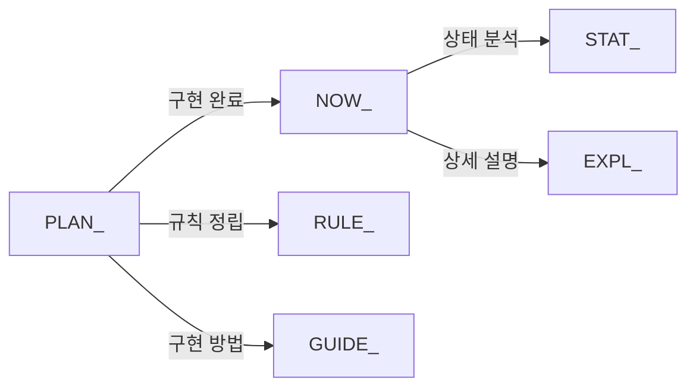

# 📁 System Backbone 문서 관리 규칙

**폴더 목적**: DDD 아키텍처 기반 시스템 백본 구성요소들의 상태 추적 및 개발 가이드
**관리 원칙**: LLM 친화적 문서 구조 + 명확한 접두사 분류 시스템
**최대 분량**: 각 문서 600줄 이내 (LLM 처리 최적화)

---

## 🏷️ **문서 접두사 분류 시스템**

### **📋 현재 상태 문서**
| **접두사** | **용도** | **예시** | **설명** |
|-----------|---------|----------|----------|
| `NOW_` | 현재 구현 완료된 시스템 | `NOW_infrastructure_backbone_status.md` | 실제 동작 중인 백본 시스템 현황 |
| `STAT_` | 현재 상태 분석 보고서 | `STAT_api_usage_analysis.md` | 특정 시점의 상태 스냅샷 |

### **🚀 계획 및 설계 문서**
| **접두사** | **용도** | **예시** | **설명** |
|-----------|---------|----------|----------|
| `PLAN_` | 계획된 신규 시스템 | `PLAN_intelligent_market_data_management.md` | 구현 예정인 백본 시스템 설계 |
| `EXPL_` | 추가 설명 및 상세 분석 | `EXPL_websocket_integration_details.md` | 기존 시스템의 심화 설명 |

### **📋 개발 규칙 및 가이드**
| **접두사** | **용도** | **예시** | **설명** |
|-----------|---------|----------|----------|
| `RULE_` | 개발 규칙 및 약속 | `RULE_ddd_architecture_guidelines.md` | 팀 차원의 개발 규칙 |
| `GUIDE_` | 구현 가이드 | `GUIDE_new_backbone_implementation.md` | 신규 백본 시스템 구현 방법 |

---

## 📂 **현재 문서 현황 (5개 문서)**

### **✅ 현재 구현 완료 시스템 (NOW_)**
- `NOW_infrastructure_backbone_status.md` - Infrastructure 15개 구성요소 현황
- `NOW_ddd_dependency_management.md` - DDD 계층 의존성 관리 시스템
- `NOW_logging_system_analysis.md` - 로깅 시스템 개선 분석

### **🚀 계획된 신규 시스템 (PLAN_)**
- `PLAN_intelligent_market_data_management.md` - 지능형 마켓 데이터 캐싱
- `PLAN_realtime_websocket_backbone.md` - 실시간 WebSocket 백본

---

## 📋 **문서 작성 규칙 (RULE_)**

### **🎯 LLM 에이전트 최적화 원칙 (엄격 준수)**
1. **분량 제한**: 각 문서 **150-200줄** (에이전트 인식 최적화)
2. **구조화된 읽기**: 첫 50줄 독립 완결, 100줄 맥락 완성
3. **제목 규칙**: 기능 중심 + 25자 이내 (즉시 파악 가능)
4. **3개 문서 법칙**: 폴더당 3개 핵심 문서만 유지 (에이전트 선택적 읽기)

### **🏷️ 접두사 사용 규칙**
```yaml
NOW_: 현재 동작 중인 시스템 (구현 완료)
PLAN_: 설계 완료된 미래 시스템 (구현 대기)
STAT_: 특정 시점의 상태 분석 (스냅샷)
EXPL_: 기존 시스템의 상세 설명 (심화 분석)
RULE_: 개발팀 공통 규칙 (아키텍처 가이드)
GUIDE_: 구현 방법론 가이드 (How-to)
```

### **📊 우선순위 표시**
```yaml
🔥 최고: 매매 시스템 핵심 백본
🔶 중간: 성능 향상 백본
🔵 낮음: 편의성 백본
✅ 완성: 구현 완료 및 안정 동작
⚠️ 주의: 개선 필요
📋 계획: 구현 예정
```

---

## 🔄 **문서 생명주기 관리**

### **문서 상태 전환 규칙**


### **정기 리뷰 프로세스**
1. **주간 리뷰**: NOW_ 문서 현황 업데이트
2. **월간 리뷰**: PLAN_ 문서 우선순위 재조정
3. **분기 리뷰**: RULE_ 문서 개정 및 GUIDE_ 업데이트

---

## 🛠️ **추천 문서 추가 계획**

### **즉시 필요한 문서**
- `RULE_ddd_architecture_standards.md` - DDD 아키텍처 표준 규칙
- `GUIDE_new_backbone_development.md` - 신규 백본 시스템 개발 가이드
- `STAT_performance_baseline.md` - 현재 시스템 성능 기준선

### **단기 추가 예정**
- `EXPL_3db_separation_strategy.md` - 3-DB 분리 전략 상세 설명
- `PLAN_distributed_logging_system.md` - 분산 로깅 시스템 계획
- `RULE_api_integration_standards.md` - API 통합 표준 규칙

### **중기 추가 예정**
- `GUIDE_performance_optimization.md` - 성능 최적화 가이드
- `STAT_security_audit_report.md` - 보안 감사 보고서
- `PLAN_cloud_migration_strategy.md` - 클라우드 마이그레이션 전략

---

## 💡 **문서 품질 관리**

### **품질 체크리스트**
- [ ] 600줄 이내 분량 준수
- [ ] 명확한 접두사 분류
- [ ] 실행 가능한 구체적 내용
- [ ] 관련 문서 간 상호 참조
- [ ] 우선순위 및 상태 표시

### **자동화 검증 스크립트**
```powershell
# 문서 분량 체크
Get-ChildItem "docs/system_backbone/*.md" | ForEach-Object {
    $lineCount = (Get-Content $_.FullName | Measure-Object -Line).Lines
    if ($lineCount -gt 600) {
        Write-Warning "$($_.Name): $lineCount 줄 (600줄 초과)"
    }
}

# 접두사 규칙 체크
Get-ChildItem "docs/system_backbone/*.md" | Where-Object {
    $_.Name -notmatch "^(NOW_|PLAN_|STAT_|EXPL_|RULE_|GUIDE_|README\.md)"
} | ForEach-Object {
    Write-Warning "$($_.Name): 잘못된 접두사"
}
```

---

## 🎯 **폴더 운영 목표**

### **단기 목표 (1개월)**
- Infrastructure 백본 15개 구성요소 100% 문서화
- 매매 변수 강화 프로젝트 백본 시스템 설계 완료
- DDD 아키텍처 규칙 체계화

### **중기 목표 (3개월)**
- 모든 백본 시스템 자동화된 모니터링 구축
- 성능 최적화 가이드라인 완성
- 신규 개발자 온보딩 가이드 체계화

### **장기 목표 (6개월)**
- 마이크로서비스 아키텍처 전환 계획 수립
- 클라우드 네이티브 백본 시스템 설계
- AI 기반 시스템 모니터링 도입

---

**관리 철학**: "모든 백본 시스템이 명확히 문서화되고, 팀원 누구나 이해할 수 있는 구조"를 지향합니다. 🚀
