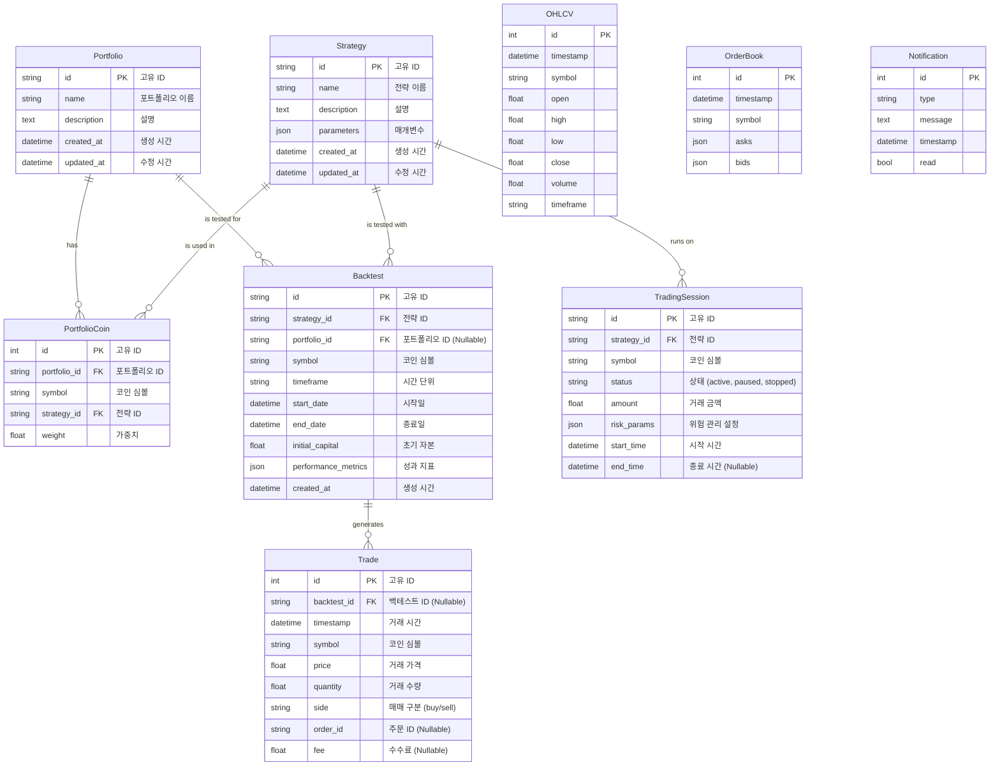

# **데이터베이스 스키마 명세서**

## **1\. 개요**

이 문서는 업비트 자동매매 시스템의 데이터베이스 스키마를 정의합니다. SQLAlchemy 모델(data\_layer/models.py)을 기반으로 각 테이블의 구조, 컬럼 명세, 그리고 테이블 간의 관계를 설명하여 데이터의 일관성과 무결성을 보장하고 개발 효율성을 높이는 것을 목표로 합니다.

## **2\. Entity-Relationship Diagram (ERD)**

시스템의 주요 데이터 모델 간의 관계는 다음과 같습니다.

## **3\. 테이블 명세**

### **3.1. strategy**

매매 전략의 정의와 파라미터를 저장합니다.

| 컬럼명 | 데이터 타입 | 제약 조건 | 설명 |
| :---- | :---- | :---- | :---- |
| id | VARCHAR(50) | PK | 전략의 고유 식별자 (UUID) |
| name | VARCHAR(100) | NOT NULL | 전략의 이름 |
| description | TEXT |  | 전략에 대한 상세 설명 |
| parameters | JSON | NOT NULL | 전략 실행에 필요한 파라미터 (예: 이동평균 기간) |
| created\_at | DATETIME | NOT NULL | 레코드 생성 시간 |
| updated\_at | DATETIME | NOT NULL | 레코드 마지막 수정 시간 |

### **3.2. portfolio**

여러 자산(코인)과 전략의 조합인 포트폴리오 정보를 저장합니다.

| 컬럼명 | 데이터 타입 | 제약 조건 | 설명 |
| :---- | :---- | :---- | :---- |
| id | VARCHAR(50) | PK | 포트폴리오의 고유 식별자 (UUID) |
| name | VARCHAR(100) | NOT NULL | 포트폴리오의 이름 |
| description | TEXT |  | 포트폴리오에 대한 상세 설명 |
| created\_at | DATETIME | NOT NULL | 레코드 생성 시간 |
| updated\_at | DATETIME | NOT NULL | 레코드 마지막 수정 시간 |

### **3.3. portfolio\_coin**

특정 포트폴리오에 어떤 코인이 어떤 전략과 가중치로 포함되어 있는지 정의합니다.

| 컬럼명 | 데이터 타입 | 제약 조건 | 설명 |
| :---- | :---- | :---- | :---- |
| id | INTEGER | PK | 고유 ID |
| portfolio\_id | VARCHAR(50) | FK (portfolio.id) | 소속된 포트폴리오의 ID |
| symbol | VARCHAR(20) | NOT NULL | 코인 심볼 (예: KRW-BTC) |
| strategy\_id | VARCHAR(50) | FK (strategy.id) | 해당 코인에 적용될 전략의 ID |
| weight | FLOAT | NOT NULL | 포트폴리오 내에서 차지하는 비중 (0.0 \~ 1.0) |

### **3.4. backtest**

개별 전략 또는 포트폴리오 전체에 대한 백테스트 실행 결과를 요약하여 저장합니다.

| 컬럼명 | 데이터 타입 | 제약 조건 | 설명 |
| :---- | :---- | :---- | :---- |
| id | VARCHAR(50) | PK | 백테스트 결과의 고유 식별자 (UUID) |
| strategy\_id | VARCHAR(50) | FK (strategy.id) | 테스트에 사용된 전략의 ID |
| portfolio\_id | VARCHAR(50) | FK (portfolio.id), NULLABLE | 포트폴리오 백테스트인 경우, 해당 포트폴리오 ID |
| symbol | VARCHAR(20) | NOT NULL | 테스트 대상 코인 심볼 |
| timeframe | VARCHAR(10) | NOT NULL | 테스트에 사용된 시간 단위 (예: 1h, 1d) |
| start\_date | DATETIME | NOT NULL | 백테스트 시작일 |
| end\_date | DATETIME | NOT NULL | 백테스트 종료일 |
| initial\_capital | FLOAT | NOT NULL | 초기 자본금 |
| performance\_metrics | JSON |  | 총수익률, MDD, 승률 등 핵심 성과 지표 |
| created\_at | DATETIME | NOT NULL | 레코드 생성 시간 |

### **3.5. trade**

백테스트 또는 실거래에서 발생한 개별 거래 내역을 저장합니다.

| 컬럼명 | 데이터 타입 | 제약 조건 | 설명 |
| :---- | :---- | :---- | :---- |
| id | INTEGER | PK | 고유 ID |
| backtest\_id | VARCHAR(50) | FK (backtest.id), NULLABLE | 백테스트 중 발생한 거래인 경우, 해당 백테스트 ID |
| timestamp | DATETIME | NOT NULL | 거래 체결 시간 |
| symbol | VARCHAR(20) | NOT NULL | 거래된 코인 심볼 |
| price | FLOAT | NOT NULL | 체결 가격 |
| quantity | FLOAT | NOT NULL | 체결 수량 |
| side | VARCHAR(10) | NOT NULL | 매매 구분 ('buy' 또는 'sell') |
| order\_id | VARCHAR(50) | NULLABLE | 거래소에서 발급한 주문 ID |
| fee | FLOAT | NULLABLE | 발생한 수수료 |

### **3.6. trading\_session**

실시간 거래 세션의 상태를 저장하고 관리합니다.

| 컬럼명 | 데이터 타입 | 제약 조건 | 설명 |
| :---- | :---- | :---- | :---- |
| id | VARCHAR(50) | PK | 거래 세션의 고유 식별자 (UUID) |
| strategy\_id | VARCHAR(50) | FK (strategy.id) | 실행 중인 전략의 ID |
| symbol | VARCHAR(20) | NOT NULL | 거래 대상 코인 심볼 |
| status | VARCHAR(20) | NOT NULL | 세션 상태 ('active', 'paused', 'stopped') |
| amount | FLOAT | NOT NULL | 해당 세션에 할당된 거래 금액 |
| risk\_params | JSON | NOT NULL | 손절매, 익절 등 위험 관리 설정 |
| start\_time | DATETIME | NOT NULL | 세션 시작 시간 |
| end\_time | DATETIME | NULLABLE | 세션 종료 시간 |

### **3.7. ohlcv / orderbook / notification**

시장 데이터와 시스템 알림을 저장하는 테이블입니다. 이들은 다른 핵심 테이블과 직접적인 관계(FK)는 없지만, 시스템 운영에 필수적인 데이터를 담고 있습니다.