# **Enhanced Database Schema V2.0 - 포지션 관리 및 전략 조합 시스템**

## **1. 개요**

이 문서는 업비트 자동매매 시스템의 확장된 데이터베이스 스키마 V2.0을 정의합니다. 기존 스키마에 **포지션 ID 관리**, **포트폴리오 추적**, **전략 조합 시스템**, **백테스트 결과 저장**, **매개변수 최적화**를 추가하여 보다 체계적인 거래 관리와 분석을 가능하게 합니다.

## **2. 주요 확장 기능**

### **2.1 포지션 ID 관리 시스템**
- 개별 포지션을 고유 ID로 추적
- 포지션별 손익, 리스크 관리, 전략 실행 이력 저장
- 포지션 변경 내역 완전 추적

### **2.2 포트폴리오 관리**
- 백테스트, 실전, 모의투자 포트폴리오 구분
- 실시간 성과 지표 계산 및 저장
- 포트폴리오별 스냅샷으로 시계열 분석 지원

### **2.3 전략 조합 시스템**
- 진입 전략 + 다중 관리 전략 조합
- 전략 충돌 해결 방식 정의
- 매개변수 최적화 프레임워크

## **3. Enhanced ERD**

```mermaid
erDiagram
    %% 전략 정의 및 조합
    StrategyDefinitions ||--o{ StrategyConfigs : "defines"
    StrategyConfigs ||--o{ StrategyCombinations : "entry_strategy"
    StrategyConfigs ||--o{ CombinationManagementStrategies : "management_strategy"
    StrategyCombinations ||--o{ CombinationManagementStrategies : "has"
    
    %% 포트폴리오 및 포지션
    StrategyCombinations ||--o{ Portfolios : "uses"
    Portfolios ||--o{ Positions : "contains"
    Portfolios ||--o{ PortfolioSnapshots : "tracked_by"
    Positions ||--o{ PositionHistory : "tracked_by"
    StrategyConfigs ||--o{ Positions : "entry_strategy"
    
    %% 백테스트 시스템
    StrategyCombinations ||--o{ BacktestResults : "tested_with"
    Portfolios ||--o{ BacktestResults : "tested_on"
    BacktestResults ||--o{ TradeLogs : "generates"
    BacktestResults ||--o{ PositionLogs : "tracks"
    Positions ||--o{ TradeLogs : "related_to"
    
    %% 최적화 시스템
    StrategyCombinations ||--o{ OptimizationJobs : "optimizes"
    OptimizationJobs ||--o{ OptimizationResults : "produces"

    %% 전략 정의
    StrategyDefinitions {
        string id PK "전략 정의 ID"
        string name "전략 이름"
        string description "설명"
        string strategy_type "entry/management"
        string class_name "구현 클래스명"
        json default_parameters "기본 매개변수"
        json parameter_schema "매개변수 스키마"
        datetime created_at "생성시간"
        datetime updated_at "수정시간"
    }

    %% 전략 설정
    StrategyConfigs {
        string config_id PK "설정 ID"
        string strategy_definition_id FK "전략 정의 ID"
        string strategy_name "설정 이름"
        json parameters "매개변수 값"
        datetime created_at "생성시간"
        datetime updated_at "수정시간"
    }

    %% 전략 조합
    StrategyCombinations {
        string combination_id PK "조합 ID"
        string name "조합 이름"
        string description "설명"
        string entry_strategy_id FK "진입 전략 ID"
        string conflict_resolution "충돌 해결 방식"
        datetime created_at "생성시간"
        datetime updated_at "수정시간"
        string created_by "생성자"
    }

    %% 조합-관리전략 연결
    CombinationManagementStrategies {
        int id PK "연결 ID"
        string combination_id FK "조합 ID"
        string strategy_config_id FK "관리전략 ID"
        int priority "우선순위"
    }

    %% 포트폴리오
    Portfolios {
        string portfolio_id PK "포트폴리오 ID"
        string name "이름"
        string description "설명"
        float initial_capital "초기 자본"
        float current_value "현재 가치"
        float cash_balance "현금 잔고"
        string portfolio_type "backtest/live/paper"
        string strategy_combination_id FK "전략 조합 ID"
        json risk_settings "리스크 설정"
        float total_return_percent "총 수익률"
        float total_return_amount "총 수익금"
        float unrealized_pnl "미실현 손익"
        float realized_pnl "실현 손익"
        float max_drawdown "최대 낙폭"
        string status "active/paused/closed"
        datetime created_at "생성시간"
        datetime updated_at "수정시간"
    }

    %% 포지션
    Positions {
        string position_id PK "포지션 ID"
        string portfolio_id FK "포트폴리오 ID"
        string symbol "심볼"
        string direction "BUY/SELL"
        float entry_price "진입가"
        float current_price "현재가"
        float quantity "수량"
        float remaining_quantity "잔여수량"
        float unrealized_pnl_percent "미실현손익률"
        float unrealized_pnl_amount "미실현손익금"
        float realized_pnl_amount "실현손익금"
        float stop_loss_price "손절가"
        float take_profit_price "익절가"
        float trailing_stop_price "트레일링스탑가"
        float max_position_value "최대포지션가치"
        string entry_strategy_id FK "진입전략ID"
        string entry_reason "진입사유"
        json management_actions "관리전략이력"
        string status "open/partial_closed/closed"
        datetime opened_at "진입시간"
        datetime updated_at "수정시간"
        datetime closed_at "청산시간"
    }

    %% 포지션 이력
    PositionHistory {
        int id PK "이력 ID"
        string position_id FK "포지션 ID"
        datetime timestamp "시간"
        string action "OPEN/ADD/REDUCE/CLOSE/UPDATE_STOP"
        float price "가격"
        float quantity_change "수량변화"
        float quantity_after "변화후수량"
        float realized_pnl "실현손익"
        float fees "수수료"
        string strategy_name "전략명"
        string reason "사유"
        string triggered_by "트리거"
        float stop_price_before "변경전손절가"
        float stop_price_after "변경후손절가"
        float target_price_before "변경전목표가"
        float target_price_after "변경후목표가"
    }

    %% 포트폴리오 스냅샷
    PortfolioSnapshots {
        int id PK "스냅샷 ID"
        string portfolio_id FK "포트폴리오 ID"
        datetime snapshot_time "스냅샷 시간"
        string snapshot_type "minute/hourly/daily/weekly"
        float total_value "총 가치"
        float cash_balance "현금잔고"
        float invested_amount "투자금액"
        float total_return_percent "총수익률"
        float total_return_amount "총수익금"
        float unrealized_pnl "미실현손익"
        float realized_pnl "실현손익"
        float drawdown_percent "낙폭률"
        int open_positions_count "열린포지션수"
        float total_positions_value "총포지션가치"
        float portfolio_beta "포트폴리오베타"
        float var_1d "1일VaR"
        float sharpe_ratio "샤프비율"
    }

    %% 백테스트 결과
    BacktestResults {
        string result_id PK "결과 ID"
        string portfolio_id FK "포트폴리오 ID"
        string combination_id FK "조합 ID"
        string symbol "심볼"
        string timeframe "시간프레임"
        datetime start_date "시작일"
        datetime end_date "종료일"
        float initial_capital "초기자본"
        float trading_fee_rate "거래수수료율"
        float slippage_rate "슬리피지율"
        json risk_settings "리스크설정"
        float total_return "총수익률"
        int total_trades "총거래수"
        int winning_trades "수익거래수"
        int losing_trades "손실거래수"
        float win_rate "승률"
        float sharpe_ratio "샤프비율"
        float max_drawdown "최대낙폭"
        json entry_contribution "진입기여도"
        json management_contribution "관리기여도"
        string status "pending/running/completed/failed"
        datetime backtest_start "백테스트시작"
        datetime backtest_end "백테스트종료"
        int data_points "데이터포인트수"
        string error_message "오류메시지"
        datetime created_at "생성시간"
    }

    %% 거래 로그
    TradeLogs {
        int id PK "로그 ID"
        string backtest_result_id FK "백테스트결과ID"
        string position_id FK "포지션 ID"
        datetime timestamp "시간"
        string action "ENTER/EXIT/ADD_BUY/ADD_SELL"
        string direction "BUY/SELL"
        float price "가격"
        float quantity "수량"
        float pnl_percent "손익률"
        float pnl_amount "손익금"
        float fees "수수료"
        string strategy_name "전략명"
        string reason "사유"
        float stop_price "손절가"
        float risk_percent "리스크률"
        float holding_time "보유시간"
        float portfolio_value_after "거래후포트폴리오가치"
        float cash_balance_after "거래후현금잔고"
    }

    %% 포지션 로그 (백테스트용)
    PositionLogs {
        int id PK "로그 ID"
        string backtest_result_id FK "백테스트결과ID"
        datetime timestamp "시간"
        string direction "BUY/SELL"
        float entry_price "진입가"
        float current_price "현재가"
        float quantity "수량"
        float stop_price "손절가"
        float unrealized_pnl_percent "미실현손익률"
        float unrealized_pnl_amount "미실현손익금"
        json management_actions "관리전략실행이력"
    }

    %% 최적화 작업
    OptimizationJobs {
        string job_id PK "작업 ID"
        string combination_id FK "조합 ID"
        string algorithm "GA/PSO/RANDOM/GRID"
        json parameter_ranges "매개변수범위"
        string optimization_target "최적화목표"
        int population_size "개체수"
        int generations "세대수"
        int iterations "반복수"
        string status "pending/running/completed/failed"
        float progress "진행률"
        datetime started_at "시작시간"
        datetime completed_at "완료시간"
        datetime created_at "생성시간"
        json best_parameters "최적매개변수"
        float best_fitness "최적적합도"
        json convergence_data "수렴데이터"
    }

    %% 최적화 결과
    OptimizationResults {
        int id PK "결과 ID"
        string job_id FK "작업 ID"
        int generation "세대"
        int individual_id "개체 ID"
        json parameters "매개변수"
        float fitness_score "적합도점수"
        float total_return "총수익률"
        float sharpe_ratio "샤프비율"
        float win_rate "승률"
        float max_drawdown "최대낙폭"
        datetime created_at "생성시간"
    }
```



## **4. 테이블 상세 명세**

### **4.1 전략 관리 테이블**

#### **4.1.1 strategy_definitions**
전략의 기본 정의와 매개변수 스키마를 저장합니다.

| 컬럼명 | 데이터 타입 | 제약 조건 | 설명 |
|--------|-------------|-----------|------|
| id | TEXT | PK | 전략 정의 고유 ID |
| name | TEXT | NOT NULL | 전략 이름 |
| description | TEXT | | 전략 설명 |
| strategy_type | TEXT | NOT NULL, CHECK | 전략 유형 (entry/management) |
| class_name | TEXT | NOT NULL | 구현 클래스명 |
| default_parameters | TEXT | NOT NULL | 기본 매개변수 (JSON) |
| parameter_schema | TEXT | NOT NULL | 매개변수 스키마 (JSON) |
| created_at | TEXT | NOT NULL | 생성 시간 |
| updated_at | TEXT | NOT NULL | 수정 시간 |

#### **4.1.2 strategy_configs**
구체적인 전략 설정값을 저장합니다.

| 컬럼명 | 데이터 타입 | 제약 조건 | 설명 |
|--------|-------------|-----------|------|
| config_id | TEXT | PK | 설정 고유 ID |
| strategy_definition_id | TEXT | FK, NOT NULL | 전략 정의 참조 |
| strategy_name | TEXT | NOT NULL | 설정 이름 |
| parameters | TEXT | NOT NULL | 매개변수 값 (JSON) |
| created_at | TEXT | NOT NULL | 생성 시간 |
| updated_at | TEXT | NOT NULL | 수정 시간 |

#### **4.1.3 strategy_combinations**
진입 전략과 관리 전략의 조합을 정의합니다.

| 컬럼명 | 데이터 타입 | 제약 조건 | 설명 |
|--------|-------------|-----------|------|
| combination_id | TEXT | PK | 조합 고유 ID |
| name | TEXT | NOT NULL | 조합 이름 |
| description | TEXT | | 조합 설명 |
| entry_strategy_id | TEXT | FK, NOT NULL | 진입 전략 참조 |
| conflict_resolution | TEXT | NOT NULL | 충돌 해결 방식 |
| created_at | TEXT | NOT NULL | 생성 시간 |
| updated_at | TEXT | NOT NULL | 수정 시간 |
| created_by | TEXT | | 생성자 |

### **4.2 포트폴리오 관리 테이블**

#### **4.2.1 portfolios**
포트폴리오의 기본 정보와 실시간 성과를 저장합니다.

| 컬럼명 | 데이터 타입 | 제약 조건 | 설명 |
|--------|-------------|-----------|------|
| portfolio_id | TEXT | PK | 포트폴리오 고유 ID |
| name | TEXT | NOT NULL | 포트폴리오 이름 |
| description | TEXT | | 설명 |
| initial_capital | REAL | NOT NULL | 초기 자본 |
| current_value | REAL | NOT NULL | 현재 가치 |
| cash_balance | REAL | NOT NULL | 현금 잔고 |
| portfolio_type | TEXT | NOT NULL | 포트폴리오 유형 |
| strategy_combination_id | TEXT | FK | 사용 전략 조합 |
| risk_settings | TEXT | | 리스크 설정 (JSON) |
| total_return_percent | REAL | | 총 수익률 |
| total_return_amount | REAL | | 총 수익금 |
| unrealized_pnl | REAL | | 미실현 손익 |
| realized_pnl | REAL | | 실현 손익 |
| max_drawdown | REAL | | 최대 낙폭 |
| status | TEXT | NOT NULL | 상태 |
| created_at | TEXT | NOT NULL | 생성 시간 |
| updated_at | TEXT | NOT NULL | 수정 시간 |

#### **4.2.2 positions**
개별 포지션의 상세 정보를 저장합니다.

| 컬럼명 | 데이터 타입 | 제약 조건 | 설명 |
|--------|-------------|-----------|------|
| position_id | TEXT | PK | 포지션 고유 ID |
| portfolio_id | TEXT | FK, NOT NULL | 포트폴리오 참조 |
| symbol | TEXT | NOT NULL | 거래 심볼 |
| direction | TEXT | NOT NULL | 거래 방향 (BUY/SELL) |
| entry_price | REAL | NOT NULL | 진입 가격 |
| current_price | REAL | NOT NULL | 현재 가격 |
| quantity | REAL | NOT NULL | 보유 수량 |
| remaining_quantity | REAL | NOT NULL | 잔여 수량 |
| unrealized_pnl_percent | REAL | | 미실현 손익률 |
| unrealized_pnl_amount | REAL | | 미실현 손익금 |
| realized_pnl_amount | REAL | | 실현 손익금 |
| stop_loss_price | REAL | | 손절 가격 |
| take_profit_price | REAL | | 익절 가격 |
| trailing_stop_price | REAL | | 트레일링 스탑 가격 |
| max_position_value | REAL | | 최대 포지션 가치 |
| entry_strategy_id | TEXT | FK | 진입 전략 참조 |
| entry_reason | TEXT | | 진입 사유 |
| management_actions | TEXT | | 관리 전략 이력 (JSON) |
| status | TEXT | NOT NULL | 포지션 상태 |
| opened_at | TEXT | NOT NULL | 진입 시간 |
| updated_at | TEXT | NOT NULL | 수정 시간 |
| closed_at | TEXT | | 청산 시간 |

### **4.3 백테스트 시스템 테이블**

#### **4.3.1 backtest_results**
백테스트 실행 결과와 성과 지표를 저장합니다.

| 컬럼명 | 데이터 타입 | 제약 조건 | 설명 |
|--------|-------------|-----------|------|
| result_id | TEXT | PK | 백테스트 결과 ID |
| portfolio_id | TEXT | FK, NOT NULL | 포트폴리오 참조 |
| combination_id | TEXT | FK, NOT NULL | 전략 조합 참조 |
| symbol | TEXT | NOT NULL | 테스트 심볼 |
| timeframe | TEXT | NOT NULL | 시간 프레임 |
| start_date | TEXT | NOT NULL | 시작일 |
| end_date | TEXT | NOT NULL | 종료일 |
| initial_capital | REAL | NOT NULL | 초기 자본 |
| trading_fee_rate | REAL | | 거래 수수료율 |
| slippage_rate | REAL | | 슬리피지율 |
| risk_settings | TEXT | NOT NULL | 리스크 설정 (JSON) |
| total_return | REAL | | 총 수익률 |
| total_trades | INTEGER | | 총 거래 수 |
| winning_trades | INTEGER | | 수익 거래 수 |
| losing_trades | INTEGER | | 손실 거래 수 |
| win_rate | REAL | | 승률 |
| sharpe_ratio | REAL | | 샤프 비율 |
| max_drawdown | REAL | | 최대 낙폭 |
| entry_contribution | TEXT | | 진입 전략 기여도 (JSON) |
| management_contribution | TEXT | | 관리 전략 기여도 (JSON) |
| status | TEXT | NOT NULL | 실행 상태 |
| backtest_start | TEXT | | 백테스트 시작 시간 |
| backtest_end | TEXT | | 백테스트 종료 시간 |
| data_points | INTEGER | | 데이터 포인트 수 |
| error_message | TEXT | | 오류 메시지 |
| created_at | TEXT | NOT NULL | 생성 시간 |

## **5. 인덱스 최적화**

### **5.1 성능 최적화 인덱스**
```sql
-- 포지션 조회 최적화
CREATE INDEX idx_positions_portfolio_status ON positions(portfolio_id, status);
CREATE INDEX idx_positions_symbol_status ON positions(symbol, status);
CREATE INDEX idx_positions_opened_at ON positions(opened_at);

-- 포지션 이력 조회 최적화
CREATE INDEX idx_position_history_position_timestamp ON position_history(position_id, timestamp);
CREATE INDEX idx_position_history_action ON position_history(action, timestamp);

-- 포트폴리오 스냅샷 조회 최적화
CREATE INDEX idx_portfolio_snapshots_portfolio_time ON portfolio_snapshots(portfolio_id, snapshot_time);
CREATE INDEX idx_portfolio_snapshots_type_time ON portfolio_snapshots(snapshot_type, snapshot_time);

-- 백테스트 결과 조회 최적화
CREATE INDEX idx_backtest_portfolio ON backtest_results(portfolio_id);
CREATE INDEX idx_backtest_combination_symbol ON backtest_results(combination_id, symbol);
CREATE INDEX idx_backtest_date_range ON backtest_results(start_date, end_date);

-- 거래 로그 조회 최적화
CREATE INDEX idx_trade_logs_backtest_timestamp ON trade_logs(backtest_result_id, timestamp);
CREATE INDEX idx_trade_logs_position ON trade_logs(position_id, timestamp);

-- 최적화 결과 조회 최적화
CREATE INDEX idx_optimization_results_job_generation ON optimization_results(job_id, generation);
CREATE INDEX idx_optimization_results_fitness ON optimization_results(fitness_score DESC);
```

## **6. 데이터 무결성 규칙**

### **6.1 제약 조건**
- 포지션의 `remaining_quantity`는 `quantity`보다 클 수 없음
- 포트폴리오의 `cash_balance`는 음수가 될 수 없음
- 백테스트의 `start_date`는 `end_date`보다 이전이어야 함
- 최적화 작업의 `progress`는 0.0~1.0 범위여야 함

### **6.2 트리거 규칙**
- 포지션 변경 시 `position_history` 자동 생성
- 포트폴리오 값 변경 시 `updated_at` 자동 갱신
- 백테스트 완료 시 성과 지표 자동 계산

## **7. 사용 예시**

### **7.1 포지션 생성 및 추적**
```sql
-- 새 포지션 생성
INSERT INTO positions (position_id, portfolio_id, symbol, direction, entry_price, quantity, ...)
VALUES ('pos_001', 'portfolio_001', 'KRW-BTC', 'BUY', 50000000, 0.1, ...);

-- 포지션 변경 이력 추가
INSERT INTO position_history (position_id, timestamp, action, price, quantity_change, ...)
VALUES ('pos_001', '2025-07-21 10:30:00', 'ADD', 49000000, 0.05, ...);
```

### **7.2 백테스트 실행 및 결과 저장**
```sql
-- 백테스트 결과 저장
INSERT INTO backtest_results (result_id, portfolio_id, combination_id, symbol, ...)
VALUES ('bt_001', 'portfolio_001', 'combo_001', 'KRW-BTC', ...);

-- 거래 로그 저장
INSERT INTO trade_logs (backtest_result_id, position_id, timestamp, action, ...)
VALUES ('bt_001', 'pos_001', '2025-07-21 10:30:00', 'ENTER', ...);
```

### **7.3 성과 분석 쿼리**
```sql
-- 포트폴리오별 총 수익률
SELECT p.name, p.total_return_percent, p.max_drawdown
FROM portfolios p
WHERE p.status = 'active'
ORDER BY p.total_return_percent DESC;

-- 전략 조합별 평균 성과
SELECT sc.name, AVG(br.total_return) as avg_return, AVG(br.sharpe_ratio) as avg_sharpe
FROM strategy_combinations sc
JOIN backtest_results br ON sc.combination_id = br.combination_id
WHERE br.status = 'completed'
GROUP BY sc.combination_id;
```

## **8. 마이그레이션 가이드**

### **8.1 기존 데이터 보존**
```sql
-- 기존 market_data, trading_strategies, ohlcv_data 테이블은 그대로 유지
-- 새 테이블들만 추가로 생성

-- 기존 trading_strategies 데이터를 새 strategy_definitions로 마이그레이션
INSERT INTO strategy_definitions (id, name, description, strategy_type, class_name, ...)
SELECT id, name, description, 'entry', class_name, ...
FROM trading_strategies;
```

### **8.2 점진적 도입**
1. **Phase 1**: 전략 정의 및 조합 테이블 생성
2. **Phase 2**: 포트폴리오 및 포지션 관리 테이블 추가
3. **Phase 3**: 백테스트 결과 저장 시스템 연동
4. **Phase 4**: 최적화 시스템 완전 통합

이 확장된 스키마를 통해 포지션별 세밀한 추적, 포트폴리오 성과 분석, 전략 조합 최적화가 가능해집니다.
