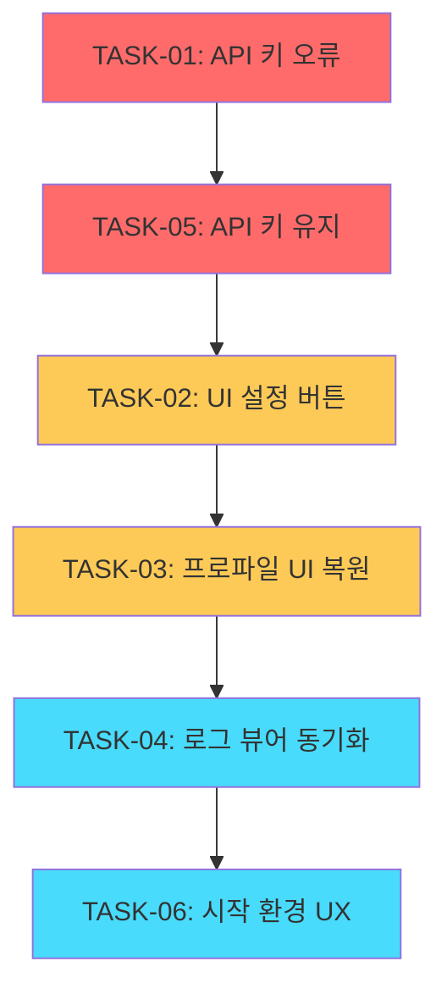

# 📋 Active Tasks Summary - 2025-08-10

## 🎯 전체 태스크 개요
총 6개 태스크로 분할된 긴급 문제 해결 프로젝트
**목표**: 사용자 경험 복원 및 시스템 안정성 확보

## 📊 우선순위별 태스크 목록

### 🔴 긴급 (Critical)
1. **[TASK-20250810-01](./TASK-20250810-01_API_KEY_LOAD_ERROR_FIX.md)** - API 키 로드 오류 긴급 수정
   - **상태**: ⏳ 대기
   - **예상 소요**: 2-3시간
   - **블로커**: 실거래 기능 완전 차단
   - **서브태스크**: 4개 (파일경로 검증, 암호화 키 검증, 로직 디버깅, 에러 메시지)

2. **[TASK-20250810-05](./TASK-20250810-05_PROFILE_API_KEY_PERSISTENCE.md)** - 프로파일 전환시 API 키 유지
   - **상태**: ⏳ 대기
   - **예상 소요**: 1-2시간
   - **리스크**: 사용자 피로도 증가, 보안 위험
   - **서브태스크**: 4개 (환경변수 분류, 선택적 적용, 상태 모니터링, UX 개선)

### 🟡 높음 (High)
3. **[TASK-20250810-02](./TASK-20250810-02_UI_SETTINGS_BUTTONS_FIX.md)** - UI 설정 탭 저장/복원 버튼 수정
   - **상태**: ⏳ 대기
   - **예상 소요**: 1-2시간
   - **문제**: 사용자 설정 변경사항 유실
   - **서브태스크**: 4개 (시그널 연결, 서비스 연동, 저장 로직, 복원 로직)

4. **[TASK-20250810-03](./TASK-20250810-03_PROFILE_UI_DESIGN_RESTORE.md)** - 환경 프로파일 UI 디자인 복원
   - **상태**: ⏳ 대기
   - **예상 소요**: 2-3시간
   - **문제**: 사용자 요구 무시한 UI 변경
   - **서브태스크**: 4개 (컴포넌트 백업, 기본 버튼 복원, 커스텀 섹션 분리, 미리보기 패널)

### 🟢 보통 (Medium)
5. **[TASK-20250810-04](./TASK-20250810-04_LOG_VIEWER_SYNC_FIX.md)** - 로그 뷰어 표시 내용 동기화
   - **상태**: ⏳ 대기
   - **예상 소요**: 1-2시간
   - **문제**: 디버깅 효율성 저하
   - **서브태스크**: 4개 (파일 읽기 검증, 실시간 모니터링, 필터링 검증, UI 동기화)

6. **[TASK-20250810-06](./TASK-20250810-06_STARTUP_ENVIRONMENT_UX.md)** - 환경변수 시작 설정 UX 개선
   - **상태**: ⏳ 대기
   - **예상 소요**: 2-3시간
   - **문제**: CLI 방식의 사용자 부적합성
   - **서브태스크**: 4개 (설정 저장소, 선택 다이얼로그, 시작 로직 통합, 안전장치)

## 📋 실행 권장 순서

## 🧪 통합 테스트 계획

### **Phase 1: 기본 기능 복구** (TASK-01, 02)
- API 키 정상 로드 → UI 설정 저장 정상 동작
- 예상 소요: 3-4시간

### **Phase 2: 사용자 경험 복원** (TASK-03, 05)
- 프로파일 UI 복원 → API 키 유지 기능 연동
- 예상 소요: 3-4시간

### **Phase 3: 디버깅 및 편의성** (TASK-04, 06)
- 로그 뷰어 동기화 → 시작 환경 UX 개선
- 예상 소요: 3-4시간

## ✅ 전체 완료 조건

### **기능적 요구사항**
- [ ] API 키 로드/저장 100% 정상 동작
- [ ] 프로파일 전환시 API 키 유지 100%
- [ ] UI 설정 저장/복원 정상 동작
- [ ] 기본 프로파일 3버튼 + 커스텀 드롭다운 UI 복원
- [ ] 로그 뷰어와 파일 내용 100% 일치
- [ ] 사용자 친화적 시작 환경 설정

### **품질 요구사항**
- [ ] 모든 TDD 테스트 통과 (커버리지 90% 이상)
- [ ] 성능 기준 충족 (응답시간 1초 이내)
- [ ] 메모리 사용량 최적화 (증가량 50MB 이하)
- [ ] 보안 요구사항 100% 충족

### **사용자 경험 요구사항**
- [ ] 일반 사용자 직관적 조작 가능 (3초 이내 목표 달성)
- [ ] 개발자 디버깅 효율성 복원
- [ ] 실거래 환경 안전장치 완벽 작동
- [ ] 기존 워크플로우 100% 호환성 유지

## 🚨 공통 리스크 관리

### **데이터 안전성**
- 모든 작업 전 데이터베이스 백업 필수
- API 키 등 보안 데이터 무결성 보장
- 설정 파일 손상시 자동 복구 메커니즘

### **호환성 유지**
- 기존 DDD 아키텍처 100% 준수
- MVP 패턴 일관성 유지
- Infrastructure Layer 로깅 시스템 연동

### **성능 최적화**
- UI 응답성 1초 이내 목표
- 메모리 사용량 모니터링
- 대용량 데이터 처리 최적화

## 📊 진행 상황 추적

| 태스크 | 진행률 | 상태 | 차단 요소 | 다음 단계 |
|--------|--------|------|-----------|-----------|
| TASK-01 | 0% | ⏳ 대기 | 없음 | 파일 경로 검증 시작 |
| TASK-02 | 0% | ⏳ 대기 | TASK-01 완료 | 시그널 연결 분석 |
| TASK-03 | 0% | ⏳ 대기 | TASK-02 완료 | UI 백업 및 분석 |
| TASK-04 | 0% | ⏳ 대기 | TASK-03 완료 | 로그 파일 읽기 검증 |
| TASK-05 | 0% | ⏳ 대기 | TASK-01 완료 | 환경변수 분류 체계 |
| TASK-06 | 0% | ⏳ 대기 | TASK-04 완료 | 설정 저장소 구현 |

## 🎯 즉시 시작 태스크
**TASK-20250810-01: API 키 로드 오류 긴급 수정**부터 시작하여 순차적으로 진행합니다.

---
**📌 중요**: 각 태스크는 완전히 완료 후 다음 태스크로 이동하며, TDD 원칙을 엄격히 준수합니다.
