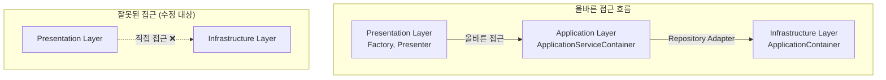

# 📋 TASK_20250929_00: Factory 패턴 올바른 사용법 적용 - 전체 프로젝트 브리프

## 🎯 태스크 목표

### 주요 목표

**현재 3-Container 구조의 올바른 사용법 적용을 통한 Factory 패턴 완성**

- 구조 변경 대신 올바른 사용법으로 문제 해결
- ApplicationServiceContainer를 통한 계층별 접근 규칙 준수
- 6개 설정 탭의 완전한 MVP 패턴 동작 구현

### 완료 기준

- ✅ 6개 모든 설정 탭이 Factory 패턴으로 정상 동작
- ✅ `python run_desktop_ui.py` 실행 시 모든 설정 화면 오류 없음
- ✅ 현재 3-Container 구조의 장점 활용 확인
- ✅ DDD + MVP + Factory + DI 통합 아키텍처 완성

---

## 🔍 핵심 발견 및 방향 전환

### 🎯 중요한 인사이트

**"구조가 문제가 아니라 사용법이 잘못되었다"**

### 🏷️ 컨테이너 파일명 혼동 문제 발견

#### 추가 발견 사항: 현재 컨테이너 파일명이 혼동을 야기

| 현재 파일명 | 클래스명 | 실제 역할 | 혼동 요소 |
|------------|----------|-----------|-----------|
| container.py | `ApplicationServiceContainer` | Application Layer 서비스 조합 | "Application"이 중복됨 |
| container.py | `ApplicationContainer` | Infrastructure DI Provider | "Application"인데 Infrastructure에 있음 |
| app_context.py | `ApplicationContext` | Context 생명주기 관리 | 역할이 명확하지 않음 |

#### 단계적 해결 방안 (Option C)

1. **1단계 (현재)**: 주석 및 문서로 역할 명확화 - Factory 작업과 함께 진행
2. **2단계 (추후)**: TASK_01~05 완료 후 파일명 변경 고려
3. **3단계 (최종)**: Import 구문 일괄 업데이트 (필요시)

#### 현재 구조의 우수성 확인

1. **ApplicationContainer (Infrastructure DI)**: 외부 의존성 격리 전담
2. **ApplicationServiceContainer (Application Layer)**: 비즈니스 서비스 조합 전담
3. **ApplicationContext (Context Management)**: 생명주기 관리 전담

#### 잘못된 사용 패턴 식별

```python
# ❌ 현재 잘못된 사용
container = get_global_container()  # ApplicationContainer 직접 접근
api_service = container.api_key_service()  # Infrastructure 직접 접근

# ✅ 올바른 사용법
app_container = get_application_container()  # ApplicationServiceContainer 경유
api_service = app_container.get_api_key_service()  # Application 경유 접근
```

---

## 📂 5개 하위 태스크 구조

### TASK A: 올바른 Container 사용법 적용 🔥 최우선

**파일**: `TASK_20250929_01-correct_container_usage.md`

- **목표**: Factory에서 ApplicationServiceContainer 올바른 사용
- **핵심**: 계층별 접근 규칙 적용 (Presentation → Application → Infrastructure)
- **예상 시간**: 2-3시간
- **종속성**: 없음 (다른 모든 태스크의 기반)

### TASK B: API Settings Factory MVP 완성 ✅ 검증 기준점

**파일**: `TASK_20250929_02-api_settings_factory_completion.md`

- **목표**: API 설정을 성공 패턴으로 완전 구현
- **핵심**: 올바른 사용법 적용 후 MVP 패턴 완전 조립
- **예상 시간**: 1-2시간
- **종속성**: TASK A 완료 후

### TASK C: Database Settings Factory 수정 🔧 오류 해결

**파일**: `TASK_20250929_03-database_settings_factory_fix.md`

- **목표**: DatabaseSettingsComponentFactory NoneType 오류 해결
- **핵심**: 존재하지 않는 서비스 호출 문제 해결
- **예상 시간**: 1.5-2시간
- **종속성**: TASK A 완료 후

### TASK D: 나머지 설정 Factory 일괄 수정 📈 확장 적용

**파일**: `TASK_20250929_04-remaining_settings_factories.md`

- **목표**: Logging, Notification, Environment Profile Factory 수정
- **핵심**: 검증된 올바른 패턴을 3개 Factory에 적용
- **예상 시간**: 2-3시간
- **종속성**: TASK A, B 완료 후

### TASK E: 통합 테스트 및 성능 검증 🎯 최종 검증

**파일**: `TASK_20250929_05-integration_test_performance.md`

- **목표**: 전체 시스템 동작 확인 및 현재 구조 장점 실증
- **핵심**: 성능 지표 수집으로 현재 구조의 우수성 증명
- **예상 시간**: 1-1.5시간
- **종속성**: 모든 태스크 완료 후

---

## 🎯 전체 전략 및 접근 방법

### 핵심 전략: "올바른 사용법" 중심 접근

1. **구조 보존**: 현재 3-Container 구조의 설계 의도 존중
2. **사용법 교정**: 계층별 접근 규칙 엄격 적용
3. **점진적 적용**: 성공 패턴 확립 → 개별 검증 → 확산
4. **성과 측정**: 현재 구조의 장점 실증
5. **MVP 구조 개선**: API Settings부터 시작하여 단계적 Presenter 이동

### DDD + Clean Architecture 준수



---

## 📊 예상 성과 및 측정 지표

### 정량적 지표

- **메모리 사용량**: Lazy Loading 효과 측정
- **초기화 시간**: 현재 구조의 성능 장점 확인
- **코드 복잡도**: 올바른 사용법으로 인한 가독성 향상
- **오류 발생률**: Factory 패턴 일관성으로 인한 버그 감소

### 정성적 가치

- **아키텍처 순수성**: DDD + Clean Architecture 완벽 구현
- **확장성**: 플러그인 아키텍처 지원 확인
- **테스트 용이성**: 계층별 독립 테스트 가능성 실증
- **유지보수성**: 올바른 사용법으로 인한 코드 이해도 향상

---

## 🚨 위험 요소 및 완화 방안

### 주요 위험 요소

| 위험 | 확률 | 영향도 | 완화 방안 |
|------|------|--------|-----------|
| **사용법 적용 실패** | 중간 | 높음 | 단계별 검증, 롤백 계획 |
| **컨테이너 파일명 혼동** | 높음 | 중간 | 주석으로 역할 명확화, 추후 파일명 변경 |
| **MVP 폴더 구조 혼란** | 높음 | 높음 | 단계적 Presenter 이동 (Option C) |
| **성능 저하** | 낮음 | 중간 | 성능 모니터링, 최적화 |
| **기존 코드 영향** | 중간 | 중간 | 백업, 점진적 적용 |

### 완화 전략

- **백업 필수**: 각 태스크 시작 전 관련 파일 백업
- **단계별 검증**: 각 태스크 완료 후 개별 동작 확인
- **롤백 준비**: 문제 발생 시 즉시 이전 상태 복원

---

## 📋 태스크 실행 순서 및 마일스톤

### Phase 1: 기반 수정 (TASK A)

**마일스톤**: Factory에서 ApplicationServiceContainer 올바른 접근 확인

- `settings_view_factory.py` 수정
- 계층별 접근 규칙 적용
- ApplicationContext 생명주기 관리 통합

### Phase 2: 개별 검증 (TASK B, C)

**마일스톤**: API Settings와 Database Settings 완전 동작

- 성공 패턴 확립 (API Settings)
- 주요 오류 해결 (Database Settings)
- 2개 설정 탭 완전 동작 확인

### Phase 3: 확장 적용 (TASK D)

**마일스톤**: 6개 모든 설정 Factory 완성

- 검증된 패턴을 나머지 3개 Factory에 적용
- 하위 위젯 DI 문제 일괄 해결
- 일관된 MVP 조립 패턴 적용

### Phase 4: 통합 검증 (TASK E)

**마일스톤**: 현재 구조의 우수성 실증

- `python run_desktop_ui.py` 전체 동작 확인
- 성능 지표 수집 및 분석
- 현재 3-Container 구조 장점 문서화

---

## 💡 핵심 원칙 및 가이드라인

### 🎯 "올바른 사용법" 원칙

1. **계층 준수**: Presentation → Application → Infrastructure
2. **Container 역할**: 각 Container의 설계 의도 존중
3. **생명주기 관리**: ApplicationContext를 통한 적절한 관리
4. **컨테이너 명확화**: 주석과 문서로 각 컨테이너 역할 명확히 구분
5. **MVP 구조 정리**: 단계적 Presenter 이동으로 올바른 MVP 분리

### 🔄 점진적 적용 원칙

1. **기반 먼저**: TASK A에서 올바른 패턴 확립
2. **검증 후 확산**: 성공 패턴 확인 후 다른 Factory에 적용
3. **안전 우선**: 각 단계마다 백업 및 검증

### 📊 성과 측정 원칙

1. **정량화**: 구체적 지표로 개선 효과 측정
2. **실증**: 현재 구조의 장점을 실제 데이터로 증명
3. **문서화**: 성과를 문서로 기록하여 향후 참조

---

## 🚀 즉시 시작할 작업

### 다음 단계: TASK A 문서 생성

```bash
# TASK A 문서 생성 요청
태스크명: "올바른 Container 사용법 적용"
파일명: TASK_20250929_01-correct_container_usage.md
우선순위: 🔥 최우선 (모든 태스크의 기반)
```

### 준비 작업

1. **현재 Factory 파일 백업**: `settings_view_factory.py` 백업 생성
2. **Container 구조 재확인**: 3개 Container의 역할과 인터페이스 점검
3. **테스트 환경 준비**: `python run_desktop_ui.py` 기준선 확인

---

## 📚 참고 문서

### 핵심 분석 문서

- **`INTEGRATED_ARCHITECTURE_GUIDE.md`**: DDD + MVP + Factory + DI 통합 가이드
- **`CURRENT_ARCHITECTURE_ADVANTAGES.md`**: 현재 구조의 장점 및 올바른 사용법
- **`TASK_20250929_02-factory_pattern_propagation.md`**: 기존 Factory 패턴 전파 시도 (참고용)

### 실제 파일 위치

- **Factory**: `upbit_auto_trading/application/factories/settings_view_factory.py`
- **Container**: `upbit_auto_trading/application/container.py` (ApplicationServiceContainer)
- **Infrastructure**: `upbit_auto_trading/infrastructure/dependency_injection/container.py` (ApplicationContainer)

---

## 🎉 예상 최종 결과

### 기술적 성과

- ✅ 6개 설정 탭 완전 동작
- ✅ Factory 패턴 일관성 100% 달성
- ✅ DDD + Clean Architecture 완벽 구현
- ✅ 현재 구조의 성능 장점 실증

### 아키텍처 가치

- **순수성**: 올바른 계층별 접근으로 아키텍처 무결성 확보
- **확장성**: 현재 구조의 플러그인 아키텍처 장점 활용
- **유지보수성**: 올바른 사용법으로 코드 이해도 및 수정 용이성 향상
- **MVP 명확성**: Presenter의 올바른 위치로 패턴 의도 명확화

---

**문서 유형**: 전체 프로젝트 브리프
**핵심 메시지**: 구조 변경이 아닌 올바른 사용법으로 완벽한 시스템 구현
**다음 단계**: TASK A 문서 생성 및 검토 요청

---

> **💡 핵심 인사이트**: "때로는 아키텍처를 바꾸는 것보다 올바르게 사용하는 것이 더 가치 있다"
>
> **🎯 성공 전략**: 현재 3-Container 구조의 설계 의도를 존중하고, 올바른 사용법만 적용하여 완벽한 Factory 패턴 시스템 완성!
