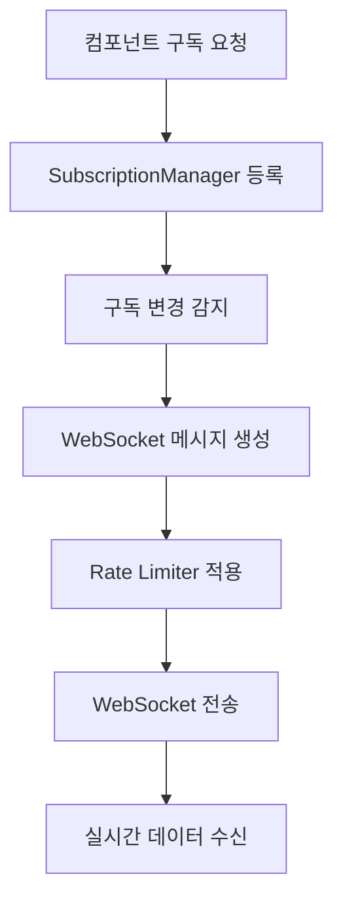
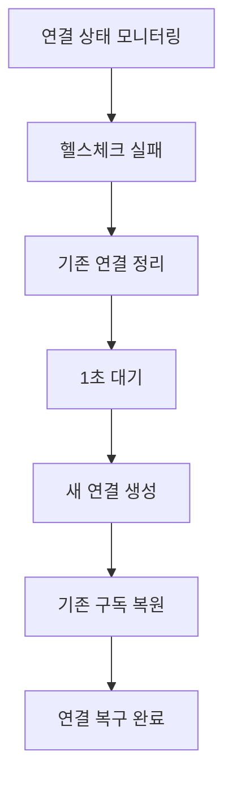

# WebSocket v6 간소화 아키텍처

## 📋 개요
업비트 자동매매 시스템의 WebSocket v6 간소화 버전 - 핵심 연결 관리에 집중

### 🎯 설계 원칙
- **간소화**: 복잡한 기능 제거, 핵심만 유지
- **안정성**: 연결 유지 및 자동 복구
- **성능**: Rate Limiter 통합 및 최적화
- **확장성**: 향후 기능 추가 용이한 구조

---

## 📁 폴더 구조

```
websocket/
├── core/                           # 핵심 로직
│   ├── websocket_manager.py        # 🎯 중앙 관리자 (싱글톤)
│   ├── websocket_client.py         # 📡 클라이언트 래퍼
│   ├── websocket_types.py          # 📝 타입 정의
│   └── data_processor.py           # 🔄 메시지 처리
├── support/                        # 지원 모듈
│   ├── subscription_manager.py     # 📋 구독 관리
│   ├── jwt_manager.py              # 🔐 JWT 토큰 관리
│   ├── websocket_config.py         # ⚙️ 설정 관리
│   └── format_utils.py             # 🧮 포맷 변환
└── WEBSOCKET_V6_ARCHITECTURE.md    # 📖 이 문서
```

---

## 🏗️ 핵심 컴포넌트

### 1. WebSocketManager (중앙 관리자)
```python
# 파일: core/websocket_manager.py
# 역할: 전체 WebSocket 연결 생명주기 관리

class WebSocketManager:
    """간소화된 WebSocket 매니저"""

    # 📌 핵심 기능
    - 싱글톤 패턴으로 전역 인스턴스 관리
    - Public/Private 연결 독립 관리
    - 자동 재연결 및 헬스체크
    - Rate Limiter 통합
    - 컴포넌트 등록/해제 (WeakRef)
```

**주요 메서드:**
- `start()`: 매니저 시작 + 즉시 Public 연결
- `_connect_websocket()`: 개별 연결 생성
- `_start_connection_monitoring()`: 30초 주기 모니터링
- `_is_connection_healthy()`: 연결 건강도 체크
- `_recover_connection()`: 자동 재연결

### 2. WebSocketClient (클라이언트 래퍼)
```python
# 파일: core/websocket_client.py
# 역할: 개별 애플리케이션에서 사용하는 간단한 인터페이스

class WebSocketClient:
    """애플리케이션용 WebSocket 클라이언트"""

    # 📌 핵심 기능
    - WebSocketManager와 연동
    - 구독 요청 전달
    - 콜백 기반 데이터 수신
```

### 3. SubscriptionManager (구독 관리)
```python
# 파일: support/subscription_manager.py
# 역할: 구독 상태 추적 및 변경 감지

class SubscriptionManager:
    """구독 상태 관리"""

    # 📌 핵심 기능
    - 컴포넌트별 구독 추적
    - Public/Private 구독 분리
    - 구독 변경 시 콜백 호출
```

---

## 🔄 내부 흐름

### 1. 시스템 시작 흐름
```mermaid
graph TD
    A[애플리케이션 시작] --> B[WebSocketManager.get_instance()]
    B --> C[하위 시스템 초기화]
    C --> D[start() 호출]
    D --> E[Public 연결 즉시 생성]
    E --> F[Private 연결 조건부 생성]
    F --> G[연결 모니터링 시작]
    G --> H[준비 완료]
```

### 2. 구독 요청 흐름


### 3. 연결 복구 흐름


---

## ⚙️ 핵심 구성

### 1. 연결 관리
```yaml
연결_정책:
  시작_시점: 프로그램 시작 즉시
  Public_연결: 항상 유지 (필수)
  Private_연결: API 키 존재 시에만
  모니터링_주기: 30초

타임아웃:
  연결: 1-5초 (상황별)
  메시지_전송: 1초
  헬스체크: 60초 무응답 시 이상
```

### 2. 재연결 메커니즘
```yaml
재연결_전략:
  감지: 연결 상태 + 마지막 활동 시간
  복구: 기존 연결 정리 → 대기 → 재연결
  구독_복원: 기존 구독 자동 복원
  실패_처리: 지수백오프 재시도
```

### 3. Rate Limiter 통합
```yaml
Rate_Limiter:
  동적_조정: 업비트 429 에러 기반
  전략: balanced (기본값)
  WebSocket_연결: 별도 제한
  메시지_전송: 통합 제한
```

---

## 🔧 테스트 검증 결과

### ✅ 정상 작동 확인
- **모든 모듈 import**: 성공
- **Public 연결**: 정상 (wss://api.upbit.com/websocket/v1)
- **Rate Limiter**: 동적 조정 활성화
- **실시간 데이터 수신**: ticker 메시지 정상 수신
- **연결 모니터링**: 30초 주기 헬스체크 시작
- **컴포넌트 관리**: 등록/해제 정상

### ⚠️ 예상된 이슈
- **Private 연결**: HTTP 401 (API 키 미설정, 정상 동작)

### 📊 성능 지표
- **연결 시간**: ~1-2초
- **메시지 처리**: 실시간 ticker 데이터 정상 수신
- **메모리 사용**: 최적화된 WeakRef 기반 컴포넌트 관리
- **Rate Limiter**: 총 2회 요청, 1회 대기

---

## 🚀 향후 확장 계획

### Phase 1: 기본 기능 (✅ 완료)
- [x] 연결 관리 시스템
- [x] 자동 재연결
- [x] Rate Limiter 통합
- [x] 구독 관리

### Phase 2: 성능 최적화 (🔄 예정)
- [ ] 백프레셔 처리
- [ ] 메시지 큐 최적화
- [ ] 연결 풀링

### Phase 3: 고급 기능 (🔄 예정)
- [ ] 구독 병합 최적화
- [ ] 메트릭스 수집
- [ ] 헬스체크 API

---

## 📝 주요 특징

### 🎯 간소화 설계
- **복잡성 제거**: v5의 복잡한 기능들 제거
- **핵심 집중**: 연결 관리와 데이터 수신에 집중
- **유지보수성**: 명확한 책임 분리

### 🔒 안정성 보장
- **자동 복구**: 네트워크 이슈 시 투명한 재연결
- **헬스체크**: 실시간 연결 상태 모니터링
- **에러 처리**: 포괄적 예외 처리

### ⚡ 성능 최적화
- **Rate Limiter**: 업비트 API 제한 준수
- **WeakRef**: 메모리 누수 방지
- **싱글톤**: 리소스 효율적 관리

---

## 🔍 디버깅 가이드

### 로그 레벨별 정보
```yaml
INFO: 연결 상태 변화, 주요 이벤트
DEBUG: 메시지 송수신 상세 로그
WARNING: 재연결, Rate Limit 대기
ERROR: 연결 실패, 복구 불가능 오류
```

### 주요 로그 패턴
```
✅ WebSocket 연결 성공: [타입] -> [URL]
🔄 WebSocket 재연결 시작: [타입]
📨 WebSocket 메시지 수신: [타입]
🚦 Rate Limiter 활동: 대기 [횟수]회
```

---

*마지막 업데이트: 2025년 9월 2일*
*테스트 상태: ✅ 모든 기본 기능 검증 완료*
