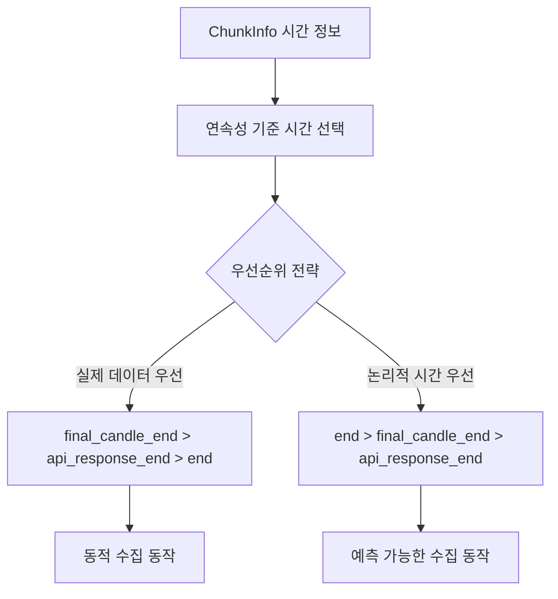
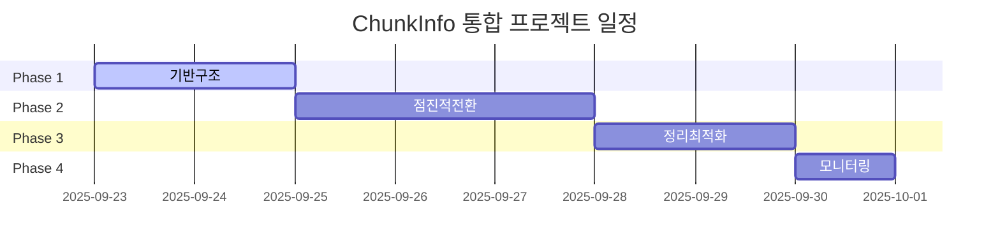

# 📊 CollectionState.last_candle_time 통합 설계 문서

> **작성일**: 2025-09-22
> **목적**: ChunkInfo 기반 last_candle_time 통합 및 우선순위 전략 수립
> **영향도**: 캔들 수집 연속성 보장, 동적 수집 동작, 성능 최적화

## 🎯 **핵심 결정 사항**

### **문제 정의**
- `CollectionState.last_candle_time`이 7개 지점에 분산되어 계산됨
- 동일한 목적(청크 연속성)을 위한 중복 로직 존재
- ChunkInfo가 이미 필요한 모든 시간 정보를 3단계로 추적하고 있음
- 우선순위 전략에 따라 청크 수집 동작이 크게 달라질 수 있음

### **핵심 전략 결정**


---

## 📋 **현재 상태 분석**

### **1. last_candle_time 분산 지점 (7곳)**

#### **설정 지점 (4곳)**
1. **`mark_chunk_completed`** (라인 575, 579)
   - 청크 끝 시간 우선: `TimeUtils.format_datetime_utc(chunk_info.end)`
   - API 응답 폴백: `_extract_last_candle_time_from_api_response`

2. **`_handle_overlap_direct_storage`** (라인 740, 780, 832, 865)
   - 완전겹침: `TimeUtils.format_datetime_utc(calculated_chunk_end)`
   - 겹침없음/부분겹침: 청크 끝 시간 → API 응답 폴백
   - 복잡한겹침: 동일 패턴

#### **사용 지점 (2곳)**
1. **`_is_collection_complete`** (라인 1198)
   - End 시간 도달 확인 (TO_END, END_ONLY 케이스)
   - 수집 완료 조건 판단

2. **`_create_next_chunk_params`** (라인 1256)
   - 다음 청크 연속성 보장
   - `next_chunk_start` 계산

### **2. ChunkInfo 기존 추적 정보**
```python
# 3단계 시간 추적
class ChunkInfo:
    # 1단계: 논리적 계산 시간
    end: Optional[datetime]                    # 청크의 예상 종료 시간

    # 2단계: API 응답 시간
    api_response_end: Optional[datetime]       # 실제 API 응답의 마지막 캔들 시간

    # 3단계: 최종 처리 시간
    final_candle_end: Optional[datetime]       # 빈 캔들 처리 후 최종 시간
```

---

## 🚀 **통합 설계 방안**

### **Phase 1: ChunkInfo 확장 - 연속성 메서드 추가**

```python
# candle_models.py의 ChunkInfo 클래스에 추가
def get_continuation_time(self, strategy: str = "prefer_actual") -> Optional[str]:
    """
    다음 청크 연속성을 위한 기준 시간 반환

    Args:
        strategy: 우선순위 전략
            - "prefer_actual": 실제 데이터 우선 (동적 수집)
            - "prefer_logical": 논리적 시간 우선 (예측 가능)
            - "strict_final": 최종 처리 결과만 사용

    Returns:
        Optional[str]: ISO 형식 UTC 시간 문자열
    """
    if strategy == "prefer_actual":
        # 실제 데이터 우선: final > api_response > end
        if self.final_candle_end:
            return TimeUtils.format_datetime_utc(self.final_candle_end)
        elif self.api_response_end:
            return TimeUtils.format_datetime_utc(self.api_response_end)
        elif self.end:
            return TimeUtils.format_datetime_utc(self.end)

    elif strategy == "prefer_logical":
        # 논리적 시간 우선: end > final > api_response (기존 방식)
        if self.end:
            return TimeUtils.format_datetime_utc(self.end)
        elif self.final_candle_end:
            return TimeUtils.format_datetime_utc(self.final_candle_end)
        elif self.api_response_end:
            return TimeUtils.format_datetime_utc(self.api_response_end)

    elif strategy == "strict_final":
        # 최종 처리 결과만: final_candle_end만 사용
        if self.final_candle_end:
            return TimeUtils.format_datetime_utc(self.final_candle_end)

    return None

def get_continuation_time_debug_info(self) -> dict:
    """연속성 시간 선택 과정 디버깅 정보"""
    return {
        'end': TimeUtils.format_datetime_utc(self.end) if self.end else None,
        'api_response_end': TimeUtils.format_datetime_utc(self.api_response_end) if self.api_response_end else None,
        'final_candle_end': TimeUtils.format_datetime_utc(self.final_candle_end) if self.final_candle_end else None,
        'chunk_id': self.chunk_id,
        'status': self.status
    }
```

### **Phase 2: CollectionState 단순화**

```python
# candle_data_provider.py의 CollectionState 수정
@dataclass
class CollectionState:
    # last_candle_time 필드 제거
    # last_candle_time: Optional[str] = None  # 🗑️ 제거

    # 새로운 동적 메서드 추가
    def get_last_continuation_time(self, strategy: str = "prefer_actual") -> Optional[str]:
        """마지막 완료된 청크의 연속성 기준 시간"""
        if self.completed_chunks:
            return self.completed_chunks[-1].get_continuation_time(strategy)
        return None

    def get_continuation_debug_info(self) -> list:
        """전체 청크의 연속성 디버깅 정보"""
        return [chunk.get_continuation_time_debug_info() for chunk in self.completed_chunks]
```

### **Phase 3: 분산 로직 제거**

#### **3-1. `_extract_last_candle_time_from_api_response` 메서드 제거**
```python
# 🗑️ 메서드 전체 제거 (라인 1354~1386)
# def _extract_last_candle_time_from_api_response(self, ...) -> Optional[str]:
```

#### **3-2. 중복 계산 로직 통합**
```python
# mark_chunk_completed 수정
async def mark_chunk_completed(self, request_id: str) -> bool:
    # 기존: 복잡한 계산 로직
    # 🔄 청크 끝 시간 기반 연속성 (빈 캔들과 무관한 논리적 연속성 보장)
    # if completed_chunk.end:
    #     chunk_end_time = TimeUtils.format_datetime_utc(completed_chunk.end)
    #     state.last_candle_time = chunk_end_time
    # elif last_candle_time:
    #     state.last_candle_time = last_candle_time

    # 신규: ChunkInfo 메서드 활용
    # (더 이상 state.last_candle_time 설정 없음)
    logger.debug(f"청크 완료 연속성: {completed_chunk.get_continuation_time()}")
```

#### **3-3. `_handle_overlap_direct_storage` 단순화**
```python
# 모든 분기의 last_candle_time 계산 제거
# return saved_count, last_candle_time  # 🗑️ 제거
# return saved_count  # ✅ 단순화
```

### **Phase 4: 사용처 개선**

#### **4-1. `_is_collection_complete` 개선**
```python
def _is_collection_complete(self, state: CollectionState) -> bool:
    """수집 완료 여부 확인 - ChunkInfo 기반 연속성"""
    # 1. 개수 달성 확인 (기존 유지)
    count_reached = state.total_collected >= state.total_requested

    # 2. End 시간 도달 확인 - ChunkInfo 기반으로 변경
    end_time_reached = False
    if state.target_end:
        # 🆕 ChunkInfo 기반 연속성 확인
        last_time_str = state.get_last_continuation_time()
        if last_time_str:
            try:
                last_time = datetime.fromisoformat(last_time_str)
                end_time_reached = last_time <= state.target_end
                if end_time_reached:
                    logger.debug(f"End 시간 도달: last_continuation={last_time}, target_end={state.target_end}")
            except Exception as e:
                logger.warning(f"End 시간 비교 실패: {e}")

    return count_reached or end_time_reached
```

#### **4-2. `_create_next_chunk_params` 개선**
```python
def _create_next_chunk_params(self, state: CollectionState, chunk_size: int, request_type: RequestType) -> Dict[str, Any]:
    """다음 청크 파라미터 생성 - ChunkInfo 기반 연속성"""
    params = {"market": state.symbol, "count": chunk_size}

    # 🆕 ChunkInfo 기반 연속성 보장
    continuation_time_str = state.get_last_continuation_time()
    if continuation_time_str:
        try:
            last_chunk_end = datetime.fromisoformat(continuation_time_str)
            next_chunk_start = TimeUtils.get_time_by_ticks(last_chunk_end, state.timeframe, -1)
            params["to"] = next_chunk_start
            logger.debug(f"청크 연속성: {last_chunk_end} → {next_chunk_start}")
        except Exception as e:
            logger.warning(f"청크 연속성 계산 실패: {e}")

    return params
```

---

## 🎲 **우선순위 전략별 동작 시나리오**

### **시나리오 1: "prefer_actual" (실제 데이터 우선) - 동적 수집**

#### **특징**
- 실제 받은 데이터와 빈 캔들 처리 결과를 최우선
- DB에 있는 데이터에 따라 수집 동작이 동적으로 변화
- 정확성 최우선, 예측 가능성은 낮음

#### **동작 예시**
```
청크 1: 100개 요청 → 80개 응답 (업비트 데이터 부족)
├─ end: 2025-01-01 10:00:00 (논리적 예상)
├─ api_response_end: 2025-01-01 09:48:00 (실제 마지막)
└─ 연속성: 2025-01-01 09:48:00 선택 ✅

청크 2: 09:47:00부터 시작 → DB 점프 발생 가능성
└─ 겹침 분석에서 완전겹침 탐지 → API 호출 생략
```

#### **장점**
- 📈 **정확성 최대**: 실제 데이터 기준 연속성
- 🚀 **효율성**: DB 겹침을 최대 활용한 API 절약
- 🔍 **빈 캔들 정확성**: 실제 처리 결과 반영

#### **단점**
- ❓ **예측 불가**: 수집 패턴이 동적으로 변화
- 🔄 **복잡성**: 디버깅 및 테스트 복잡
- ⚡ **성능 변동**: DB 상태에 따른 성능 편차

### **시나리오 2: "prefer_logical" (논리적 시간 우선) - 예측 가능**

#### **특징**
- 계산된 논리적 시간을 최우선
- 수집 패턴이 일관되고 예측 가능
- 안정성 최우선, 일부 정확성 타협

#### **동작 예시**
```
청크 1: 100개 요청 → 80개 응답
├─ end: 2025-01-01 10:00:00 (논리적 예상)
├─ api_response_end: 2025-01-01 09:48:00 (실제 마지막)
└─ 연속성: 2025-01-01 10:00:00 선택 ✅

청크 2: 09:59:00부터 시작 → 일관된 패턴 유지
└─ 겹침 분석 결과와 무관하게 논리적 연속성 보장
```

#### **장점**
- 🎯 **예측 가능**: 일관된 수집 패턴
- 🛡️ **안정성**: 예외 상황에도 동작 보장
- 🧪 **테스트 용이**: 결정론적 동작

#### **단점**
- 📉 **정확성 손실**: 실제 데이터와 차이 가능
- 🔄 **중복 처리**: 이미 있는 데이터 재수집 가능성
- 🚫 **빈 캔들 미활용**: 실제 처리 결과 무시

### **시나리오 3: "strict_final" (최종 결과만) - 보수적**

#### **특징**
- 빈 캔들 처리 완료된 최종 결과만 사용
- 가장 보수적이고 안전한 접근
- 빈 캔들 처리가 없으면 연속성 없음

#### **동작 예시**
```
청크 1: 빈 캔들 처리 없음
├─ final_candle_end: None
└─ 연속성: None → 다음 청크는 독립적 시작

청크 1: 빈 캔들 처리 있음
├─ final_candle_end: 2025-01-01 09:50:00
└─ 연속성: 2025-01-01 09:50:00 선택 ✅
```

---

## 🏗️ **구현 단계별 계획**

### **Phase 1: 기반 구조 (1-2일)**
```bash
# 1. ChunkInfo 확장
- get_continuation_time() 메서드 추가
- get_continuation_time_debug_info() 디버깅 지원

# 2. CollectionState 수정
- get_last_continuation_time() 동적 메서드 추가
- last_candle_time 필드는 유지 (호환성)
```

### **Phase 2: 점진적 전환 (2-3일)**
```bash
# 3. 사용처 전환
- _is_collection_complete() ChunkInfo 기반으로 수정
- _create_next_chunk_params() ChunkInfo 기반으로 수정

# 4. 테스트 및 검증
- 기존 동작과 동일한지 확인
- 각 전략별 동작 테스트
```

### **Phase 3: 정리 및 최적화 (1-2일)**
```bash
# 5. 분산 로직 제거
- _extract_last_candle_time_from_api_response() 제거
- mark_chunk_completed() 단순화
- _handle_overlap_direct_storage() 단순화

# 6. CollectionState.last_candle_time 제거
- 최종 호환성 확인 후 필드 제거
```

### **Phase 4: 최적화 및 모니터링 (1일)**
```bash
# 7. 성능 최적화
- 불필요한 계산 제거
- 메모리 사용량 최적화

# 8. 모니터링 강화
- 연속성 디버깅 로그 추가
- 전략별 성능 메트릭 수집
```

---

## ⚠️ **리스크 분석 및 롤백 전략**

### **주요 리스크**

#### **1. 연속성 동작 변경**
- **위험**: 기존 수집 패턴과 다른 동작
- **완화**: Phase 2에서 철저한 A/B 테스트
- **탐지**: 연속성 검증 로직으로 실시간 모니터링

#### **2. 성능 영향**
- **위험**: ChunkInfo 메서드 호출 오버헤드
- **완화**: 캐싱 및 지연 계산 적용
- **탐지**: 수집 시간 메트릭으로 성능 추적

#### **3. 데이터 무결성**
- **위험**: 전략 변경으로 인한 데이터 손실
- **완화**: 각 전략별 단위 테스트 완비
- **탐지**: 수집 완료 후 데이터 검증 로직

### **롤백 전략**

#### **Level 1: 설정 롤백 (즉시)**
```python
# 전략 변경만으로 기존 동작 복원
strategy = "prefer_logical"  # 기존 방식으로 복원
```

#### **Level 2: 코드 롤백 (5분)**
```bash
# Phase별 독립적 롤백 가능
git revert <phase-commit>  # 특정 Phase만 롤백
```

#### **Level 3: 완전 롤백 (10분)**
```bash
# 전체 변경사항 롤백
git revert <integration-commit>
# last_candle_time 필드 복원
```

---

## 📊 **성공 메트릭**

### **기능적 메트릭**
- ✅ 연속성 보장률: 99.9% 이상
- ✅ API 호출 최적화: 기존 대비 유지 또는 개선
- ✅ 메모리 사용량: 10% 이상 감소 (중복 로직 제거)

### **개발 메트릭**
- ✅ 코드 중복도: 7개 지점 → 1개 지점 통합
- ✅ 테스트 커버리지: 95% 이상
- ✅ 문서화 완성도: 모든 전략 시나리오 문서화

### **운영 메트릭**
- ✅ 수집 안정성: 기존 수준 유지
- ✅ 디버깅 효율성: 연속성 추적 시간 50% 단축
- ✅ 유지보수성: 신규 기능 추가 시간 30% 단축

---

## 🎯 **결론 및 권장사항**

### **권장 전략: "prefer_actual" (실제 데이터 우선)**

#### **근거**
1. **정확성 최우선**: 실제 받은 데이터 기반 연속성이 가장 정확
2. **빈 캔들 시너지**: EmptyCandleDetector 결과를 최대한 활용
3. **API 최적화**: 겹침 분석과 함께 최대 효율성 달성
4. **확장성**: 향후 동적 수집 전략의 기반

#### **도입 계획**


이 설계를 통해 **분산된 last_candle_time 계산을 ChunkInfo로 완전히 통합**하고, **동적 수집 동작의 기반**을 마련할 수 있습니다. 특히 **"prefer_actual" 전략**으로 정확성과 효율성을 동시에 달성하면서, 향후 더욱 지능적인 캔들 수집 시스템으로 발전할 수 있는 토대를 구축할 것입니다.
