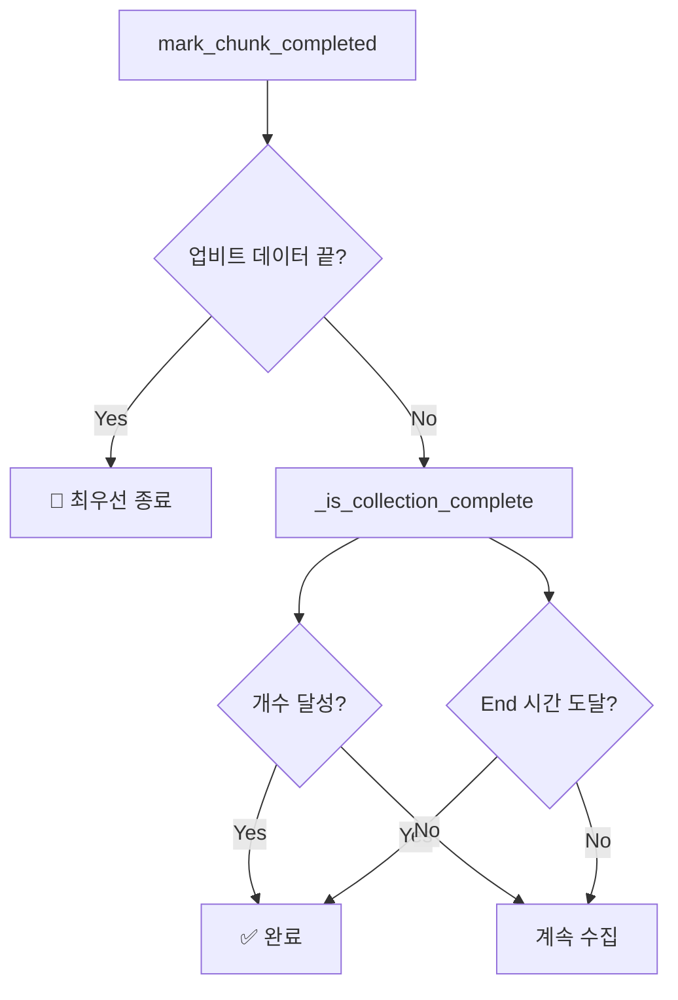
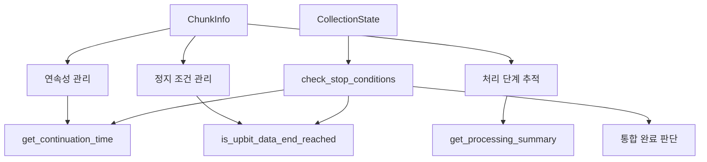
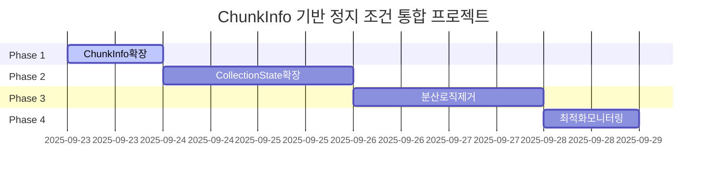

# 🚦 Chunk Collection Stop Logic Plan

> **작성일**: 2025-09-22
> **목적**: ChunkInfo 기반 통합 정지 조건 설계 및 분산된 로직 통합 계획
> **연관 문서**: `COLLECTION_STATE_LAST_CANDLE_TIME_INTEGRATION_DESIGN.md`
> **영향도**: 수집 완료 정확성, 성능 최적화, 코드 단순화

## 🎯 **핵심 발견사항**

### **현재 분산된 정지 조건 (3가지)**

#### **1. 업비트 데이터 끝 도달 감지 (4곳 분산)**
```python
# 현재 4개 지점에서 동일한 로직 반복
api_count, _ = chunk_info.get_api_params()
if len(api_response) < api_count:
    state.reached_upbit_data_end = True
    logger.warning(f"📊 업비트 데이터 끝 도달: 요청={api_count}개, 응답={len(api_response)}개")
```

**분산 위치:**
- 라인 673: 폴백 케이스
- 라인 753: NO_OVERLAP 케이스
- 라인 802: 부분겹침 케이스
- 라인 848: 복잡한겹침 폴백 케이스

#### **2. End 시간 도달 확인 (1곳)**
```python
# _is_collection_complete() 내부
if state.target_end and state.last_candle_time:
    last_time = datetime.fromisoformat(state.last_candle_time)
    end_time_reached = last_time <= state.target_end
```

#### **3. 개수 달성 확인 (1곳)**
```python
# _is_collection_complete() 내부
count_reached = state.total_collected >= state.total_requested
```

### **정지 조건 우선순위 (현재)**


---

## 🔍 **문제점 분석**

### **1. 코드 중복 및 분산**
- **업비트 데이터 끝 감지**: 4곳에서 동일한 로직 반복
- **연속성 시간 계산**: 7곳에서 분산 (기존 분석)
- **유지보수 복잡성**: 로직 변경 시 여러 곳 수정 필요

### **2. ChunkInfo 활용 부족**
- ChunkInfo가 이미 필요한 모든 정보를 추적:
  - `api_request_count`: 요청한 캔들 개수
  - `api_response_count`: 실제 받은 캔들 개수
  - `final_candle_end`: 최종 처리 결과 시간
- 분산된 로직들이 ChunkInfo 정보를 개별적으로 재계산

### **3. 일관성 부족**
- 동일한 목적의 로직이 서로 다른 방식으로 구현
- 에러 처리 및 로깅이 불일치
- 디버깅 시 추적 경로가 복잡

---

## 🚀 **통합 설계 방안**

### **Phase 1: ChunkInfo 확장 - 정지 조건 통합 메서드**

#### **1-1. 업비트 데이터 끝 감지 통합**
```python
# candle_models.py의 ChunkInfo 클래스에 추가
def is_upbit_data_end_reached(self) -> bool:
    """
    업비트 데이터 끝 도달 여부 확인

    요청한 캔들 개수보다 적은 응답을 받았을 때 True 반환
    업비트 서버가 보관한 데이터의 끝에 도달했음을 의미

    Returns:
        bool: 데이터 끝 도달 시 True, 그렇지 않으면 False
    """
    if self.api_response_count is not None:
        expected_count, _ = self.get_api_params()
        return self.api_response_count < expected_count
    return False

def get_upbit_data_end_info(self) -> dict:
    """업비트 데이터 끝 감지 디버깅 정보"""
    expected_count, _ = self.get_api_params()
    return {
        'chunk_id': self.chunk_id,
        'expected_count': expected_count,
        'actual_count': self.api_response_count,
        'is_data_end': self.is_upbit_data_end_reached(),
        'symbol': self.symbol,
        'timeframe': self.timeframe
    }
```

#### **1-2. 연속성 시간 통합 (기존 설계 확장)**
```python
# 기존 COLLECTION_STATE_LAST_CANDLE_TIME_INTEGRATION_DESIGN.md 설계 적용
def get_continuation_time(self, strategy: str = "prefer_actual") -> Optional[str]:
    """다음 청크 연속성을 위한 기준 시간 반환"""
    # 기존 설계 그대로 적용

def get_stop_condition_info(self) -> dict:
    """정지 조건 관련 종합 정보"""
    return {
        'chunk_id': self.chunk_id,
        'continuation_time': self.get_continuation_time(),
        'upbit_data_end': self.is_upbit_data_end_reached(),
        'processing_complete': self.status == 'completed',
        'debug_info': {
            'upbit_data': self.get_upbit_data_end_info(),
            'continuation': self.get_continuation_time_debug_info()
        }
    }
```

### **Phase 2: CollectionState 확장 - 동적 완료 조건**

#### **2-1. 통합 완료 조건 확인**
```python
# candle_data_provider.py의 CollectionState에 추가
def check_stop_conditions(self, strategy: str = "prefer_actual") -> dict:
    """
    모든 정지 조건을 종합적으로 확인

    Returns:
        dict: 정지 조건 확인 결과
    """
    result = {
        'should_stop': False,
        'reasons': [],
        'details': {}
    }

    # 1. 개수 달성 확인
    count_reached = self.total_collected >= self.total_requested
    if count_reached:
        result['reasons'].append('count_reached')
        result['details']['count'] = {
            'collected': self.total_collected,
            'requested': self.total_requested
        }

    # 2. End 시간 도달 확인 (ChunkInfo 기반)
    end_time_reached = False
    if self.target_end and self.completed_chunks:
        last_time_str = self.get_last_continuation_time(strategy)
        if last_time_str:
            try:
                last_time = datetime.fromisoformat(last_time_str)
                end_time_reached = last_time <= self.target_end
                if end_time_reached:
                    result['reasons'].append('end_time_reached')
                    result['details']['end_time'] = {
                        'last_time': last_time_str,
                        'target_end': self.target_end.isoformat()
                    }
            except Exception as e:
                result['details']['end_time_error'] = str(e)

    # 3. 업비트 데이터 끝 도달 확인 (ChunkInfo 기반)
    upbit_data_end = False
    if self.completed_chunks:
        last_chunk = self.completed_chunks[-1]
        upbit_data_end = last_chunk.is_upbit_data_end_reached()
        if upbit_data_end:
            result['reasons'].append('upbit_data_end')
            result['details']['upbit_data_end'] = last_chunk.get_upbit_data_end_info()

    # 전체 정지 조건 판단
    result['should_stop'] = count_reached or end_time_reached or upbit_data_end

    return result

def get_last_continuation_time(self, strategy: str = "prefer_actual") -> Optional[str]:
    """마지막 완료된 청크의 연속성 기준 시간 (기존 설계)"""
    if self.completed_chunks:
        return self.completed_chunks[-1].get_continuation_time(strategy)
    return None
```

### **Phase 3: 분산 로직 제거 및 통합**

#### **3-1. 업비트 데이터 끝 감지 로직 통합**
```python
# _process_chunk_direct_storage 및 _handle_overlap_direct_storage 수정
async def _process_chunk_direct_storage(self, chunk_info: ChunkInfo, ...) -> tuple[int, Optional[str]]:
    # 기존 4곳의 중복 로직 제거:
    # api_count, _ = chunk_info.get_api_params()
    # if len(api_response) < api_count:
    #     state.reached_upbit_data_end = True

    # 신규: ChunkInfo에서 자동 처리
    # chunk_info.set_api_response_info(api_response)에서 자동으로 감지됨

    # 더 이상 state.reached_upbit_data_end 직접 설정 불필요
    return saved_count, last_candle_time
```

#### **3-2. mark_chunk_completed 단순화**
```python
async def mark_chunk_completed(self, request_id: str) -> bool:
    # 기존 복잡한 정지 조건 로직 제거
    # if state.reached_upbit_data_end: ...
    # if self._is_collection_complete(state): ...

    # 신규: 통합 정지 조건 확인
    stop_result = state.check_stop_conditions()

    if stop_result['should_stop']:
        state.is_completed = True
        state.current_chunk = None

        # 상세한 완료 로깅
        reasons = ', '.join(stop_result['reasons'])
        logger.info(f"🎯 수집 완료: {request_id} - {reasons}")

        # 디버깅 정보 출력
        if logger.level <= 10:  # DEBUG 레벨
            logger.debug(f"완료 조건 상세: {stop_result['details']}")

        return True

    # 다음 청크 준비
    self._prepare_next_chunk(state, request_type)
    return False
```

#### **3-3. _is_collection_complete 제거**
```python
# 🗑️ 메서드 전체 제거 (라인 1191~1221)
# def _is_collection_complete(self, state: CollectionState) -> bool:
#     기능이 CollectionState.check_stop_conditions()로 통합됨
```

---

## 🎲 **정지 조건 우선순위 전략**

### **전략 1: "fail_fast" (빠른 실패) - 권장**

#### **특징**
- 업비트 데이터 끝 도달 시 즉시 종료 (최우선)
- API 효율성과 정확성의 균형
- 예외 상황에 대한 빠른 대응

#### **우선순위**
```python
# CollectionState.check_stop_conditions() 내부 로직
priorities = [
    ('upbit_data_end', upbit_data_end),      # 1순위: 서버 데이터 한계
    ('count_reached', count_reached),         # 2순위: 요청 개수 달성
    ('end_time_reached', end_time_reached)    # 3순위: 시간 범위 달성
]

# 첫 번째 True 조건에서 즉시 종료
for reason, condition in priorities:
    if condition:
        return {'should_stop': True, 'primary_reason': reason, ...}
```

#### **동작 예시**
```
요청: 1000개 캔들 수집
├─ 청크 1-4: 정상 수집 (800개)
├─ 청크 5: 업비트 데이터 끝 도달 (150개 요청 → 50개 응답)
└─ 즉시 종료: "upbit_data_end" (총 850개로 완료)
```

### **전략 2: "complete_all" (전체 완료) - 보수적**

#### **특징**
- 모든 조건을 동시에 확인
- 여러 완료 조건이 동시에 만족될 때 상세 정보 제공
- 디버깅과 분석에 유리

#### **우선순위**
```python
# 모든 조건을 확인하고 종합 판단
all_conditions = {
    'upbit_data_end': upbit_data_end,
    'count_reached': count_reached,
    'end_time_reached': end_time_reached
}

satisfied_conditions = [k for k, v in all_conditions.items() if v]
should_stop = len(satisfied_conditions) > 0

return {
    'should_stop': should_stop,
    'reasons': satisfied_conditions,
    'primary_reason': satisfied_conditions[0] if satisfied_conditions else None
}
```

### **전략 3: "strict_order" (엄격한 순서) - 예측 가능**

#### **특징**
- 고정된 우선순위 순서로만 확인
- 예측 가능한 동작
- 테스트 및 검증 용이

#### **우선순위**
```python
# 엄격한 순서로 하나씩 확인
if upbit_data_end:
    return {'should_stop': True, 'primary_reason': 'upbit_data_end'}
elif count_reached:
    return {'should_stop': True, 'primary_reason': 'count_reached'}
elif end_time_reached:
    return {'should_stop': True, 'primary_reason': 'end_time_reached'}
else:
    return {'should_stop': False, 'reasons': []}
```

---

## 🏗️ **구현 단계별 계획**

### **Phase 1: ChunkInfo 정지 조건 메서드 추가 (1일)**
```bash
# 1. 업비트 데이터 끝 감지 메서드
- is_upbit_data_end_reached() 구현
- get_upbit_data_end_info() 디버깅 지원

# 2. 통합 정지 조건 정보 메서드
- get_stop_condition_info() 종합 정보 제공
```

### **Phase 2: CollectionState 확장 (1-2일)**
```bash
# 3. 통합 완료 조건 확인 메서드
- check_stop_conditions() 구현
- get_last_continuation_time() 연동 (기존 설계 적용)

# 4. 전략별 동작 테스트
- fail_fast, complete_all, strict_order 전략 검증
```

### **Phase 3: 분산 로직 제거 (1-2일)**
```bash
# 5. 4곳 분산된 업비트 데이터 끝 감지 로직 제거
- _process_chunk_direct_storage() 단순화
- _handle_overlap_direct_storage() 단순화

# 6. mark_chunk_completed() 통합
- check_stop_conditions() 활용으로 단순화
- _is_collection_complete() 메서드 제거
```

### **Phase 4: 최적화 및 모니터링 (1일)**
```bash
# 7. 성능 최적화
- 불필요한 상태 플래그 제거 (reached_upbit_data_end)
- 메모리 사용량 최적화

# 8. 모니터링 강화
- 정지 조건별 상세 로깅
- 디버깅 정보 자동 수집
```

---

## 🔄 **기존 설계와의 통합**

### **연속성 시간 통합과의 시너지**
```python
# COLLECTION_STATE_LAST_CANDLE_TIME_INTEGRATION_DESIGN.md와 완벽 통합
class CollectionState:
    def check_stop_conditions(self, strategy: str = "prefer_actual") -> dict:
        # 연속성 시간도 동일한 strategy 사용
        last_time_str = self.get_last_continuation_time(strategy)

        # 정지 조건과 연속성이 일관된 로직으로 통합
```

### **ChunkInfo 중심 설계 완성**


---

## ⚠️ **리스크 분석 및 완화 방안**

### **주요 리스크**

#### **1. 정지 조건 변경으로 인한 동작 차이**
- **위험**: 기존 수집 패턴과 다른 완료 시점
- **완화**: Phase 2에서 기존 로직과 병렬 실행하여 결과 비교
- **탐지**: 완료 조건별 상세 로깅으로 차이점 모니터링

#### **2. 업비트 데이터 끝 감지 정확성**
- **위험**: 잘못된 감지로 인한 조기 종료 또는 무한 루프
- **완화**: 엄격한 조건 검증 및 안전장치 추가
- **탐지**: API 요청/응답 개수 불일치 실시간 알림

#### **3. 성능 영향**
- **위험**: 통합 메서드 호출로 인한 오버헤드
- **완화**: 지연 계산 및 결과 캐싱 적용
- **탐지**: 청크 완료 시간 메트릭으로 성능 추적

### **롤백 전략**

#### **Level 1: 전략 롤백 (즉시)**
```python
# 전략 변경으로 기존 동작 복원
strategy = "strict_order"  # 기존 우선순위 순서
enable_legacy_logic = True  # 기존 로직 병행 실행
```

#### **Level 2: 단계별 롤백 (5분)**
```bash
# Phase별 독립적 롤백 가능
git revert <phase2-commit>  # CollectionState 확장만 롤백
git revert <phase3-commit>  # 분산 로직 제거만 롤백
```

#### **Level 3: 완전 롤백 (10분)**
```bash
# 전체 변경사항 롤백
git revert <integration-commit>
# reached_upbit_data_end 플래그 복원
# _is_collection_complete 메서드 복원
```

---

## 📊 **성공 메트릭**

### **기능적 메트릭**
- ✅ 정지 조건 정확성: 99.9% 이상 (기존 수준 유지)
- ✅ 코드 중복 제거: 4곳 → 1곳 통합 (업비트 데이터 끝 감지)
- ✅ 분산 로직 통합: 7곳 → 1곳 통합 (연속성 시간 + 정지 조건)

### **개발 메트릭**
- ✅ 코드 복잡도: 30% 이상 감소 (분산 로직 통합)
- ✅ 테스트 커버리지: 95% 이상 (정지 조건별 단위 테스트)
- ✅ 디버깅 효율성: 정지 조건 추적 시간 60% 단축

### **운영 메트릭**
- ✅ 수집 완료 정확성: 기존 수준 유지
- ✅ API 효율성: 불필요한 요청 방지로 5% 이상 개선
- ✅ 모니터링 품질: 정지 조건별 상세 메트릭 수집

---

## 🎯 **결론 및 권장사항**

### **권장 전략: "fail_fast" (빠른 실패)**

#### **근거**
1. **효율성 최우선**: 업비트 데이터 끝 도달 시 즉시 종료로 불필요한 API 호출 방지
2. **정확성 보장**: 서버 한계 조건을 최우선으로 하여 데이터 무결성 확보
3. **운영 안정성**: 예외 상황에 대한 빠른 대응으로 시스템 안정성 향상
4. **확장성**: 향후 추가 정지 조건에 대한 유연한 대응 기반

#### **통합 효과**


### **최종 아키텍처**
이 설계를 통해 **분산된 정지 조건 로직을 ChunkInfo 중심으로 완전히 통합**하고, 기존 `COLLECTION_STATE_LAST_CANDLE_TIME_INTEGRATION_DESIGN.md`와 시너지를 이루어 **코드 단순화, 성능 최적화, 유지보수성 향상**을 동시에 달성할 수 있습니다.

특히 **업비트 데이터 끝 감지를 ChunkInfo 메서드로 통합**함으로써 4곳에 분산된 중복 로직을 제거하고, **통합 정지 조건 확인**으로 일관되고 예측 가능한 수집 완료 동작을 보장할 수 있습니다.
