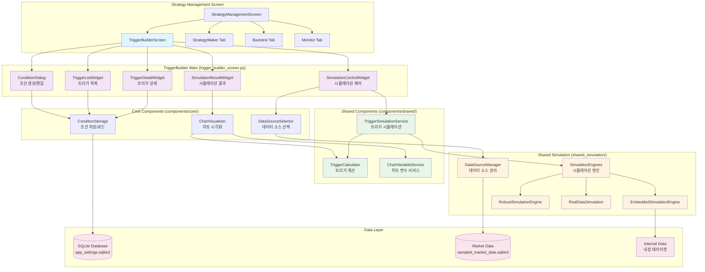
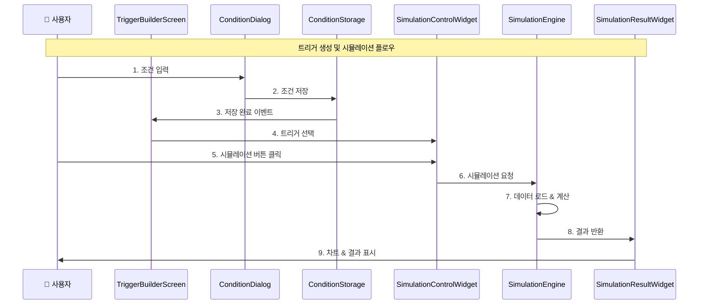
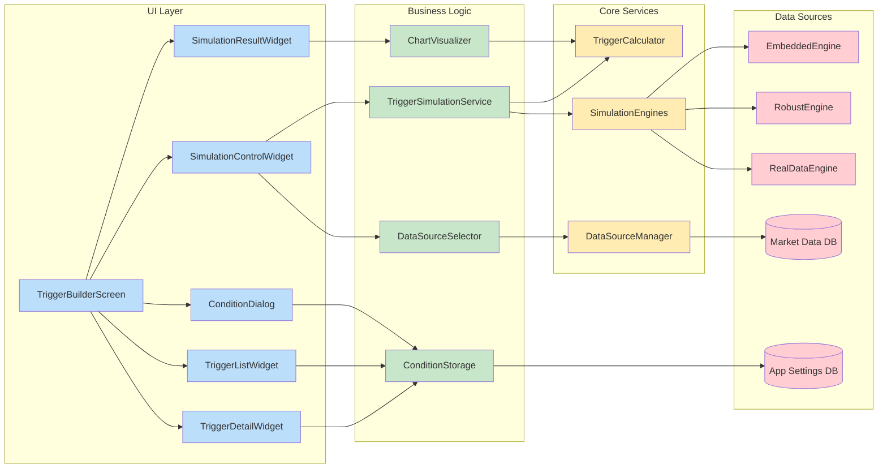
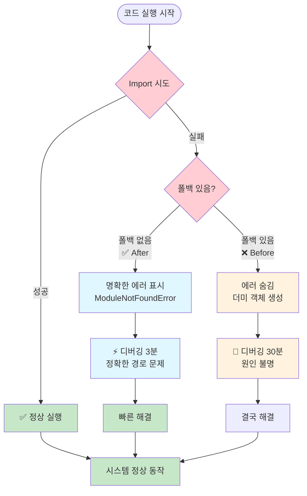
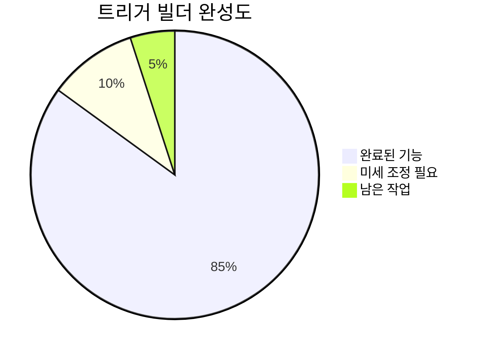

# 트리거 빌더 시스템 아키텍처 다이어그램

## 🏗️ **전체 시스템 아키텍처**



## 🔄 **데이터 플로우 다이어그램**



## 🧩 **컴포넌트 의존성 그래프**



## 🚨 **폴백 제거 정책 적용 흐름**



## 📊 **현재 상태 대시보드**

```mermaid
gantt
    title 트리거 빌더 개발 진행상황
    dateFormat X
    axisFormat %s

    section 핵심 기능
    폴백 코드 제거    :done, fallback, 0, 1
    Import 경로 수정  :done, import, 1, 2
    데이터 소스 복구  :done, datasource, 2, 3
    트리거 리스트     :done, triggerlist, 3, 4
    시뮬레이션 엔진   :done, simulation, 4, 5
    
    section 미세 조정
    MiniSimulation   :active, mini, 5, 6
    차트 개선        :crit, chart, 6, 7
    에러 UI          :error, 7, 8
```





---

## 🎯 **다음 에이전트 작업 가이드**

### 1️⃣ **즉시 확인할 파일들**
```
📁 trigger_builder/
├── 📄 trigger_builder_screen.py (1616 lines) - 메인 화면
├── 📁 components/core/condition_storage.py - 조건 저장
├── 📁 components/shared/__init__.py - 공유 컴포넌트 
└── 📁 shared_simulation/engines/ - 시뮬레이션 엔진
```

### 2️⃣ **남은 에러 해결**
```python
# 1. MiniSimulationService import 경로 정리
# 위치: components/mini_simulation/__init__.py
from .services.mini_simulation_service import MiniSimulationService

# 2. 시뮬레이션 결과 차트 미세 조정
# 위치: trigger_builder_screen.py:569
ax.text(0.5, 0.5, f"❌ 시뮬레이션 실패\n\n{str(e)[:100]}...")
```

### 3️⃣ **성공 기준**
- [ ] 모든 시뮬레이션 버튼 정상 동작
- [ ] 미니 차트에 실제 데이터 표시  
- [ ] 에러 시에도 명확한 메시지 표시
