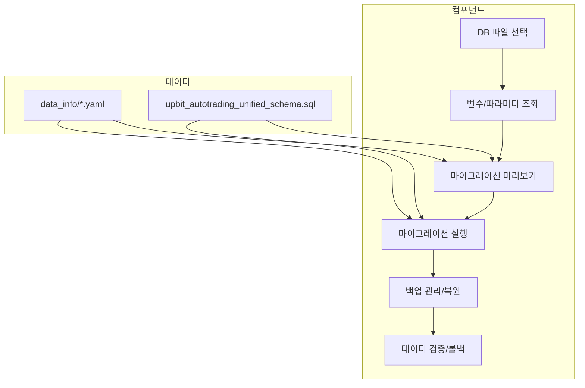

# 📚 Trading Variables DB Migration GUI Tool - Architecture & Deep Review

## 1. 폴더 구조 및 주요 파일

```
gui_variables_DB_migration_util/
├── components/                # 주요 GUI 컴포넌트 (프레임별 분리)
│   ├── db_selector.py         # DB 파일 선택 및 정보 표시
│   ├── variables_viewer.py    # 변수/파라미터 조회
│   ├── migration_preview.py   # 마이그레이션 미리보기 및 상세 분석
│   ├── migration_executor.py  # 마이그레이션 실행 및 진행 상황
│   ├── backup_manager.py      # 백업 관리 및 복원
│   ├── ...                    # 기타 유틸리티/서브컴포넌트
├── data_info/                 # 마이그레이션 대상 데이터 및 스키마
│   ├── *.yaml                 # 변수/파라미터/카테고리 등 참조 데이터
│   ├── upbit_autotrading_unified_schema.sql # 통합 스키마
│   ├── ...
├── trading_variables_DB_migration_main_gui.py # 전체 GUI 메인
├── run_gui_trading_variables_DB_migration.py  # 실행 스크립트
├── README.md                  # 사용법 및 기능 요약
├── USER_GUIDE.md              # 사용자 가이드
└── improvement_plan.md        # 개선/업데이트 계획
```

## 2. 주요 기능 및 연결성

- **메인 GUI (`trading_variables_DB_migration_main_gui.py`)**
  - 각 기능별 컴포넌트 프레임을 탭/노트북으로 연결
  - DB 선택 → 변수 조회 → 미리보기 → 실행 → 백업 관리 등 단계별 흐름
  - `components/` 폴더의 각 프레임을 import하여 UI/로직 분리

- **컴포넌트별 역할**
  - `db_selector.py`: DB 파일 선택, 경로 관리, 테이블 정보 표시
  - `variables_viewer.py`: DB 내 변수/파라미터 카테고리별 조회, 통계
  - `migration_preview.py`: 기존 DB와 새 스키마 비교, 변경사항/리스크/호환성 분석
  - `migration_executor.py`: 실제 마이그레이션 실행, 진행 상황 모니터링, 롤백 지원
  - `backup_manager.py`: 백업 생성/복원, 파일 관리, 무결성 검증

- **데이터/스키마 관리**
  - `data_info/` 폴더의 YAML/SQL 파일을 통해 마이그레이션 대상 데이터와 스키마 정의
  - `migrate_yaml_to_db.py`, `verify_migration.py` 등 데이터 동기화/검증 서브툴 존재

## 3. 기능 흐름 및 연결성 (Mermaid 차트)



## 4. 심층 검토 및 개선 포인트

- **모듈화/컴포넌트화**: 각 기능별로 프레임/클래스 분리, 유지보수 용이
- **데이터/스키마 동기화**: YAML→DB→코드 간 일관성 확보, 검증/백업 프로세스 내장
- **리스크 관리**: 미리보기/백업/롤백 기능으로 데이터 손실 최소화
- **확장성**: 새로운 변수/테이블/스키마 추가 시 data_info 폴더만 갱신하면 연동 가능
- **사용자 경험**: 단계별 안내, 실시간 진행 상황, 상세 로그/리포트 제공

## 5. 결론

본 폴더는 매매 변수 DB 마이그레이션의 모든 과정을 GUI 기반으로 안전하게 지원하며, 각 기능은 컴포넌트화되어 명확하게 연결되어 있습니다. 데이터/스키마/코드의 일관성, 리스크 관리, 확장성 측면에서 우수한 구조를 갖추고 있습니다.

---

*본 문서는 자동 생성된 심층 구조/연결성/기능 분석 리포트입니다.*
